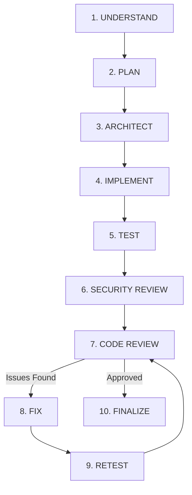

# Feature Delivery Orchestration Skill

## 1. Purpose & Scope
This skill provides the central development workflow for the Main Agent. It governs the 10-stage end-to-end feature pipeline, scale-aware execution decisions, and coordination across subagents.

## 2. Activation Triggers
Activate when the user requests a new feature, API endpoint, UI component, background worker, or meaningful system refactor.

## 3. Inspection Targets
- [`AGENTS.md`](file:///c:/Users/ascora/Desktop/maher/Car-Export-CRM/AGENTS.md) (Hierarchy of authority & DoD)
- [`PRODUCT.md`](file:///c:/Users/ascora/Desktop/maher/Car-Export-CRM/PRODUCT.md) & [`docs/domain-model.md`](file:///c:/Users/ascora/Desktop/maher/Car-Export-CRM/docs/domain-model.md) (Domain rules)
- [`ARCHITECTURE.md`](file:///c:/Users/ascora/Desktop/maher/Car-Export-CRM/ARCHITECTURE.md) & [`docs/api-contracts.md`](file:///c:/Users/ascora/Desktop/maher/Car-Export-CRM/docs/api-contracts.md) (Layer placement)
- [`SECURITY.md`](file:///c:/Users/ascora/Desktop/maher/Car-Export-CRM/SECURITY.md) (Security constraints)

## 4. Scale Decision Logic (Full vs. Lightweight Lifecycle)

Before execution, classify the request scale:
- **Trivial Change** (typo fix, single comment edit, minor CSS tweak): Bypass multi-agent stages. Execute inline: `UNDERSTAND` → `IMPLEMENT` → `FINALIZE`.
- **Meaningful Feature** (new endpoint, DB model, webhook logic, AI integration, UI screen): Execute FULL 10-Stage Lifecycle.

---

## 5. The 10-Stage Feature Lifecycle

### Stage Details:
1. **UNDERSTAND**: Validate intent against `PRODUCT.md`. Check for Human Approval Gate triggers (`AGENTS.md`).
2. **PLAN**: Formulate plan, update/verify contracts in `docs/api-contracts.md` and `docs/domain-model.md`.
3. **ARCHITECT**: Verify layer boundaries, Port interface abstractions, and multi-tenant DB impact.
4. **IMPLEMENT**: Build backend/frontend code adhering to typing and quality standards (`DEVELOPMENT.md`).
5. **TEST**: Write unit & integration tests (`pytest`, `vitest`). Verify cross-tenant isolation.
6. **SECURITY REVIEW**: Execute 10-point security audit (`SECURITY.md`). Check IDOR and input validation.
7. **CODE REVIEW**: Run linter, type checks, and diff review (`code-review` skill).
8. **FIX**: Address findings cleanly without collateral refactoring.
9. **RETEST**: Re-run test suite to ensure zero regressions.
10. **FINALIZE**: Update documentation, ADRs, and present clean summary to user.

## 6. Expected Outputs
- Completed implementation adhering to DoD.
- Passing test suite and clean type checks.
- Updated documentation artifacts.
