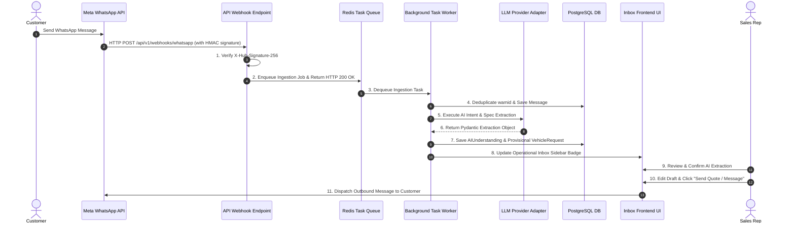

# ARCHITECTURE.md - System Architecture Specification

This document provides the authoritative system architecture specification for **Car-Export-CRM**. It details the logical 4-tier layer separation, 11 application modules, Ports & Adapters interfaces, WhatsApp webhook ingestion pipeline, AI orchestration boundaries, security architecture, observability standards, and evolutionary extraction rules.

---

## 1. Architectural Strategy: Modular Monolith + Asynchronous Workers

Car-Export-CRM adopts a **Modular Monolith** pattern paired with **Asynchronous Background Task Processing**.

This strategy balances rapid MVP iteration, low operational complexity, and strict multi-tenant row isolation while establishing explicit module boundaries for future service extraction under [ADR 0004](file:///c:/Users/ascora/Desktop/maher/Car-Export-CRM/docs/decisions/0004-evolutionary-service-extraction.md).

```text
+-----------------------------------------------------------------------------------+
|                            PRESENTATION / INTERFACE LAYER                         |
|         (FastAPI Routers: Webhooks, REST Controllers, Auth Middleware)            |
+-----------------------------------------------------------------------------------+
                                          │
+-----------------------------------------------------------------------------------+
|                                  APPLICATION LAYER                                |
|        (Use Cases, Transaction Management, RBAC Evaluation, Async Orchestrators)   |
+-----------------------------------------------------------------------------------+
                                          │
+-----------------------------------------------------------------------------------+
|                                    DOMAIN LAYER                                   |
|       (Entities, Value Objects, Aggregates, State Machines, Domain Invariants)    |
+-----------------------------------------------------------------------------------+
                                          │
+-----------------------------------------------------------------------------------+
|                            INFRASTRUCTURE / ADAPTER LAYER                         |
|   +-------------------+  +----------------+  +------------------+  +-----------+  |
|   | WhatsAppAdapter   |  | LLMAdapter     |  | S3StorageAdapter |  | DB/Redis  |  |
|   +-------------------+  +----------------+  +------------------+  +-----------+  |
+-----------------------------------------------------------------------------------+
```

---

## 2. 4-Tier Logical Layer Architecture

### 2.1 Presentation / Interface Layer
- **Controllers & Webhooks**: FastAPI async routers receiving external HTTP requests and Meta WhatsApp Cloud API webhooks (`/api/v1/webhooks/whatsapp`).
- **Middleware**: HMAC-SHA256 webhook signature validation, JWT authentication, tenant context extraction, CORS handling.

### 2.2 Application Layer
- **Use Case Orchestrators**: Application services executing transactional workflows (e.g. `CreateQuoteUseCase`, `IngestWhatsAppMessageUseCase`).
- **Authorization Checks**: Evaluates RBAC permissions (`Customer:view`, `Quotation:approve`) using session tenant context.

### 2.3 Domain Layer
- **Aggregates & Invariants**: Enforces business rules (`INV-001` through `INV-010`), state machines (`Lead`, `Quotation`, `Conversation`), and domain models. Independent of database or framework libraries.

### 2.4 Infrastructure Layer
- **Persistence**: SQLAlchemy 2.0 async engine (`asyncpg`) connecting to PostgreSQL.
- **Async Queue**: Redis + ARQ background workers executing long-running extraction, PDF rendering, and webhook tasks.
- **Provider Adapters**: Concrete port implementations in `app/adapters/` (`MetaCloudApiAdapter`, `OpenAIAdapter`, `S3StorageAdapter`).

---

## 3. 11 Core Application Modules

```text
src/backend/app/modules/
├── identity/          # User authentication, JWT issuance, password hashing
├── tenants/           # Tenant organization settings and profile management
├── customers/         # Customer profile master data, E.164 normalization, FCR eligibility
├── messaging/         # WhatsApp webhooks, conversation threads, message history
├── sourcing/          # Vehicle requests, criteria specs, sourcing matches
├── leads/             # Lead pipeline state machine, priority, assignment
├── quotes/            # Export quotation math (Netto/Brutto VAT, customs), PDF generator
├── vehicles/          # Sourced vehicle inventory records and location
├── documents/         # Export document metadata and pre-signed URL access
├── ai_engine/         # Intent classification, Pydantic extraction schemas, prompt safety
└── audit/             # Immutable AuditEvent log records
```

### Module Dependency Rules:

| Module | Allowed Dependencies | Forbidden Dependencies |
| :--- | :--- | :--- |
| `identity` | `tenants`, `core` | `quotes`, `messaging`, `ai_engine` |
| `tenants` | `core` | `messaging`, `quotes`, `leads` |
| `customers` | `tenants`, `core` | `quotes`, `ai_engine` |
| `messaging` | `customers`, `tenants`, `ports` | Direct DB joins to `quotes` or `vehicles` |
| `sourcing` | `customers`, `tenants` | `quotes` |
| `leads` | `customers`, `sourcing`, `tenants` | Direct raw SQL calls across module boundaries |
| `quotes` | `leads`, `vehicles`, `documents`, `ports` | Unvalidated LLM freeform calls |
| `vehicles` | `tenants`, `core` | `messaging`, `ai_engine` |
| `documents` | `tenants`, `ports`, `core` | `ai_engine` |
| `ai_engine` | `ports`, `core` | Direct DB mutations without validation |
| `audit` | `tenants`, `core` | All other feature modules |

---

## 4. Ports & Adapters (Dependency Inversion & Local-First MVP)

Under [ADR 0002](file:///c:/Users/ascora/Desktop/maher/Car-Export-CRM/docs/decisions/0002-ports-and-adapters.md) and [ADR 0018](file:///c:/Users/ascora/Desktop/maher/Car-Export-CRM/docs/decisions/0018-provider-agnostic-ports-local-first-and-multi-tenant-whatsapp.md), application modules MUST NEVER import third-party SDKs directly. All external infrastructure capabilities pass through abstract Port interfaces in `app/ports/` and adapter implementations in `app/adapters/`.

### 4.1 Local-First MVP Reference Stack vs Production Adapters

| Capability / Port | Interface Port (`app/ports/`) | Local MVP Reference Adapter (`app/adapters/`) | Production Cloud Adapter (`app/adapters/`) |
| :--- | :--- | :--- | :--- |
| **Messaging** | `WhatsAppProvider` | `DemoWhatsAppProvider` (Local/Simulated) | `MetaWhatsAppProvider` (Meta Cloud API) |
| **Object Storage** | `ObjectStorageProvider` | `MinIOStorageAdapter` (Local S3-compatible) | `S3StorageAdapter` (AWS S3) |
| **LLM Orchestration** | `LLMProvider` | `OllamaLLMAdapter` (Local runner) | `OpenAILLMAdapter` / `GeminiLLMAdapter` |
| **Database** | Database Engine | Local PostgreSQL + `pgvector` | Managed PostgreSQL + `pgvector` |
| **Task Queue / Cache** | Task Queue Engine | Local Redis | Managed Redis |

*Local-First Invariant*: The MVP is fully runnable locally without mandatory paid cloud infrastructure. Production services (AWS S3, OpenAI, Gemini) are optional production adapters.

```python
# Abstract Port Interfaces (src/backend/app/ports/)

class WhatsAppProvider(ABC):
    @abstractmethod
    async def send_text_message(self, recipient_phone: str, text: str, phone_number_id: str) -> str: pass

class LLMProvider(ABC):
    @abstractmethod
    async def extract_structured_data(self, prompt: str, schema_cls: Type[T]) -> T: pass

class ObjectStorageProvider(ABC):
    @abstractmethod
    async def generate_presigned_url(self, storage_path: str, expiry_seconds: int = 900) -> str: pass
```

---

## 5. WhatsApp Webhook Ingestion & Async Pipeline



### 5.1 Multi-Tenant WhatsApp Account Resolution
Under [ADR 0018](file:///c:/Users/ascora/Desktop/maher/Car-Export-CRM/docs/decisions/0018-provider-agnostic-ports-local-first-and-multi-tenant-whatsapp.md), the system resolves tenant context dynamically from incoming webhook payloads:
```text
Meta phone_number_id ──> Lookup WhatsAppAccount ──> Resolve Tenant ──> Resolve Conversation ──> Resolve Customer
```

### 5.2 WhatsApp Customer Onboarding Concept
Customer onboarding follows Meta's standard Embedded Signup workflow:
1. Tenant Admin initiates "Connect WhatsApp" in CRM settings.
2. Meta Embedded Signup OAuth pop-up authorizes WABA assets and returns `phone_number_id` and credentials.
3. CRM securely stores the new `WhatsAppAccount` record bound to `tenant_id`.
4. Domain logic remains untouched when connecting new customer business numbers.

### Trust & Failure Boundaries:
- **Signature Boundary**: HTTP requests to `/webhooks/whatsapp` MUST pass HMAC signature verification before parsing payload body.
- **Tenant Context Resolution**: `tenant_id` is resolved exclusively via `WhatsAppAccount.phone_number_id` lookup in PostgreSQL. Client parameters are NEVER trusted.
- **Idempotency Boundary**: Inbound message IDs (`wamid`) are deduplicated in Redis/DB before execution.
- **Async Isolation**: Webhook handler returns HTTP 200 within < 200 ms. All heavy tasks run in Redis workers.

---

## 6. AI Non-Authoritative Orchestration Boundary

Under [ADR 0003](file:///c:/Users/ascora/Desktop/maher/Car-Export-CRM/docs/decisions/0003-ai-orchestration-boundary.md), AI is an assistant, never an autonomous business authority.

```text
Untrusted Customer Message ──> Enclose in <untrusted_user_message> Tags
                                           │
                                           ▼
                               LLM Extraction Call (temp=0.0)
                                           │
                                           ▼
                                Pydantic Schema Validation
                                           │
                                           ▼
                          Provisional Sidebar Card (Unconfirmed)
                                           │
                                           ▼
                        HUMAN SALES REP VALIDATION & CONFIRMATION
                                           │
                                           ▼
                          Authoritative Business State Mutation
```

---

## 7. Security & Tenant Authorization Architecture

### 7.1 Fundamental Security Invariant (`INV-001` & `INV-002`)
- **JWT Context Authority**: Tenant identity MUST be extracted strictly from authenticated JWT token claims.
- **Client Non-Trust**: `tenant_id` supplied in request URLs, headers, or body payloads is NEVER trusted for authorization.
- **Query Boundary**: Every database query explicitly appends `.where(Entity.tenant_id == current_tenant_id)`.
- **IDOR Protection**: Accessing resource belonging to Tenant B by a user from Tenant A returns `HTTP 404 Not Found`.

---

## 8. Observability & Failure Handling

### 8.1 Structured Logging Standards
All application logs MUST format as structured JSON containing mandatory correlation fields:
```json
{
  "timestamp": "2026-09-11T14:10:00Z",
  "level": "INFO",
  "correlation_id": "req-8f4b29a1-09bc",
  "tenant_id": "9b1deb4d-3b7d-4bad-9bdd-2b0d7b3dcb6d",
  "user_id": "550e8400-e29b-41d4-a716-446655440000",
  "module": "messaging",
  "action": "MESSAGE_DISPATCHED",
  "message": "Outbound WhatsApp message dispatched successfully."
}
```

### 8.2 Failure & Retry Boundaries
- **WhatsApp API Outage**: Message marked `FailedToDeliver` in DB; worker retries up to 3 times with exponential backoff before alerting Sales Rep in UI.
- **LLM API Timeout**: Falls back to regex parameter extraction; marks AI card as `Extraction Unavailable (Manual Entry Required)`.
- **DB Connection Failure**: Uvicorn web server returns `HTTP 503 Service Unavailable` on `/health` check.

---

## 9. Conceptual Architecture Diagrams

### 9.1 System Context Diagram
```text
+----------------------+         +-------------------------------------+         +----------------------+
|  Tunisian Buyer /    | <=====> |          Meta WhatsApp Cloud API    | <=====> |  Car-Export-CRM API  |
|  European Supplier   |         +-------------------------------------+         |  (FastAPI Backend)   |
+----------------------+                                                         +----------------------+
                                                                                            ║
+----------------------+                                                                    ║
|  Sales Rep / Manager | <==================================================================╝
|  (React Browser UI)  |
+----------------------+
```

---

## 10. Database Architecture & Persistence Model

Under [`docs/database-design.md`](file:///c:/Users/ascora/Desktop/maher/Car-Export-CRM/docs/database-design.md), the system employs **PostgreSQL** as its single relational database engine paired with **UUIDv7** time-ordered primary keys.

### 10.1 Key Persistence Characteristics
- **Multi-Tenant Row Isolation**: Every tenant-owned table contains `tenant_id: UUID NOT NULL REFERENCES tenants(id)`. Repository layers enforce mandatory `.where(Model.tenant_id == current_tenant_id)` query boundaries derived from authenticated JWT claims (`BR-001`, `BR-002`).
- **Financial Precision**: All pricing and currency values use `NUMERIC(12, 2)` or `NUMERIC(15, 2)` types. Floating point columns are strictly forbidden for pricing math (`BR-005`).
- **4-Tier AI Provenance Boundary**: Raw customer message (`messages`) → Provisional AI extraction (`ai_understandings`) → Human Rep confirmation (`vehicle_requests`) → Authoritative pipeline state (`leads`, `quotations`). AI outputs never directly mutate business ground truth without human authorization (`INV-003`, `INV-006`).
- **Transaction Boundaries**: Webhook ingestion, background AI processing, and quotation PDF generation execute in separate atomic transactions. Database transactions are never held open during external API calls or LLM execution.

---

## 11. API Architecture & Endpoint Specification

Under [`docs/api-contracts.md`](file:///c:/Users/ascora/Desktop/maher/Car-Export-CRM/docs/api-contracts.md), the system exposes a structured REST API under the `/api/v1` base path prefix.

### 11.1 Key API Architectural Characteristics
- **JWT Authentication & Tenant Scoping**: Authenticated endpoints extract `user_id` and `tenant_id` exclusively from JWT Bearer token claims (`BR-001`). URLs use root resource patterns (e.g. `/api/v1/customers/{id}`); client-supplied `tenant_id` path shortcuts are strictly forbidden to prevent IDOR/BOLA attacks.
- **WhatsApp Webhook Ingestion**: Asynchronous endpoint (`POST /api/v1/webhooks/whatsapp`) performing HMAC-SHA256 signature verification (`X-Hub-Signature-256`), Meta `wamid` deduplication, and <200ms background worker task dispatch (`BR-007`, `BR-008`).
- **AI Human Confirmation Endpoint**: Explicit architectural separation between provisional Layer 2 AI suggestions (`GET /conversations/{id}/ai-suggestion`) and rep-validated business ground truth (`POST /leads/{id}/vehicle-request/confirm`). AI outputs never directly mutate authoritative state (`INV-003`, `INV-006`).
- **Idempotency & Concurrency**: `Idempotency-Key` headers prevent duplicate quote creation and message dispatches; ETag version headers enforce Optimistic Concurrency Control (`409 Conflict`) on mutable resources (`ADR 0010`).

---

## 12. Security Architecture & Isolation Invariants

Under [`SECURITY.md`](file:///c:/Users/ascora/Desktop/maher/Car-Export-CRM/SECURITY.md), the system enforces **11 mandatory multi-tenant security invariants** (`SEC-001` to `SEC-011`) and a comprehensive defense-in-depth threat model.

### 12.1 Key Security Characteristics
- **Server-Side Identity Context**: `tenant_id` is derived strictly from trusted server-side authenticated identity context (`BR-001`). Client-supplied `tenant_id` parameters in URL paths or request bodies are strictly forbidden (`SEC-001`, `SEC-002`).
- **Non-Sequential IDs & IDOR/BOLA Masking**: Primary keys use non-sequential UUIDv7 identifiers (`ADR 0005`), which reduce predictable enumeration but provide NO authorization boundary by themselves. Every database query, vector search, and cache lookup is tenant-scoped (`.where(Model.tenant_id == current_tenant_id)`). Unauthorized cross-tenant resource requests return `HTTP 404 Not Found` to prevent resource existence disclosure (`SEC-010`, `AC-01`).
- **Asynchronous Worker Security (`SEC-011`)**: Background jobs (Redis ARQ) must contain validated tenant and operation context derived from a trusted API transaction. Workers never derive authorization solely from user-controlled payload data.
- **Outbound Fetch & SSRF Egress Guard**: Customer-controlled URLs and document links are restricted by an outbound fetch policy blocking RFC 1918 private IPs, loopback, and cloud metadata endpoints.
- **Webhook Integrity**: Meta WhatsApp Cloud API webhooks verify HMAC-SHA256 signatures (`X-Hub-Signature-256`, `BR-007`) and Meta `wamid` deduplication (`BR-008`).
- **AI Security & HITL**: Non-authoritative AI boundary (`INV-003`, `INV-006`) + prompt injection XML `<untrusted_user_message>` tagging (`BR-009` prompt structuring) + 8-step defense pipeline (`ADR 0012`) + mandatory Human-in-the-Loop confirmation (`ADR 0014`).
- **Append-Only Security Audit Log**: `audit_events` logging enforces DB-level `UPDATE`/`DELETE` restrictions for normal application code and strict PII/secret scrubbing invariants (`BR-016`, `INV-009`).

---

## 13. Architecture Decision Records Index

- [ADR 0001: Modular Monolith Architecture Baseline](file:///c:/Users/ascora/Desktop/maher/Car-Export-CRM/docs/decisions/0001-modular-monolith-architecture.md)
- [ADR 0002: Ports and Adapters Architecture for External Integrations](file:///c:/Users/ascora/Desktop/maher/Car-Export-CRM/docs/decisions/0002-ports-and-adapters.md)
- [ADR 0003: AI Non-Authoritative Orchestration Boundary](file:///c:/Users/ascora/Desktop/maher/Car-Export-CRM/docs/decisions/0003-ai-orchestration-boundary.md)
- [ADR 0004: Evolutionary Service Extraction Criteria](file:///c:/Users/ascora/Desktop/maher/Car-Export-CRM/docs/decisions/0004-evolutionary-service-extraction.md)
- [ADR 0005: PostgreSQL as Primary Database & UUIDv7 Identifier Strategy](file:///c:/Users/ascora/Desktop/maher/Car-Export-CRM/docs/decisions/0005-postgresql-and-uuidv7-identifier-strategy.md)
- [ADR 0006: Tenant Isolation & Multi-Tenancy Database Strategy](file:///c:/Users/ascora/Desktop/maher/Car-Export-CRM/docs/decisions/0006-tenant-isolation-and-database-multi-tenancy.md)
- [ADR 0007: AI Data Provenance and JSONB Usage Policy](file:///c:/Users/ascora/Desktop/maher/Car-Export-CRM/docs/decisions/0007-ai-data-provenance-and-jsonb-usage-policy.md)
- [ADR 0008: API Versioning and Response Envelope Specification](file:///c:/Users/ascora/Desktop/maher/Car-Export-CRM/docs/decisions/0008-api-versioning-and-envelope-specification.md)
- [ADR 0009: Cursor Pagination and Filter Whitelist Strategy](file:///c:/Users/ascora/Desktop/maher/Car-Export-CRM/docs/decisions/0009-cursor-pagination-and-filter-whitelist-strategy.md)
- [ADR 0010: Idempotency and Optimistic Concurrency Control](file:///c:/Users/ascora/Desktop/maher/Car-Export-CRM/docs/decisions/0010-idempotency-and-optimistic-concurrency-control.md)
- [ADR 0011: PostgreSQL pgvector for Tenant-Isolated Vector Retrieval](file:///c:/Users/ascora/Desktop/maher/Car-Export-CRM/docs/decisions/0011-pgvector-for-tenant-isolated-rag-retrieval.md)
- [ADR 0012: Five-Layer AI Output Validation and HITL Boundary](file:///c:/Users/ascora/Desktop/maher/Car-Export-CRM/docs/decisions/0012-five-layer-ai-output-validation-and-hitl-boundary.md)
- [ADR 0013: Multi-Tenant Security Invariants and IDOR Defense](file:///c:/Users/ascora/Desktop/maher/Car-Export-CRM/docs/decisions/0013-multi-tenant-security-invariants-and-idor-defense.md)
- [ADR 0014: Defense-in-Depth Prompt Injection and AI Trust Boundaries](file:///c:/Users/ascora/Desktop/maher/Car-Export-CRM/docs/decisions/0014-defense-in-depth-prompt-injection-and-ai-trust-boundaries.md)
- [ADR 0015: Frontend State Management and TanStack Query Strategy](file:///c:/Users/ascora/Desktop/maher/Car-Export-CRM/docs/decisions/0015-frontend-state-management-and-tanstack-query-strategy.md)
- [ADR 0016: Operational Density Design System and Inbox Workspace](file:///c:/Users/ascora/Desktop/maher/Car-Export-CRM/docs/decisions/0016-operational-density-design-system-and-inbox-workspace.md)
- [ADR 0017: MVP Production Topology and Evolutionary Infrastructure Scaling](file:///c:/Users/ascora/Desktop/maher/Car-Export-CRM/docs/decisions/0017-mvp-production-topology-and-evolutionary-scaling.md)

---

## 14. Initial Engineering Backlog & Execution Plan

The architectural specifications across Stages 2.1–2.11 are operationalized in the dependency-aware [**Initial Engineering Backlog**](file:///c:/Users/ascora/Desktop/maher/Car-Export-CRM/docs/engineering-backlog.md) covering 22 workstreams (`WS-01` to `WS-22`) and 65 granular execution tasks (`TASK-0101` to `TASK-2203`).

---

## 15. Verification & Compliance Confirmation

- **Application Code**: NONE
- **Database Code / Migrations**: NONE
- **FastAPI / Endpoint Code**: NONE
- **AI Worker / LLM Implementation Code**: NONE
- **Security Middleware / Code**: NONE (Design/architecture phase only)
- **Frontend Components**: NONE
- **Infrastructure Scripts**: NONE
- **Microservices Introduced**: NONE (Modular Monolith confirmed)


