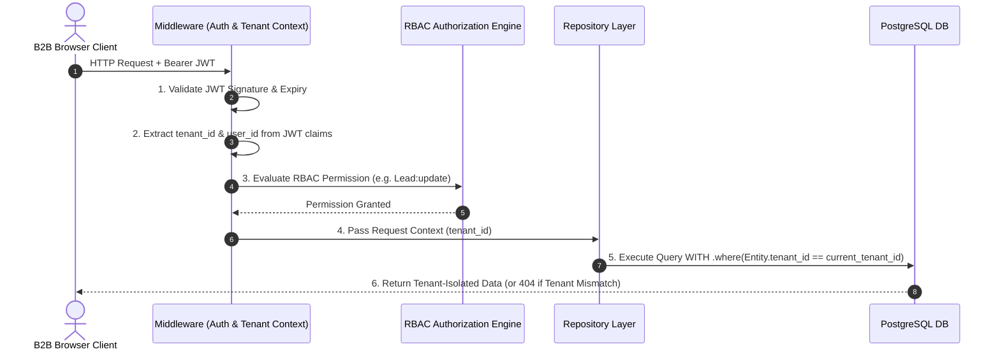
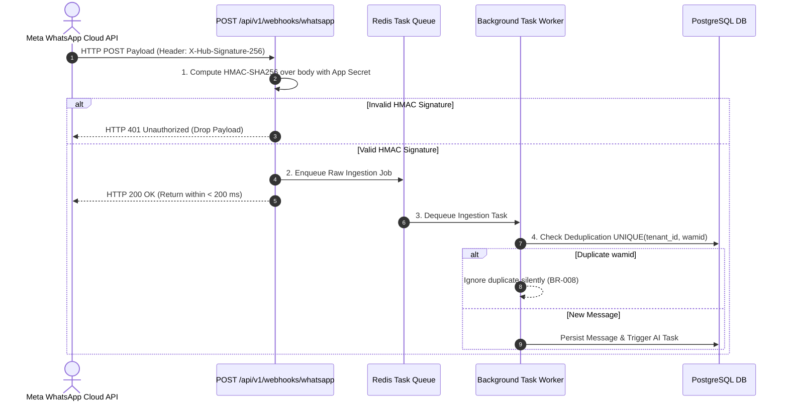
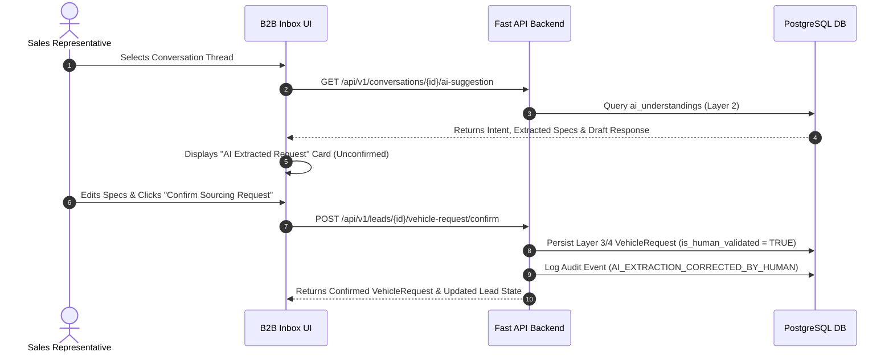

# REST API Contracts & Endpoint Specification

This document provides the authoritative, production-grade REST API contract specification for **Car-Export-CRM**. It defines base path conventions, authentication mechanisms, tenant context resolution, RBAC authorization, endpoint catalogs, request/response JSON schemas, error taxonomies, webhook ingestion pipelines, AI Human-in-the-Loop endpoints, and security boundaries for the MVP.

---

## 1. API Principles

1. **Predictable REST Architecture**: Resources use standard HTTP methods (`GET`, `POST`, `PATCH`, `DELETE`) with plural noun endpoint URIs (e.g. `/api/v1/customers`).
2. **Strict Multi-Tenant Scoping**: Tenant context is derived strictly from authenticated JWT claims (`BR-001`, `BR-002`). Client-supplied `tenant_id` parameters in URL paths or request bodies are strictly forbidden for authorization.
3. **Standard Response Envelopes**: All responses are wrapped in standard JSON envelopes. Success responses use `{ "success": true, "data": ..., "meta": ... }`; errors follow RFC 7807 Problem Details (`ADR 0008`).
4. **Data Type Uniformity**:
   - **Identifiers**: 36-character hyphenated UUIDv7 strings (`018f4b29-a109-7bc3-89bd-2b0d7b3dcb6d`).
   - **Timestamps**: ISO-8601 UTC strings (`YYYY-MM-DDTHH:MM:SSZ`).
   - **Monetary Values**: Fixed-precision numeric strings or numbers formatted to 2 decimal places in EUR or 3 in TND (e.g. `18500.00`). Binary floating-point representation is strictly forbidden (`BR-005`).
5. **Non-Authoritative AI Guardrail**: AI outputs are accessible via provisional suggestion endpoints and require explicit human agent action to mutate authoritative business state (`INV-003`, `INV-006`).
6. **Stateless Operations**: Server-side user session context is carried in signed JWT access tokens.

---

## 2. API Versioning

- **Base Path Prefix**: `/api/v1`
- **Versioning Strategy**: URI Path Versioning (`ADR 0008`).
- **Backward Compatibility Policy**:
  - Non-breaking changes (adding optional response fields or optional query filters) do NOT increment the major version.
  - Breaking changes (removing fields, renaming fields, altering data types, or changing authorization scope) require releasing `/api/v2`.

---

## 3. Authentication Architecture

### 3.1 Authentication Mechanism
Authenticates via JSON Web Tokens (JWT) issued by the identity authority.

- **Header Transport**: `Authorization: Bearer <access_token>`
- **Token Claims**:
  - `sub`: User ID (`UUIDv7`)
  - `tenant_id`: Tenant ID (`UUIDv7`)
  - `role`: RBAC Role string (`SuperAdmin`, `TenantAdmin`, `SalesAgent`, `LogisticsAgent`)
  - `exp`: Expiration timestamp (UNIX epoch seconds, 15-minute default lifetime)
  - `jti`: Unique token identifier UUID

### 3.2 Authentication Endpoints

#### `POST /api/v1/auth/login`
- **Purpose**: Authenticate employee user and issue JWT access token (`FR-AUTH-001`).
- **Auth**: Public unauthenticated.
- **Request Body**:
  ```json
  {
    "email": "agent@autoexport-hamburg.de",
    "password": "SecurePassword123!"
  }
  ```
- **Success Response (`HTTP 200 OK`)**:
  ```json
  {
    "success": true,
    "data": {
      "access_token": "eyJhbGciOiJIUzI1NiIsInR5cCI6IkpXVCJ9...",
      "token_type": "Bearer",
      "expires_in": 900,
      "user": {
        "id": "018f4b29-a109-7bc3-89bd-2b0d7b3dcb6d",
        "tenant_id": "018f4b29-3b7d-4bad-9bdd-2b0d7b3dcb6d",
        "email": "agent@autoexport-hamburg.de",
        "full_name": "Karl Schmidt",
        "role": "SalesAgent"
      }
    },
    "meta": {
      "timestamp": "2026-09-11T15:00:00Z",
      "correlation_id": "req-8f4b29a1-09bc"
    }
  }
  ```
- **Error Response (`HTTP 401 Unauthorized`)**:
  ```json
  {
    "success": false,
    "error": {
      "code": "UNAUTHENTICATED",
      "message": "Invalid email or password.",
      "timestamp": "2026-09-11T15:00:00Z",
      "correlation_id": "req-8f4b29a1-09bc"
    }
  }
  ```

---

## 4. Tenant Context & Security Boundaries



### Security Rules:
1. **JWT Authority**: Tenant identity MUST be extracted strictly from authenticated JWT token claims (`BR-001`). Client-supplied `tenant_id` parameters in URL paths or request bodies are ignored.
2. **Path Conventions**: Endpoints use root resource URIs (e.g. `/api/v1/customers/{id}`). Endpoints MUST NOT use `/api/v1/tenants/{tenant_id}/customers/{id}` to prevent authorization bypass.
3. **Cross-Tenant Access Defense**: If a user from Tenant A attempts to access resource ID `cust_999` belonging to Tenant B, the system returns `HTTP 404 Not Found` to prevent resource existence disclosure (`BR-002`, `AC-01`).

---

## 5. RBAC Authorization Rules

| API Resource / Category | Action | Required Permission | Allowed Roles |
| :--- | :--- | :--- | :--- |
| **Auth** | Login | Public | All |
| **Customers** | List / Search / View | `Customer:view` | SuperAdmin, TenantAdmin, SalesAgent, LogisticsAgent |
| **Customers** | Create / Update | `Customer:create`, `Customer:update` | SuperAdmin, TenantAdmin, SalesAgent, LogisticsAgent |
| **Customers** | Delete | `Customer:delete` | SuperAdmin, TenantAdmin |
| **Conversations** | List / View Chat | `Conversation:view` | SuperAdmin, TenantAdmin, SalesAgent, LogisticsAgent (View Only) |
| **Conversations** | Claim / Assign | `Conversation:assign` | SuperAdmin, TenantAdmin, SalesAgent |
| **Conversations** | Respond (Outbound) | `Conversation:respond` | SuperAdmin, TenantAdmin, SalesAgent |
| **Leads** | List / View Kanban | `Lead:view` | SuperAdmin, TenantAdmin, SalesAgent, LogisticsAgent (View Only) |
| **Leads** | Update State / Assign | `Lead:update` | SuperAdmin, TenantAdmin, SalesAgent |
| **Vehicles** | List / Search Stock | `Vehicle:view` | SuperAdmin, TenantAdmin, SalesAgent, LogisticsAgent |
| **Vehicles** | Add / Update Stock | `Vehicle:create`, `Vehicle:update` | SuperAdmin, TenantAdmin, LogisticsAgent |
| **Quotations** | Create Draft / View | `Quotation:create`, `Quotation:view` | SuperAdmin, TenantAdmin, SalesAgent, LogisticsAgent |
| **Quotations** | Approve Discount Override | `Quotation:approve` | SuperAdmin, TenantAdmin |
| **Documents** | Upload / Download | `Document:upload`, `Document:view` | SuperAdmin, TenantAdmin, SalesAgent, LogisticsAgent |
| **Audit Logs** | View Security Logs | `Audit:view` | SuperAdmin, TenantAdmin |

---

## 6. Resource Model Specifications

### 6.1 Core API Data Models

```text
Customer JSON Representation:
{
  "id": "018f4b29-a109-7bc3-89bd-2b0d7b3dcb6d",
  "phone_e164": "+21698123456",
  "display_phone_number": "+216 98 123 456",
  "full_name": "Mohamed Ben Ali",
  "preferred_language": "fr",
  "fcr_eligible": true,
  "notes": "Interested in Golf 8 or BMW X3",
  "created_at": "2026-09-11T12:00:00Z",
  "updated_at": "2026-09-11T14:30:00Z"
}

Lead JSON Representation:
{
  "id": "018f4b29-b210-7bc3-89bd-2b0d7b3dcb6e",
  "customer_id": "018f4b29-a109-7bc3-89bd-2b0d7b3dcb6d",
  "customer": { ... },
  "vehicle_request_id": "018f4b29-c311-7bc3-89bd-2b0d7b3dcb6f",
  "assigned_agent_id": "018f4b29-d412-7bc3-89bd-2b0d7b3dcb70",
  "status": "Sourcing",
  "priority": "High",
  "lost_reason": null,
  "version": "W/\"018f4b29-v2\"",
  "created_at": "2026-09-11T12:05:00Z",
  "updated_at": "2026-09-11T14:00:00Z"
}

Quotation JSON Representation:
{
  "id": "018f4b29-e513-7bc3-89bd-2b0d7b3dcb71",
  "quote_number": "QT-2026-0042",
  "lead_id": "018f4b29-b210-7bc3-89bd-2b0d7b3dcb6e",
  "vehicle_id": "018f4b29-f614-7bc3-89bd-2b0d7b3dcb72",
  "vehicle_price_eur": "18500.00",
  "vat_regime": "Netto_Export",
  "shipping_fee_eur": "1200.00",
  "transit_insurance_eur": "350.00",
  "custom_discount_eur": "0.00",
  "total_price_eur": "20050.00",
  "estimated_customs_tnd": "14500.000",
  "status": "Approved",
  "valid_until": "2026-09-25",
  "pdf_document_id": "018f4b29-g715-7bc3-89bd-2b0d7b3dcb73",
  "created_at": "2026-09-11T14:15:00Z"
}
```

---

## 7. Endpoint Catalog Overview

| Method | Endpoint Path | Description | Required Role / Permission |
| :--- | :--- | :--- | :--- |
| `POST` | `/api/v1/auth/login` | User login & JWT issuance | Public |
| `GET` | `/api/v1/webhooks/whatsapp` | Meta WhatsApp Cloud API verification challenge | Public (Hub Verification) |
| `POST` | `/api/v1/webhooks/whatsapp` | Meta WhatsApp Cloud API webhook ingestion | Public (HMAC Verified) |
| `GET` | `/api/v1/customers` | List / search customer profiles | `Customer:view` |
| `POST` | `/api/v1/customers` | Create manual customer profile | `Customer:create` |
| `GET` | `/api/v1/customers/{id}` | Get customer profile details | `Customer:view` |
| `PATCH` | `/api/v1/customers/{id}` | Update customer details / FCR eligibility | `Customer:update` |
| `GET` | `/api/v1/conversations` | List active inbox conversations (Filtered) | `Conversation:view` |
| `GET` | `/api/v1/conversations/{id}` | Get conversation thread details | `Conversation:view` |
| `POST` | `/api/v1/conversations/{id}/assign` | Claim or reassign chat thread | `Conversation:assign` |
| `GET` | `/api/v1/conversations/{id}/messages` | List chat history (Cursor paginated) | `Conversation:view` |
| `POST` | `/api/v1/conversations/{id}/messages` | Outbound WhatsApp message dispatch | `Conversation:respond` |
| `GET` | `/api/v1/conversations/{id}/ai-suggestion` | Get provisional Layer 2 AI extractions & drafts | `Conversation:view` |
| `GET` | `/api/v1/leads` | List leads (Kanban / Filtered) | `Lead:view` |
| `GET` | `/api/v1/leads/{id}` | Get lead pipeline card details | `Lead:view` |
| `PATCH` | `/api/v1/leads/{id}` | Update lead status / priority / agent | `Lead:update` |
| `POST` | `/api/v1/leads/{id}/vehicle-request/confirm` | **AI HITL Confirmation Endpoint** (Layer 3/4) | `Lead:update` |
| `GET` | `/api/v1/vehicles` | Search sourced vehicle stock | `Vehicle:view` |
| `POST` | `/api/v1/vehicles` | Add vehicle record | `Vehicle:create` |
| `POST` | `/api/v1/quotes` | Create export quotation draft | `Quotation:create` |
| `GET` | `/api/v1/quotes/{id}` | Get quotation breakdown details | `Quotation:view` |
| `POST` | `/api/v1/quotes/{id}/approve` | Manager discount override approval | `Quotation:approve` |
| `POST` | `/api/v1/quotes/{id}/send` | Render PDF & dispatch quote to WhatsApp | `Quotation:create` |
| `GET` | `/api/v1/follow-ups` | List scheduled follow-up reminders | `Lead:view` |
| `POST` | `/api/v1/follow-ups` | Schedule new follow-up reminder | `Lead:update` |
| `PATCH` | `/api/v1/follow-ups/{id}` | Complete or cancel follow-up task | `Lead:update` |
| `POST` | `/api/v1/documents/upload-intent` | Get pre-signed S3 upload URL | `Document:upload` |
| `GET` | `/api/v1/documents/{id}/download` | Get pre-signed S3 download URL | `Document:view` |
| `GET` | `/api/v1/audit-events` | List security audit logs (Admin only) | `Audit:view` |
| `GET` | `/health/liveness` | Service liveness probe | Public |
| `GET` | `/health/readiness` | DB & Redis readiness probe | Public |

---

## 8. Customer API Specification

### `GET /api/v1/customers`
- **Purpose**: List and search customer profiles (`FR-CUST-001`).
- **Query Parameters**:
  - `search`: String (Filters `phone_e164` or `full_name` via trigram index).
  - `fcr_eligible`: Boolean (`true` / `false`).
  - `cursor`: Opaque base64 cursor (`ADR 0009`).
  - `limit`: Integer (`1` to `100`, default `25`).
- **Success Response (`HTTP 200 OK`)**:
  ```json
  {
    "success": true,
    "data": [
      {
        "id": "018f4b29-a109-7bc3-89bd-2b0d7b3dcb6d",
        "phone_e164": "+21698123456",
        "display_phone_number": "+216 98 123 456",
        "full_name": "Mohamed Ben Ali",
        "preferred_language": "fr",
        "fcr_eligible": true,
        "created_at": "2026-09-11T12:00:00Z"
      }
    ],
    "meta": {
      "limit": 25,
      "has_next": false,
      "next_cursor": null,
      "total": 1
    }
  }
  ```

### `PATCH /api/v1/customers/{id}`
- **Purpose**: Update customer profile, preferred language, or FCR status (`FR-CUST-002`).
- **Request Body**:
  ```json
  {
    "full_name": "Mohamed Ben Ali",
    "preferred_language": "ar_tn",
    "fcr_eligible": true,
    "notes": "FCR cert verified valid for 2026."
  }
  ```
- **Validation Rules**:
  - `preferred_language`: Must be one of `['fr', 'ar_tn', 'en']`.

---

## 9. Conversation & Inbox API Specification

### `GET /api/v1/conversations`
- **Purpose**: Populate 3-panel operational inbox conversation list (`FR-INBOX-001`).
- **Query Parameters**:
  - `status`: String (`PendingAgent`, `Active`, `Resolved`, `Archived`).
  - `assigned_agent_id`: UUID string or special key `unassigned`.
  - `cursor`: Opaque base64 cursor.
  - `limit`: Integer (default `25`).

### `POST /api/v1/conversations/{id}/assign`
- **Purpose**: Claim or reassign a chat thread to a sales rep (`FR-INBOX-002`).
- **Request Body**:
  ```json
  {
    "agent_id": "018f4b29-d412-7bc3-89bd-2b0d7b3dcb70"
  }
  ```

---

## 10. Message API Specification

### `GET /api/v1/conversations/{id}/messages`
- **Purpose**: Retrieve historical WhatsApp messages for a chat thread.
- **Query Parameters**:
  - `cursor`: Base64 cursor encoding `(created_at, id)`.
  - `limit`: Default `50`.

### `POST /api/v1/conversations/{id}/messages`
- **Purpose**: Dispatch outbound WhatsApp message to customer (`FR-MSG-001`).
- **Headers**: `Idempotency-Key: <uuidv4>` (`ADR 0010`).
- **Request Body**:
  ```json
  {
    "content": "Bonjour Mohamed, voici les détails pour la Golf 8 TDI 2021."
  }
  ```

---

## 11. WhatsApp Webhook API Contract



### 11.1 Webhook Verification Challenge (`GET /api/v1/webhooks/whatsapp`)
- **Purpose**: Respond to Meta webhook verification setup.
- **Query Parameters**: `hub.mode`, `hub.verify_token`, `hub.challenge`.
- **Behavior**: If `hub.verify_token` matches configured token, return `hub.challenge` string with `HTTP 200 OK`.

### 11.2 Inbound Webhook Ingestion (`POST /api/v1/webhooks/whatsapp`)
- **Headers**: `X-Hub-Signature-256: sha256=<signature>` (`BR-007`).
- **Processing Time**: Returns `HTTP 200 OK` within **< 200 ms**. All parsing runs asynchronously in Redis background workers.

---

## 12. Lead Pipeline API Specification

### `PATCH /api/v1/leads/{id}`
- **Purpose**: Transition lead state or update priority (`FR-LEAD-001`).
- **Headers**: `If-Match: "W/\"018f4b29-v2\""` (`ADR 0010`).
- **Request Body**:
  ```json
  {
    "status": "Sourcing",
    "priority": "High",
    "assigned_agent_id": "018f4b29-d412-7bc3-89bd-2b0d7b3dcb70"
  }
  ```
- **Error Behavior**: Invalid state transition (e.g. `New` directly to `Won`) returns `HTTP 422 Unprocessable Entity` (`BR-011`). Stale ETag returns `HTTP 409 Conflict`.

---

## 13. AI Understanding & HITL Confirmation API



### 13.1 `GET /api/v1/conversations/{id}/ai-suggestion`
- **Purpose**: Retrieve provisional Layer 2 AI intent and vehicle spec extraction (`FR-AI-001`).
- **Response Data**:
  ```json
  {
    "ai_understanding_id": "018f4b29-h816-7bc3-89bd-2b0d7b3dcb74",
    "intent": "SOURCING_INQUIRY",
    "confidence_score": 0.950,
    "provisional_specs": {
      "make": "Volkswagen",
      "model": "Golf 8",
      "min_year": 2021,
      "fuel_type": "Diesel",
      "budget_eur": "18000.00",
      "fcr_mentioned": true
    },
    "summary_fr": "Client recherche une Golf 8 Diesel 2021 FCR avec budget de 18 000 €.",
    "suggested_reply": "Bonjour Mohamed, j'ai bien noté votre recherche pour une Golf 8 Diesel 2021 FCR. Nous vérifions nos stocks en Allemagne."
  }
  ```

### 13.2 `POST /api/v1/leads/{id}/vehicle-request/confirm`
- **Purpose**: **Human Confirmation Endpoint** — Sales rep validates or edits AI output to create authoritative business truth (`FR-AI-002`, `BR-003`).
- **Request Body**:
  ```json
  {
    "ai_understanding_id": "018f4b29-h816-7bc3-89bd-2b0d7b3dcb74",
    "make": "Volkswagen",
    "model": "Golf 8",
    "min_year": 2021,
    "max_year": 2023,
    "fuel_type": "Diesel",
    "transmission": "Automatic",
    "budget_eur": "18500.00",
    "fcr_required": true,
    "destination_port": "Rades"
  }
  ```
- **Behavior**: Persists authoritative `VehicleRequest` record with `is_human_validated = true`, links confirmed request to Lead, advances Lead state to `Qualified`, and logs `AI_EXTRACTION_CORRECTED_BY_HUMAN` audit event.

---

## 14. Export Quotation API Specification

### `POST /api/v1/quotes`
- **Purpose**: Calculate export pricing breakdown and create draft quote (`FR-QUOTE-001`).
- **Headers**: `Idempotency-Key: <uuidv4>` (`ADR 0010`).
- **Request Body**:
  ```json
  {
    "lead_id": "018f4b29-b210-7bc3-89bd-2b0d7b3dcb6e",
    "vehicle_id": "018f4b29-f614-7bc3-89bd-2b0d7b3dcb72",
    "vehicle_price_eur": "18500.00",
    "vat_regime": "Netto_Export",
    "shipping_fee_eur": "1200.00",
    "transit_insurance_eur": "350.00",
    "custom_discount_eur": "0.00"
  }
  ```
- **Behavior**: Computes total price in EUR and informational Tunisia customs duties in TND (`BR-006`). If discount > 5%, sets status to `Review` requiring manager approval (`BR-015`); otherwise sets status to `Draft`.

---

## 15. Document API Specification

### 15.1 `POST /api/v1/documents/upload-intent`
- **Purpose**: Request secure pre-signed S3 upload URL (`FR-DOC-001`).
- **Request Body**:
  ```json
  {
    "customer_id": "018f4b29-a109-7bc3-89bd-2b0d7b3dcb6d",
    "document_type": "CarteGrise",
    "file_name": "carte_grise_golf8.pdf",
    "mime_type": "application/pdf",
    "file_size_bytes": 1048576,
    "checksum_sha256": "e3b0c44298fc1c149afbf4c8996fb92427ae41e4649b934ca495991b7852b855"
  }
  ```
- **Success Response (`HTTP 201 Created`)**:
  ```json
  {
    "success": true,
    "data": {
      "document_id": "018f4b29-g715-7bc3-89bd-2b0d7b3dcb73",
      "upload_url": "https://car-export-storage.s3.eu-central-1.amazonaws.com/tenants/018f4b29/docs/carte_grise.pdf?AWSAccessKeyId=...",
      "expires_in_seconds": 900
    }
  }
  ```

### 15.2 `GET /api/v1/documents/{id}/download`
- **Purpose**: Get short-lived (15-min expiry) pre-signed download URL (`BR-013`, `INV-008`).

---

## 16. Audit Log API Specification

### `GET /api/v1/audit-events`
- **Purpose**: Retrieve security audit logs (`FR-AUDIT-001`).
- **Role Constraint**: `TenantAdmin`, `SuperAdmin` only.
- **Query Parameters**: `action`, `user_id`, `cursor`, `limit`.
- **Note**: Append-only log. `POST`, `PUT`, `PATCH`, `DELETE` operations are strictly forbidden.

---

## 17. Health & Observability Endpoints

### `GET /health/liveness`
- **Purpose**: K8s / load balancer liveness check. Returns `HTTP 200 OK` `{ "status": "alive" }`.

### `GET /health/readiness`
- **Purpose**: Dependency readiness check (verifies PostgreSQL & Redis connections).
- **Response (`HTTP 200 OK`)**: `{ "status": "ready", "database": "up", "redis": "up" }`. If DB down, returns `HTTP 503 Service Unavailable`.

---

## 18. Error Taxonomy & RFC 7807 Format

| HTTP Status | Error Code | Description |
| :--- | :--- | :--- |
| `400 Bad Request` | `VALIDATION_ERROR` | Request body or query params failed Pydantic schema validation. |
| `401 Unauthorized` | `UNAUTHENTICATED` | Missing, expired, or malformed JWT token. |
| `403 Forbidden` | `FORBIDDEN` | Insufficient RBAC permission or tenant scope violation. |
| `404 Not Found` | `RESOURCE_NOT_FOUND` | Resource ID does not exist in tenant context (`BR-002`). |
| `409 Conflict` | `CONCURRENCY_CONFLICT` | ETag version mismatch or concurrent request (`ADR 0010`). |
| `422 Unprocessable` | `BUSINESS_RULE_VIOLATION` | Fails domain business rule (e.g. invalid state jump). |
| `429 Too Many` | `RATE_LIMIT_EXCEEDED` | Exceeded tenant API rate limit. |
| `500 Internal` | `INTERNAL_SERVER_ERROR` | Unexpected server exception. |

---

## 19. Rate Limiting Strategy

| Endpoint Category | Rate Limit | Scope |
| :--- | :--- | :--- |
| `POST /api/v1/auth/login` | 5 requests / minute | Per IP address |
| `POST /api/v1/webhooks/whatsapp` | 100 requests / second | Per WhatsApp Phone Number ID |
| `POST /api/v1/conversations/{id}/messages` | 30 requests / minute | Per User ID |
| General Authenticated APIs | 300 requests / minute | Per Tenant ID |

---

## 20. Observability & Correlation

- **Correlation Header**: Clients MAY pass `X-Correlation-ID: <uuid>`. If omitted, API gateway generates a new correlation ID.
- **Log Propagation**: `X-Correlation-ID`, `tenant_id`, and `user_id` are injected into every structured log line.

---

## 21. API Security Review Checklist

- [x] **Tenant Context Isolation**: Derived strictly from JWT claims (`BR-001`). No `/tenants/{id}/...` path shortcuts.
- [x] **BOLA / IDOR Defense**: All resource requests verify tenant ownership; cross-tenant requests return `HTTP 404 Not Found`.
- [x] **Webhook Security**: Meta HMAC-SHA256 signature verified before body parsing (`BR-007`).
- [x] **AI Safety**: AI suggestions separated from human confirmation endpoint (`BR-003`).
- [x] **Financial Security**: Monetary values represented as exact decimal strings/numbers.
- [x] **Pre-signed Storage**: S3 credentials hidden; 15-min pre-signed URLs enforced (`BR-013`).

---

## 22. Traceability Matrix

| Requirement ID | User Journey | API Endpoint | HTTP Method | Required Permission |
| :--- | :--- | :--- | :--- | :--- |
| `FR-AUTH-001` | All | `/api/v1/auth/login` | `POST` | Public |
| `FR-TENANT-001` | All | All Endpoints | All | Authenticated JWT |
| `FR-CUST-001` | J1 | `/api/v1/customers` | `GET`, `POST` | `Customer:view`, `Customer:create` |
| `FR-CONV-001` | J1 | `/api/v1/webhooks/whatsapp` | `GET`, `POST` | Public (HMAC Verified) |
| `FR-CONV-002` | J1 | `/api/v1/webhooks/whatsapp` | `POST` | Meta `wamid` Deduplication |
| `FR-MSG-001` | J2 | `/api/v1/conversations/{id}/messages` | `POST` | `Conversation:respond` |
| `FR-AI-001` | J3 | `/api/v1/conversations/{id}/ai-suggestion` | `GET` | `Conversation:view` |
| `FR-AI-002` | J4 | `/api/v1/leads/{id}/vehicle-request/confirm` | `POST` | `Lead:update` |
| `FR-LEAD-001` | J5 | `/api/v1/leads/{id}` | `PATCH` | `Lead:update` |
| `FR-QUOTE-001` | J7 | `/api/v1/quotes` | `POST` | `Quotation:create` |
| `FR-QUOTE-002` | J8 | `/api/v1/quotes/{id}/approve` | `POST` | `Quotation:approve` |
| `FR-DOC-001` | J10 | `/api/v1/documents/upload-intent` | `POST` | `Document:upload` |
| `FR-AUDIT-001` | All | `/api/v1/audit-events` | `GET` | `Audit:view` |

---

## 23. Document Status & Open Questions

- **Status**: Approved & Authoritative API Specification for MVP.
- **Open Questions**: None. All endpoints, authorization contracts, webhook pipelines, and AI HITL confirmation flows are fully resolved.
