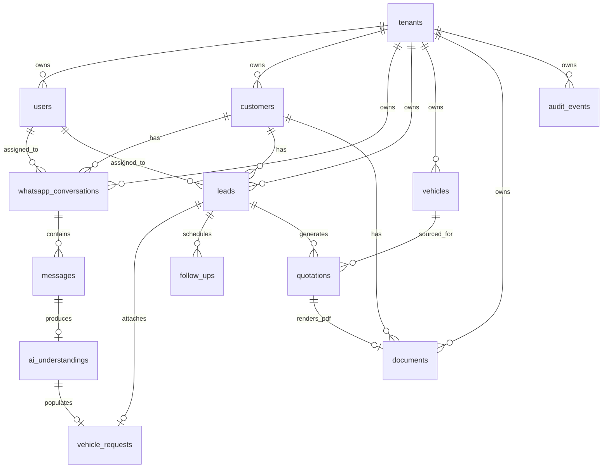
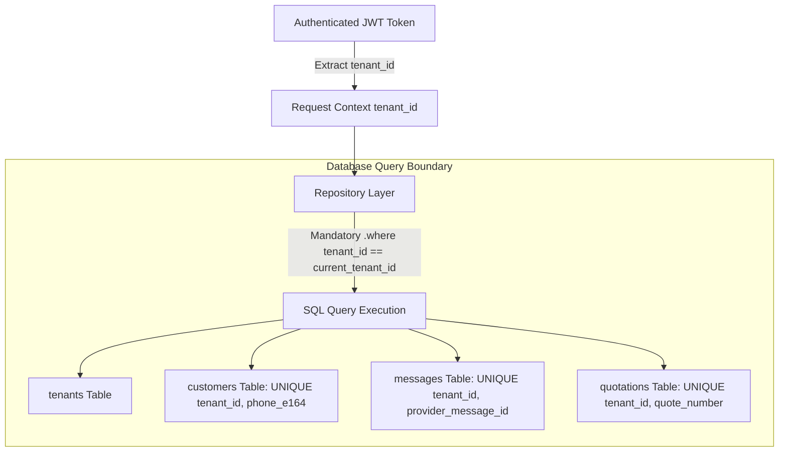
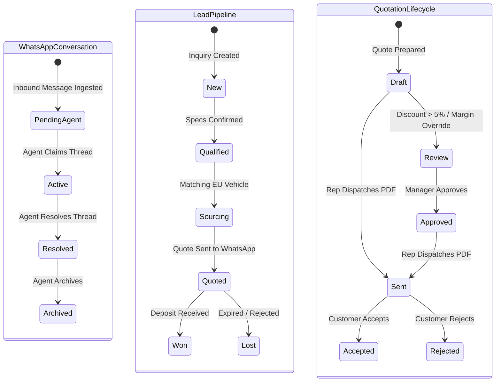
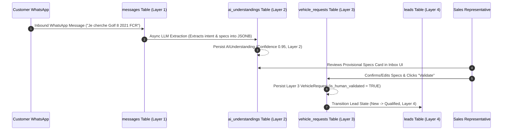

# Database Architecture & Design Specification

This document details the complete, authoritative PostgreSQL database design for **Car-Export-CRM**. It translates the product vision, user journeys, functional requirements, domain model, and security policies into a production-grade relational database architecture for the MVP.

---

## 1. Database Principles

1. **Relational Grounding**: Core business state is relationally modeled with strict column types, explicit foreign keys, NOT NULL constraints, and domain validation rules.
2. **Strict Multi-Tenant Row Isolation**: Every tenant-owned table contains a required `tenant_id` column. Queries, unique constraints, and indexes are scoped by tenant context (`BR-001`, `BR-002`).
3. **Financial Math Precision**: All monetary values use exact decimal representations (`NUMERIC(12, 2)` or `NUMERIC(15, 2)`). Floating-point data types (`FLOAT`, `REAL`) are strictly forbidden for pricing (`BR-005`).
4. **Non-Authoritative AI Provenance**: AI interpretations are stored as provisional records (`AIUnderstanding`) and never overwrite validated business entities directly (`INV-003`, `INV-006`).
5. **UUIDv7 Primary Key Uniformity**: Primary keys use time-ordered 128-bit UUIDv7 IDs for high B-Tree index locality, distributed generation, and protection against enumeration/IDOR attacks.
6. **Immutable Historical Records**: Messages, dispatched PDF quotes, and audit logs are append-only, immutable historical business records (`INV-005`, `INV-009`).

---

## 2. PostgreSQL Rationale

PostgreSQL is selected as the single primary database engine for Car-Export-CRM based on the following evaluation:

| Dimension | PostgreSQL Capability & Justification |
| :--- | :--- |
| **Transaction Integrity** | Full ACID compliance with serializable and read-committed isolation levels ensures transactional safety across multi-step lead and quote workflows. |
| **Relational Constraints** | Native foreign keys, composite unique constraints, check constraints, and non-null guarantees enforce domain invariants at the storage layer. |
| **JSONB Flexibility** | Binary JSONB storage allows schema-validated storage of WhatsApp webhook metadata and LLM extraction payloads with GIN index search capabilities without sacrificing relational rigor for core domain tables. |
| **Search Capabilities** | Built-in `pg_trgm` (trigram fuzzy matching for customer names and vehicles) and `tsvector` full-text search eliminate the need for Elasticsearch/OpenSearch in MVP. |
| **Scalability & Performance** | Handles tens of millions of rows per table effortlessly with B-Tree indexes, partial indexes, and horizontal connection pooling (pgBouncer). |

---

## 3. Domain → Database Mapping

### 3.1 Domain Aggregate & Entity to Table Mapping Matrix

| Domain Aggregate / Entity | Primary Database Table | Tenant Ownership | Persistence Responsibility |
| :--- | :--- | :--- | :--- |
| `Tenant` Aggregate Root | `tenants` | Self (Root Tenant) | Root organizational identity & settings |
| `User` Entity | `users` | `tenant_id` | Exporter employee accounts & RBAC roles |
| `Customer` Aggregate Root | `customers` | `tenant_id` | Customer master profile & E.164 phone identity |
| `WhatsAppConversation` Root | `whatsapp_conversations` | `tenant_id` | Messaging thread context & operational status |
| `Message` Entity | `messages` | `tenant_id` | Inbound & outbound chat message history |
| `AIUnderstanding` Value/Entity | `ai_understandings` | `tenant_id` | Provisional LLM extraction payloads & confidence |
| `VehicleRequest` Entity | `vehicle_requests` | `tenant_id` | Confirmed customer vehicle sourcing specifications |
| `Lead` Aggregate Root | `leads` | `tenant_id` | Primary sales opportunity state machine card |
| `Vehicle` Aggregate Root | `vehicles` | `tenant_id` | Sourced vehicle stock & pricing inventory records |
| `Quotation` Aggregate Root | `quotations` | `tenant_id` | Formal export quote breakdown & approval state |
| `FollowUp` Entity | `follow_ups` | `tenant_id` | Scheduled sales rep reminder tasks |
| `Document` Aggregate Root | `documents` | `tenant_id` | File metadata & private storage object keys |
| `AuditEvent` Aggregate Root | `audit_events` | `tenant_id` | Immutable security logs & audit trails |

### 3.2 Value Objects, Derived Data & Transient Storage Evaluation

| Domain Concept | Representation Strategy | Justification |
| :--- | :--- | :--- |
| `Money` (EUR, TND) | Flattened Relational Columns | Represented as `amount_eur NUMERIC(12, 2)` / `amount_tnd NUMERIC(12, 3)` in `quotations` and `vehicles`. No separate VO table needed. |
| `PhoneNumber` | Flattened Relational Columns | Represented as `phone_e164 VARCHAR(20)` and `display_phone_number VARCHAR(30)` in `customers`. |
| `VehicleSpecs` | Flattened Relational Columns | Represented as `make`, `model`, `min_year`, `max_year`, `fuel_type`, `transmission` columns in `vehicle_requests` and `vehicles`. |
| `AIConfidence` & `IntentType` | Relational Columns in `ai_understandings` | `intent VARCHAR(50)` and `confidence_score NUMERIC(4, 3)` relationally indexed for analytics. |
| Transient LLM Prompts | Not Stored in Relational Model | Raw prompts discarded after execution; structured outputs saved in `ai_understandings.extracted_payload` JSONB. |
| Operational Inbox Read Models | Cached Relational Columns | `whatsapp_conversations.last_message_at` and `unread_count` maintained for fast inbox listing queries. |

### 3.3 Architectural Rationale for Table Normalization & Granularity Decisions

To ensure full transparency for backend implementation, the design explicitly evaluates table normalization boundaries:

#### 1. Single `quotations` Table vs. `quotations` + `quotation_items`
- **Decision**: Single `quotations` table containing embedded vehicle pricing fields (`vehicle_id`, `vehicle_price_eur`, `vat_regime`, `shipping_fee_eur`, `transit_insurance_eur`, `custom_discount_eur`, `total_price_eur`, `estimated_customs_tnd`).
- **Rationale**: In the European-Tunisian car export market, a quotation is a package offer for a single specific vehicle exported to a buyer. Unlike general e-commerce selling multi-item shopping carts, car export deals are strictly 1-to-1 per quote. Flattening line items into `quotations` eliminates unneeded JOIN complexity, prevents orphaned item bugs, and guarantees atomic quote creation in a single table write. If multi-vehicle bundle quotes are introduced post-MVP, a separate `quotation_items` table can be extracted cleanly.

#### 2. Single `users` Table with Scalar `role` Column vs. `users` + `roles` + `user_roles`
- **Decision**: Single `users` table with a scalar `role VARCHAR(30)` column enforced by a `CHECK` constraint.
- **Rationale**: The product RBAC model defines 4 fixed, distinct user personas (`SuperAdmin`, `TenantAdmin`, `SalesAgent`, `LogisticsAgent`). Exporter employees hold exactly one primary functional role within a tenant organization. Storing `role` directly on `users` avoids 3-table JOIN overhead on every API authentication and request authorization check while guaranteeing strict type safety via database `CHECK` constraints.

#### 3. AI Persistence Granularity (`ai_understandings` vs. `vehicle_requests`)
- **Decision**: Two dedicated tables: `ai_understandings` (Layer 2 LLM suggestions) and `vehicle_requests` (Layer 3/4 human-confirmed business truth).
- **Rationale**: 
  - `ai_understandings` captures provisional, unvetted LLM extractions, intent classification, raw JSONB payloads, model names, and confidence scores.
  - `vehicle_requests` captures authoritative, rep-confirmed vehicle criteria (`is_human_validated = TRUE`, `confirmed_by_user_id`).
  - Storing provisional AI extractions separately from confirmed business truth guarantees that unvalidated LLM output can NEVER contaminate sales queries or export quote calculations (`INV-003`, `INV-006`). Creating additional sub-tables (`ai_suggestions`, `ai_confirmations`) was rejected as over-engineering because `ai_understandings` (Layer 2) and `vehicle_requests` (Layer 3/4) fully cover the provenance lifecycle.

---

## 4. Logical Schema Overview

---

## 5. Major Table Specifications

### 5.1 `tenants` Table
- **Purpose**: Root aggregate storing exporter organization profiles and account settings.
- **Primary Key**: `id` (`UUID`, UUIDv7)
- **Tenant Ownership**: N/A (Root table)
- **Columns**:
  - `id` (`UUID`, NOT NULL, PK)
  - `name` (`VARCHAR(100)`, NOT NULL) — Organization name (e.g. "AutoExport Hamburg GmbH").
  - `company_registration_number` (`VARCHAR(50)`, NULLABLE) — Commercial registry ID.
  - `country` (`VARCHAR(2)`, NOT NULL, DEFAULT 'DE') — ISO 3166-1 alpha-2 country code.
  - `whatsapp_phone_number_id` (`VARCHAR(50)`, NULLABLE, UNIQUE) — Meta WhatsApp Cloud API Phone Number ID.
  - `is_active` (`BOOLEAN`, NOT NULL, DEFAULT TRUE) — Account status.
  - `created_at` (`TIMESTAMPTZ`, NOT NULL, DEFAULT CURRENT_TIMESTAMP)
  - `updated_at` (`TIMESTAMPTZ`, NOT NULL, DEFAULT CURRENT_TIMESTAMP)
- **Uniqueness**: `UNIQUE (whatsapp_phone_number_id)`
- **Deletion Behavior**: Protected. Hard deletion disabled; setting `is_active = FALSE` suspends account.

### 5.2 `users` Table
- **Purpose**: Employee user accounts with authentication credentials and RBAC roles.
- **Primary Key**: `id` (`UUID`, UUIDv7)
- **Tenant Ownership**: `tenant_id` (`UUID`, NOT NULL, FK → `tenants.id`)
- **Columns**:
  - `id` (`UUID`, NOT NULL, PK)
  - `tenant_id` (`UUID`, NOT NULL, FK → `tenants.id` ON DELETE RESTRICT)
  - `email` (`VARCHAR(255)`, NOT NULL) — Lowercase user email.
  - `password_hash` (`VARCHAR(255)`, NOT NULL) — Argon2id / bcrypt hash string.
  - `full_name` (`VARCHAR(100)`, NOT NULL)
  - `role` (`VARCHAR(30)`, NOT NULL) — Enum (`SuperAdmin`, `TenantAdmin`, `SalesAgent`, `LogisticsAgent`).
  - `is_active` (`BOOLEAN`, NOT NULL, DEFAULT TRUE)
  - `last_login_at` (`TIMESTAMPTZ`, NULLABLE)
  - `created_at` (`TIMESTAMPTZ`, NOT NULL, DEFAULT CURRENT_TIMESTAMP)
  - `updated_at` (`TIMESTAMPTZ`, NOT NULL, DEFAULT CURRENT_TIMESTAMP)
- **Uniqueness**: `UNIQUE (tenant_id, email)`
- **Constraints**: `CHECK (role IN ('SuperAdmin', 'TenantAdmin', 'SalesAgent', 'LogisticsAgent'))`
- **Deletion Behavior**: Soft delete (`is_active = FALSE`). Disables access per `FR-AUTH-002`.

### 5.3 `customers` Table
- **Purpose**: Master buyer directory storing normalized E.164 phone numbers and FCR eligibility status.
- **Primary Key**: `id` (`UUID`, UUIDv7)
- **Tenant Ownership**: `tenant_id` (`UUID`, NOT NULL, FK → `tenants.id`)
- **Columns**:
  - `id` (`UUID`, NOT NULL, PK)
  - `tenant_id` (`UUID`, NOT NULL, FK → `tenants.id` ON DELETE RESTRICT)
  - `phone_e164` (`VARCHAR(20)`, NOT NULL) — E.164 normalized phone (e.g. `+21698123456`).
  - `whatsapp_id` (`VARCHAR(30)`, NOT NULL) — Raw WhatsApp wa_id (e.g. `21698123456`).
  - `full_name` (`VARCHAR(100)`, NULLABLE) — Customer display name.
  - `preferred_language` (`VARCHAR(5)`, NOT NULL, DEFAULT 'fr') — ISO language (`fr`, `ar_tn`, `en`).
  - `fcr_eligible` (`BOOLEAN`, NOT NULL, DEFAULT FALSE) — Tunisia FCR privilege indicator.
  - `notes` (`TEXT`, NULLABLE) — Agent manual notes.
  - `created_at` (`TIMESTAMPTZ`, NOT NULL, DEFAULT CURRENT_TIMESTAMP)
  - `updated_at` (`TIMESTAMPTZ`, NOT NULL, DEFAULT CURRENT_TIMESTAMP)
- **Uniqueness**: `UNIQUE (tenant_id, phone_e164)`
- **Constraints**: `CHECK (preferred_language IN ('fr', 'ar_tn', 'en'))`
- **Deletion Behavior**: RESTRICT on FKs. Preserves customer identity for legal/historical records.

### 5.4 `whatsapp_conversations` Table
- **Purpose**: Operational WhatsApp chat thread context tying together chat messages, assigned agent, and inbox state.
- **Primary Key**: `id` (`UUID`, UUIDv7)
- **Tenant Ownership**: `tenant_id` (`UUID`, NOT NULL, FK → `tenants.id`)
- **Columns**:
  - `id` (`UUID`, NOT NULL, PK)
  - `tenant_id` (`UUID`, NOT NULL, FK → `tenants.id` ON DELETE RESTRICT)
  - `customer_id` (`UUID`, NOT NULL, FK → `customers.id` ON DELETE RESTRICT)
  - `assigned_agent_id` (`UUID`, NULLABLE, FK → `users.id` ON DELETE SET NULL)
  - `status` (`VARCHAR(30)`, NOT NULL, DEFAULT 'PendingAgent') — Enum (`PendingAgent`, `Active`, `Resolved`, `Archived`).
  - `last_message_at` (`TIMESTAMPTZ`, NOT NULL, DEFAULT CURRENT_TIMESTAMP)
  - `unread_count` (`INTEGER`, NOT NULL, DEFAULT 0)
  - `created_at` (`TIMESTAMPTZ`, NOT NULL, DEFAULT CURRENT_TIMESTAMP)
  - `updated_at` (`TIMESTAMPTZ`, NOT NULL, DEFAULT CURRENT_TIMESTAMP)
- **Uniqueness**: `UNIQUE (tenant_id, customer_id)` (One active conversation thread per customer per tenant).
- **Constraints**: `CHECK (status IN ('PendingAgent', 'Active', 'Resolved', 'Archived'))`

### 5.5 `messages` Table
- **Purpose**: Append-only storage of inbound and outbound WhatsApp chat messages.
- **Primary Key**: `id` (`UUID`, UUIDv7)
- **Tenant Ownership**: `tenant_id` (`UUID`, NOT NULL, FK → `tenants.id`)
- **Columns**:
  - `id` (`UUID`, NOT NULL, PK)
  - `tenant_id` (`UUID`, NOT NULL, FK → `tenants.id` ON DELETE RESTRICT)
  - `conversation_id` (`UUID`, NOT NULL, FK → `whatsapp_conversations.id` ON DELETE CASCADE)
  - `provider_message_id` (`VARCHAR(100)`, NOT NULL) — Meta `wamid` string for deduplication (`BR-008`).
  - `direction` (`VARCHAR(10)`, NOT NULL) — Enum (`Inbound`, `Outbound`).
  - `sender_type` (`VARCHAR(10)`, NOT NULL) — Enum (`Customer`, `Agent`, `System`).
  - `sender_user_id` (`UUID`, NULLABLE, FK → `users.id` ON DELETE SET NULL)
  - `message_type` (`VARCHAR(20)`, NOT NULL, DEFAULT 'text') — Enum (`text`, `image`, `document`, `audio`).
  - `content` (`TEXT`, NOT NULL) — Message body text or caption.
  - `media_url` (`TEXT`, NULLABLE) — Private media storage path if applicable.
  - `delivery_status` (`VARCHAR(20)`, NOT NULL, DEFAULT 'Sent') — Enum (`Sent`, `Delivered`, `Read`, `Failed`).
  - `metadata` (`JSONB`, NOT NULL, DEFAULT '{}'::jsonb) — Raw webhook metadata.
  - `created_at` (`TIMESTAMPTZ`, NOT NULL, DEFAULT CURRENT_TIMESTAMP)
- **Uniqueness**: `UNIQUE (tenant_id, provider_message_id)`
- **Constraints**: `CHECK (direction IN ('Inbound', 'Outbound'))`, `CHECK (sender_type IN ('Customer', 'Agent', 'System'))`
- **Deletion Behavior**: Immutable. Deletions strictly forbidden to maintain audit integrity.

### 5.6 `ai_understandings` Table
- **Purpose**: Provisional Layer 2 AI extractions, intent classification, and confidence scoring.
- **Primary Key**: `id` (`UUID`, UUIDv7)
- **Tenant Ownership**: `tenant_id` (`UUID`, NOT NULL, FK → `tenants.id`)
- **Columns**:
  - `id` (`UUID`, NOT NULL, PK)
  - `tenant_id` (`UUID`, NOT NULL, FK → `tenants.id` ON DELETE RESTRICT)
  - `message_id` (`UUID`, NOT NULL, FK → `messages.id` ON DELETE CASCADE)
  - `intent` (`VARCHAR(50)`, NOT NULL) — Enum (`SOURCING_INQUIRY`, `PRICE_CHECK`, `FCR_CUSTOMS_INQUIRY`, `SHIPPING_STATUS`, `GENERAL_QUESTION`).
  - `extracted_payload` (`JSONB`, NOT NULL) — Pydantic schema validation output (`VehicleRequestExtraction`).
  - `confidence_score` (`NUMERIC(4, 3)`, NOT NULL) — Float value between 0.000 and 1.000.
  - `detected_language` (`VARCHAR(5)`, NOT NULL, DEFAULT 'fr')
  - `summary_fr` (`TEXT`, NOT NULL) — One-sentence French inbox summary.
  - `model_name` (`VARCHAR(50)`, NOT NULL) — LLM provider model string (e.g. `gpt-4o-mini`).
  - `prompt_version` (`VARCHAR(20)`, NOT NULL) — Version string (e.g. `v1.2`).
  - `created_at` (`TIMESTAMPTZ`, NOT NULL, DEFAULT CURRENT_TIMESTAMP)
- **Constraints**: `CHECK (confidence_score >= 0.000 AND confidence_score <= 1.000)`
- **Deletion Behavior**: Retained for model tuning and auditing.

### 5.7 `vehicle_requests` Table
- **Purpose**: Layer 3/4 confirmed customer vehicle sourcing specs (Make, Model, Year, Fuel, Budget, FCR).
- **Primary Key**: `id` (`UUID`, UUIDv7)
- **Tenant Ownership**: `tenant_id` (`UUID`, NOT NULL, FK → `tenants.id`)
- **Columns**:
  - `id` (`UUID`, NOT NULL, PK)
  - `tenant_id` (`UUID`, NOT NULL, FK → `tenants.id` ON DELETE RESTRICT)
  - `customer_id` (`UUID`, NOT NULL, FK → `customers.id` ON DELETE RESTRICT)
  - `ai_understanding_id` (`UUID`, NULLABLE, FK → `ai_understandings.id` ON DELETE SET NULL)
  - `make` (`VARCHAR(50)`, NOT NULL) — e.g. "Volkswagen".
  - `model` (`VARCHAR(50)`, NOT NULL) — e.g. "Golf 8".
  - `min_year` (`INTEGER`, NULLABLE) — e.g. 2021.
  - `max_year` (`INTEGER`, NULLABLE)
  - `fuel_type` (`VARCHAR(20)`, NULLABLE) — Enum (`Diesel`, `Petrol`, `Hybrid`, `Electric`).
  - `transmission` (`VARCHAR(20)`, NULLABLE) — Enum (`Automatic`, `Manual`).
  - `max_mileage_km` (`INTEGER`, NULLABLE)
  - `budget_eur` (`NUMERIC(12, 2)`, NULLABLE) — Max budget stated in Euros.
  - `fcr_required` (`BOOLEAN`, NOT NULL, DEFAULT FALSE) — Requires Tunisia FCR 5-year compliance (`BR-004`).
  - `destination_port` (`VARCHAR(50)`, NOT NULL, DEFAULT 'Rades') — Default 'Rades' or 'La Goulette'.
  - `is_human_validated` (`BOOLEAN`, NOT NULL, DEFAULT FALSE) — Layer 3 HITL validation flag.
  - `confirmed_by_user_id` (`UUID`, NULLABLE, FK → `users.id` ON DELETE SET NULL)
  - `confirmed_at` (`TIMESTAMPTZ`, NULLABLE)
  - `created_at` (`TIMESTAMPTZ`, NOT NULL, DEFAULT CURRENT_TIMESTAMP)
  - `updated_at` (`TIMESTAMPTZ`, NOT NULL, DEFAULT CURRENT_TIMESTAMP)

### 5.8 `leads` Table
- **Purpose**: Core sales opportunity pipeline card tracking buyer qualification, state, and assigned sales rep.
- **Primary Key**: `id` (`UUID`, UUIDv7)
- **Tenant Ownership**: `tenant_id` (`UUID`, NOT NULL, FK → `tenants.id`)
- **Columns**:
  - `id` (`UUID`, NOT NULL, PK)
  - `tenant_id` (`UUID`, NOT NULL, FK → `tenants.id` ON DELETE RESTRICT)
  - `customer_id` (`UUID`, NOT NULL, FK → `customers.id` ON DELETE RESTRICT)
  - `vehicle_request_id` (`UUID`, NULLABLE, FK → `vehicle_requests.id` ON DELETE SET NULL)
  - `assigned_agent_id` (`UUID`, NULLABLE, FK → `users.id` ON DELETE SET NULL)
  - `status` (`VARCHAR(20)`, NOT NULL, DEFAULT 'New') — Pipeline Enum (`New`, `Qualified`, `Sourcing`, `Quoted`, `Won`, `Lost`).
  - `priority` (`VARCHAR(10)`, NOT NULL, DEFAULT 'Medium') — Enum (`Low`, `Medium`, `High`, `Urgent`).
  - `lost_reason` (`VARCHAR(50)`, NULLABLE) — Enum (`Out of Budget`, `Bought Locally`, `Unresponsive`, `FCR Ineligible`, `Other`).
  - `closed_at` (`TIMESTAMPTZ`, NULLABLE)
  - `created_at` (`TIMESTAMPTZ`, NOT NULL, DEFAULT CURRENT_TIMESTAMP)
  - `updated_at` (`TIMESTAMPTZ`, NOT NULL, DEFAULT CURRENT_TIMESTAMP)
- **Constraints**: `CHECK (status IN ('New', 'Qualified', 'Sourcing', 'Quoted', 'Won', 'Lost'))`

### 5.9 `vehicles` Table
- **Purpose**: Sourced vehicle stock inventory details, VIN, location, and European VAT regime status.
- **Primary Key**: `id` (`UUID`, UUIDv7)
- **Tenant Ownership**: `tenant_id` (`UUID`, NOT NULL, FK → `tenants.id`)
- **Columns**:
  - `id` (`UUID`, NOT NULL, PK)
  - `tenant_id` (`UUID`, NOT NULL, FK → `tenants.id` ON DELETE RESTRICT)
  - `vin` (`VARCHAR(17)`, NULLABLE) — Vehicle Identification Number.
  - `make` (`VARCHAR(50)`, NOT NULL)
  - `model` (`VARCHAR(50)`, NOT NULL)
  - `first_registration_year` (`INTEGER`, NOT NULL) — Registration year for FCR 5-year check.
  - `mileage_km` (`INTEGER`, NOT NULL)
  - `fuel_type` (`VARCHAR(20)`, NOT NULL)
  - `transmission` (`VARCHAR(20)`, NOT NULL)
  - `purchase_price_eur` (`NUMERIC(12, 2)`, NOT NULL) — Purchase/cost price in EUR.
  - `vat_regime` (`VARCHAR(20)`, NOT NULL) — Enum (`Netto_Export`, `Brutto_Margin`).
  - `supplier_name` (`VARCHAR(100)`, NULLABLE) — European dealership/source.
  - `supplier_location` (`VARCHAR(100)`, NULLABLE) — e.g. "Munich, Germany".
  - `status` (`VARCHAR(20)`, NOT NULL, DEFAULT 'Available') — Enum (`Available`, `Reserved`, `Sold`, `Archived`).
  - `created_at` (`TIMESTAMPTZ`, NOT NULL, DEFAULT CURRENT_TIMESTAMP)
  - `updated_at` (`TIMESTAMPTZ`, NOT NULL, DEFAULT CURRENT_TIMESTAMP)
- **Constraints**: `CHECK (vat_regime IN ('Netto_Export', 'Brutto_Margin'))`

### 5.10 `quotations` Table
- **Purpose**: Formal export quote calculation aggregate, pricing breakdown, and PDF approval lifecycle state.
- **Primary Key**: `id` (`UUID`, UUIDv7)
- **Tenant Ownership**: `tenant_id` (`UUID`, NOT NULL, FK → `tenants.id`)
- **Columns**:
  - `id` (`UUID`, NOT NULL, PK)
  - `tenant_id` (`UUID`, NOT NULL, FK → `tenants.id` ON DELETE RESTRICT)
  - `lead_id` (`UUID`, NOT NULL, FK → `leads.id` ON DELETE RESTRICT)
  - `vehicle_id` (`UUID`, NOT NULL, FK → `vehicles.id` ON DELETE RESTRICT)
  - `created_by_user_id` (`UUID`, NOT NULL, FK → `users.id` ON DELETE RESTRICT)
  - `approved_by_user_id` (`UUID`, NULLABLE, FK → `users.id` ON DELETE SET NULL)
  - `quote_number` (`VARCHAR(50)`, NOT NULL) — Human-readable ID (e.g. `QT-2026-0042`).
  - `vehicle_price_eur` (`NUMERIC(12, 2)`, NOT NULL)
  - `vat_regime` (`VARCHAR(20)`, NOT NULL) — Enum (`Netto_Export`, `Brutto_Margin`).
  - `shipping_fee_eur` (`NUMERIC(12, 2)`, NOT NULL, DEFAULT 0.00)
  - `transit_insurance_eur` (`NUMERIC(12, 2)`, NOT NULL, DEFAULT 0.00)
  - `custom_discount_eur` (`NUMERIC(12, 2)`, NOT NULL, DEFAULT 0.00)
  - `total_price_eur` (`NUMERIC(12, 2)`, NOT NULL) — Final total in EUR.
  - `estimated_customs_tnd` (`NUMERIC(12, 3)`, NOT NULL) — Informational customs estimate in TND (`BR-006`).
  - `status` (`VARCHAR(20)`, NOT NULL, DEFAULT 'Draft') — Enum (`Draft`, `Review`, `Approved`, `Sent`, `Accepted`, `Rejected`, `Expired`, `Cancelled`).
  - `valid_until` (`DATE`, NOT NULL) — Expiry date (default 14 days).
  - `pdf_document_id` (`UUID`, NULLABLE, FK → `documents.id` ON DELETE SET NULL)
  - `created_at` (`TIMESTAMPTZ`, NOT NULL, DEFAULT CURRENT_TIMESTAMP)
  - `updated_at` (`TIMESTAMPTZ`, NOT NULL, DEFAULT CURRENT_TIMESTAMP)
- **Uniqueness**: `UNIQUE (tenant_id, quote_number)`
- **Constraints**: `CHECK (total_price_eur >= 0.00)`, `CHECK (status IN ('Draft', 'Review', 'Approved', 'Sent', 'Accepted', 'Rejected', 'Expired', 'Cancelled'))`

### 5.11 `follow_ups` Table
- **Purpose**: Sales rep reminder tasks attached to leads.
- **Primary Key**: `id` (`UUID`, UUIDv7)
- **Tenant Ownership**: `tenant_id` (`UUID`, NOT NULL, FK → `tenants.id`)
- **Columns**:
  - `id` (`UUID`, NOT NULL, PK)
  - `tenant_id` (`UUID`, NOT NULL, FK → `tenants.id` ON DELETE RESTRICT)
  - `lead_id` (`UUID`, NOT NULL, FK → `leads.id` ON DELETE CASCADE)
  - `assigned_agent_id` (`UUID`, NOT NULL, FK → `users.id` ON DELETE RESTRICT)
  - `due_at` (`TIMESTAMPTZ`, NOT NULL) — Scheduled execution timestamp.
  - `status` (`VARCHAR(20)`, NOT NULL, DEFAULT 'Pending') — Enum (`Pending`, `Completed`, `Overdue`, `Cancelled`).
  - `notes` (`TEXT`, NULLABLE)
  - `completed_at` (`TIMESTAMPTZ`, NULLABLE)
  - `created_at` (`TIMESTAMPTZ`, NOT NULL, DEFAULT CURRENT_TIMESTAMP)
  - `updated_at` (`TIMESTAMPTZ`, NOT NULL, DEFAULT CURRENT_TIMESTAMP)

### 5.12 `documents` Table
- **Purpose**: Export file metadata, S3 storage object keys, and malware scan status.
- **Primary Key**: `id` (`UUID`, UUIDv7)
- **Tenant Ownership**: `tenant_id` (`UUID`, NOT NULL, FK → `tenants.id`)
- **Columns**:
  - `id` (`UUID`, NOT NULL, PK)
  - `tenant_id` (`UUID`, NOT NULL, FK → `tenants.id` ON DELETE RESTRICT)
  - `customer_id` (`UUID`, NULLABLE, FK → `customers.id` ON DELETE SET NULL)
  - `uploaded_by_user_id` (`UUID`, NOT NULL, FK → `users.id` ON DELETE RESTRICT)
  - `document_type` (`VARCHAR(30)`, NOT NULL) — Enum (`CarteGrise`, `FCRCertificate`, `QuotePDF`, `ExportInvoice`, `VehiclePhoto`).
  - `storage_path` (`VARCHAR(500)`, NOT NULL) — Private S3 storage key.
  - `file_name` (`VARCHAR(255)`, NOT NULL) — Original filename.
  - `mime_type` (`VARCHAR(100)`, NOT NULL) — e.g. `application/pdf`.
  - `file_size_bytes` (`BIGINT`, NOT NULL)
  - `checksum_sha256` (`VARCHAR(64)`, NOT NULL) — SHA-256 integrity hash.
  - `malware_scan_status` (`VARCHAR(20)`, NOT NULL, DEFAULT 'Pending') — Enum (`Pending`, `Clean`, `Infected`).
  - `created_at` (`TIMESTAMPTZ`, NOT NULL, DEFAULT CURRENT_TIMESTAMP)

### 5.13 `audit_events` Table
- **Purpose**: Immutable security audit trail logging state mutations, dispatches, and role actions (`BR-016`).
- **Primary Key**: `id` (`UUID`, UUIDv7)
- **Tenant Ownership**: `tenant_id` (`UUID`, NOT NULL, FK → `tenants.id`)
- **Columns**:
  - `id` (`UUID`, NOT NULL, PK)
  - `tenant_id` (`UUID`, NOT NULL, FK → `tenants.id` ON DELETE RESTRICT)
  - `user_id` (`UUID`, NULLABLE, FK → `users.id` ON DELETE SET NULL) — NULL for system/webhook actions.
  - `action` (`VARCHAR(50)`, NOT NULL) — Event type (e.g. `QUOTE_DISPATCHED`, `CUSTOMER_UPDATED`).
  - `resource_type` (`VARCHAR(50)`, NOT NULL) — Target aggregate (e.g. `Quotation`, `Customer`).
  - `resource_id` (`UUID`, NULLABLE) — Target aggregate primary key.
  - `payload_before` (`JSONB`, NULLABLE) — Pre-mutation state delta.
  - `payload_after` (`JSONB`, NULLABLE) — Post-mutation state delta.
  - `ip_address` (`VARCHAR(45)`, NULLABLE) — Client IP address.
  - `user_agent` (`TEXT`, NULLABLE)
  - `correlation_id` (`VARCHAR(100)`, NOT NULL) — Request correlation UUID.
  - `created_at` (`TIMESTAMPTZ`, NOT NULL, DEFAULT CURRENT_TIMESTAMP)
- **Deletion Behavior**: Immutable append-only log. DB-level permissions restrict `UPDATE` and `DELETE`.

---

## 6. Relationships & Cascading Deletion Rules

| Parent Table | Child Table | Relationship | FK Constraint Name | On Delete Action | Rationale |
| :--- | :--- | :--- | :--- | :--- | :--- |
| `tenants` | `users` | 1-to-Many | `fk_users_tenant` | `RESTRICT` | Tenant cannot be dropped with active users. |
| `tenants` | `customers` | 1-to-Many | `fk_customers_tenant` | `RESTRICT` | Protects customer master records. |
| `customers` | `whatsapp_conversations` | 1-to-1 / 1-to-Many | `fk_conversations_customer` | `RESTRICT` | Chat history preserved for customer profile. |
| `whatsapp_conversations` | `messages` | 1-to-Many | `fk_messages_conversation` | `CASCADE` | Messages belong exclusively to parent conversation thread. |
| `messages` | `ai_understandings` | 1-to-1 | `fk_ai_message` | `CASCADE` | AI extraction tied directly to source message. |
| `ai_understandings` | `vehicle_requests` | 1-to-1 | `fk_vreq_ai` | `SET NULL` | Preserves confirmed request even if raw AI record is purged. |
| `customers` | `leads` | 1-to-Many | `fk_leads_customer` | `RESTRICT` | Sales leads must remain traceable. |
| `leads` | `quotations` | 1-to-Many | `fk_quotes_lead` | `RESTRICT` | Historical export quotes MUST NEVER be cascade deleted (`INV-005`). |
| `vehicles` | `quotations` | 1-to-Many | `fk_quotes_vehicle` | `RESTRICT` | Quotations preserve historical vehicle price link. |
| `leads` | `follow_ups` | 1-to-Many | `fk_followups_lead` | `CASCADE` | Follow-up reminders deleted if lead is hard deleted. |

---

## 7. Tenant Isolation Architecture

### Multi-Tenancy Invariants & Isolation Controls:
1. **Tenant ID Column**: Every tenant-owned table MUST include `tenant_id: UUID NOT NULL REFERENCES tenants(id)`.
2. **Context Resolution**: `tenant_id` is populated exclusively from authenticated JWT claims (`BR-001`). Client payload parameters are discarded.
3. **Tenant-Scoped Uniqueness**: Natural keys enforce tenant scope:
   - `customers`: `UNIQUE (tenant_id, phone_e164)`
   - `messages`: `UNIQUE (tenant_id, provider_message_id)`
   - `quotations`: `UNIQUE (tenant_id, quote_number)`
   - `users`: `UNIQUE (tenant_id, email)`
4. **Repository Enforcement**: Base repository layer enforces `.where(Model.tenant_id == current_tenant_id)` on all reads/writes.
5. **Cross-Tenant Prevention**: Accessing resource ID of Tenant B under Tenant A identity returns `HTTP 404 Not Found` (`AC-01`).

---

## 8. Identifier Strategy (UUIDv7)

All primary keys use **UUIDv7** (RFC 9562).

### Technical Specification:
- **Format**: 128-bit time-ordered UUID (`018f4b29-a109-7bc3-89bd-2b0d7b3dcb6d`).
- **Structure**:
  - Bits 0–47: 48-bit UNIX millisecond timestamp.
  - Bits 48–51: Version field (`0111` = 7).
  - Bits 52–63: 12-bit sequence counter for sub-millisecond ordering.
  - Bits 64–65: Variant field (`10`).
  - Bits 66–127: 62 cryptographically strong pseudo-random bits.

### Performance & Security Evaluation:
- **B-Tree Index Performance**: Monotonically increasing timestamps cluster new inserts on the right side of index pages, eliminating random disk I/O and index fragmentation.
- **Security**: 62 random bits prevent ID enumeration attacks across public API endpoints.
- **Distributed Generation**: Application servers generate IDs concurrently without database sequence locks.

### Implementation Compatibility Specifications for Backend Developers:
1. **Generation Responsibility**: Primary keys MUST be generated in the **application layer** (Python FastAPI/SQLAlchemy service handlers or domain constructors) using a standard UUIDv7 generator (`uuid6.uuid7()` or Python 3.13+ `uuid.uuid7()`) before persisting objects. This allows aggregate roots to construct child entity references in memory prior to executing database `flush()` or `commit()`.
2. **PostgreSQL Column Representation**: All primary key and foreign key columns use PostgreSQL native `uuid` data type (16 bytes binary storage).
3. **SQLAlchemy 2.0 ORM Binding**: SQLAlchemy models declare primary keys as:
   `id: Mapped[py_uuid.UUID] = mapped_column(PG_UUID(as_uuid=True), primary_key=True, default=generate_uuidv7)`
4. **Scope & Exceptions**:
   - All 13 primary entity tables use UUIDv7 primary keys.
   - Natural external IDs (Meta WhatsApp `provider_message_id` / `wamid`, vehicle `vin`, human quote numbers `QT-2026-0042`) are stored in separate indexed `VARCHAR` columns alongside the UUIDv7 primary key.
5. **No Business Semantics from Primary Key Timestamps**:
   - Although UUIDv7 embeds a 48-bit UNIX millisecond timestamp for B-Tree index locality, business logic, API filters, and audit queries MUST NEVER extract timestamps from `id`.
   - All temporal query filtering MUST rely strictly on explicit `created_at TIMESTAMPTZ` and `updated_at TIMESTAMPTZ` columns.

---

## 9. Database Integrity Constraints

### 9.1 Valid State Enums (`CHECK` Constraints)
- `users`: `CHECK (role IN ('SuperAdmin', 'TenantAdmin', 'SalesAgent', 'LogisticsAgent'))`
- `customers`: `CHECK (preferred_language IN ('fr', 'ar_tn', 'en'))`
- `whatsapp_conversations`: `CHECK (status IN ('PendingAgent', 'Active', 'Resolved', 'Archived'))`
- `messages`: `CHECK (direction IN ('Inbound', 'Outbound')) AND CHECK (sender_type IN ('Customer', 'Agent', 'System'))`
- `leads`: `CHECK (status IN ('New', 'Qualified', 'Sourcing', 'Quoted', 'Won', 'Lost'))`
- `vehicles`: `CHECK (vat_regime IN ('Netto_Export', 'Brutto_Margin'))`
- `quotations`: `CHECK (status IN ('Draft', 'Review', 'Approved', 'Sent', 'Accepted', 'Rejected', 'Expired', 'Cancelled'))`

### 9.2 Financial & Domain Range Constraints
- `quotations`: `CHECK (total_price_eur >= 0.00)`
- `vehicles`: `CHECK (purchase_price_eur >= 0.00 AND first_registration_year >= 1900)`
- `ai_understandings`: `CHECK (confidence_score >= 0.000 AND confidence_score <= 1.000)`

---

## 10. Indexing Strategy

Compound indexes are structured to prioritize `tenant_id` filtering first, followed by query search attributes:

| Target Table | Index Name | Column Specification | Query Pattern Supported |
| :--- | :--- | :--- | :--- |
| `customers` | `idx_customers_tenant_phone` | `(tenant_id, phone_e164)` | Fast customer lookup by phone number |
| `whatsapp_conversations` | `idx_conv_tenant_status_updated` | `(tenant_id, status, last_message_at DESC)` | Operational Inbox filter & tab ordering |
| `messages` | `idx_messages_conv_created` | `(conversation_id, created_at ASC)` | Thread chat history retrieval |
| `messages` | `idx_messages_tenant_wamid` | `(tenant_id, provider_message_id)` | Meta `wamid` webhook deduplication |
| `leads` | `idx_leads_tenant_status` | `(tenant_id, status, updated_at DESC)` | Pipeline Kanban board queries |
| `follow_ups` | `idx_followups_tenant_due` | `(tenant_id, status, due_at ASC)` | Due follow-up reminder alerts |
| `quotations` | `idx_quotes_tenant_status` | `(tenant_id, status, created_at DESC)` | Quote listing & approval queue |
| `vehicles` | `idx_vehicles_tenant_search` | `(tenant_id, status, make, model)` | Operational vehicle sourcing search |
| `audit_events` | `idx_audit_tenant_action` | `(tenant_id, created_at DESC)` | Manager audit trail queries |

---

## 11. Search Strategy

PostgreSQL provides all necessary search capabilities for MVP without requiring external search engines (Elasticsearch):

1. **Exact Phone & Identity Search**: B-Tree composite index `(tenant_id, phone_e164)` in `< 1 ms`.
2. **Fuzzy Customer & Vehicle Search**: PostgreSQL `pg_trgm` extension trigram indexes on `customers.full_name` and `vehicles.model` for fast `ILIKE` pattern matching.
3. **Full-Text Message Search**: PostgreSQL `tsvector`GIN index on `messages.content` using French dictionary configuration for message keyword queries.

---

## 12. State Machine Persistence

State transitions are validated at application layer inside aggregate domain methods and protected at database level via `CHECK` constraints on status columns.

---

## 13. AI Persistence & Provenance Flow

---

## 14. Documents & Object Storage Integration

1. **Binary Blob Exclusion**: Document files (*Carte Grise*, *FCR* certificates, Quote PDFs) are stored in private S3 bucket storage.
2. **Metadata Storage**: `documents` table stores S3 object key (`storage_path`), SHA-256 checksum, MIME type, and malware scan status.
3. **Access Control**: Served exclusively via short-lived pre-signed URLs with a 15-minute expiration time (`BR-013`, `INV-008`).

---

## 15. Audit Event Architecture

1. **Immutability**: `audit_events` table is append-only. DB grants restrict `UPDATE` and `DELETE`.
2. **State Delta Tracking**: Mutating actions store `payload_before` and `payload_after` JSONB snapshots for complete historical diffing.
3. **Sanitization**: Passwords, authentication tokens, and sensitive financial secrets are scrubbed before writing audit records.

---

## 16. Transaction Boundaries & Async Idempotency

### Transaction Rules:
1. **Webhook Ingestion**:
   - Transaction 1: Insert `messages` record + Update `whatsapp_conversations` status & timestamps → **COMMIT**.
   - Return `HTTP 200 OK` to Meta Cloud API within < 200 ms.
2. **AI Background Processing**:
   - Task Dequeue → Execute LLM Provider call (Outside DB Transaction).
   - Transaction 2: Insert `ai_understandings` record → **COMMIT**.
3. **Quotation Dispatch**:
   - Transaction 3: Validate pricing → Insert `quotations` record → Render PDF → Insert `documents` metadata → Create `audit_events` → **COMMIT**.
   - Outbound WhatsApp API call executed after transaction commit.

---

## 17. Concurrency Control

- **Duplicate Webhooks**: Prevented via `UNIQUE (tenant_id, provider_message_id)` constraint on `messages`. Duplicate deliveries execute `ON CONFLICT DO NOTHING`.
- **Concurrent Agent Thread Claims**: Prevented via optimistic locking on `whatsapp_conversations` or `UPDATE ... WHERE assigned_agent_id IS NULL`.
- **Follow-up Processing**: Worker locks pending follow-ups using `SELECT ... FOR UPDATE SKIP LOCKED`.

---

## 18. Retention, Soft Delete & GDPR Compliance

- **Soft Delete**: Applied to `users` (`is_active = FALSE`) and `vehicles` (`status = 'Archived'`).
- **Hard Retention Rules**:
  - `messages` and `quotations`: Retained for 5 years per European commercial export record laws.
  - `audit_events`: Immutable retention for 3 years.
  - Customer GDPR Erasure: Executed via explicit anonymization (`phone_e164` anonymized, PII cleared) while retaining historical quote numbers and revenue accounting metadata.

---

## 19. Future Alembic Migration Guidelines

1. **Single Migration Head**: All schema updates MUST maintain a clean linear Alembic revision history.
2. **Safe Production Migrations**:
   - Step 1: Add new column as NULLABLE or with DEFAULT.
   - Step 2: Deploy application code writing to new column.
   - Step 3: Backfill data and apply NOT NULL constraint in separate migration.
3. **Index Creation**: Add indexes using `CREATE INDEX CONCURRENTLY` to prevent blocking production writes.

---

## 20. Performance & Scalability Assumptions

- **MVP Target Scale**:
  - 100 active tenants.
  - 10,000 customers per tenant (~1M total customers).
  - 500,000 messages per tenant (~50M total messages).
- **Storage Profile**: ~50GB total database size for MVP target. Single primary PostgreSQL instance with 4 vCPU / 16GB RAM handles workload effortlessly.

---

## 21. Backup & Recovery Strategy

- **Automated Daily Backups**: Full database snapshot taken nightly and copied to geo-redundant storage.
- **Write-Ahead Log (WAL) Archiving**: Continuous WAL archiving enables Point-in-Time Recovery (PITR) with a Recovery Point Objective (RPO) < 5 minutes.
- **Recovery Time Objective (RTO)**: Target < 1 hour for full database restoration.

---

## 22. Database Security Review Checklist

- [x] **Multi-tenant isolation**: Every tenant table has `tenant_id` FK and composite unique constraints (`BR-001`, `BR-002`).
- [x] **No default client trust**: `tenant_id` derived exclusively from authenticated JWT tokens.
- [x] **Enumeration defense**: All entities use random-looking UUIDv7 primary keys.
- [x] **PII protection**: Phone numbers normalized; pre-signed URLs enforced for document access.
- [x] **Financial integrity**: Decimal `NUMERIC` types enforced on all monetary fields.
- [x] **AI safety**: AI outputs marked non-authoritative in Layer 2; human confirmation required before business state mutation.
- [x] **Audit integrity**: Security actions log immutable `audit_events`.

---

## 23. Requirements & Domain Traceability Matrix

| Requirement ID | Domain Aggregate | Database Table(s) | Enforcing Constraint / Index |
| :--- | :--- | :--- | :--- |
| `FR-AUTH-001` | `Tenant`, `User` | `tenants`, `users` | `UNIQUE (tenant_id, email)` |
| `FR-TENANT-001` | `Tenant` | All Tables | `tenant_id` FK & App Repository Scoping |
| `FR-CUST-001` | `Customer` | `customers` | `UNIQUE (tenant_id, phone_e164)` |
| `FR-CONV-001` | `WhatsAppConversation` | `whatsapp_conversations` | `idx_conv_tenant_status_updated` |
| `FR-CONV-002` | `Message` | `messages` | `UNIQUE (tenant_id, provider_message_id)` |
| `FR-AI-001` | `AIUnderstanding` | `ai_understandings` | `CHECK (confidence_score >= 0.000)` |
| `FR-AI-002` | `VehicleRequest` | `vehicle_requests` | `is_human_validated` flag |
| `FR-LEAD-001` | `Lead` | `leads` | `CHECK (status IN (...))` |
| `FR-QUOTE-001` | `Quotation` | `quotations` | `NUMERIC(12, 2)`, `UNIQUE (tenant_id, quote_number)` |
| `FR-DOC-001` | `Document` | `documents` | `storage_path`, Pre-signed URL architecture |
| `FR-AUDIT-001` | `AuditEvent` | `audit_events` | Immutable log, `idx_audit_tenant_action` |

---

## 24. Document Status & Open Questions

- **Status**: Approved & Authoritative Database Architecture Specification for MVP.
- **Open Questions**: None. All domain entity mappings, integrity constraints, multi-tenant boundaries, and AI provenance flows are fully resolved.
