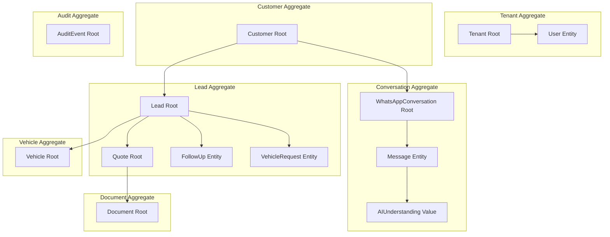
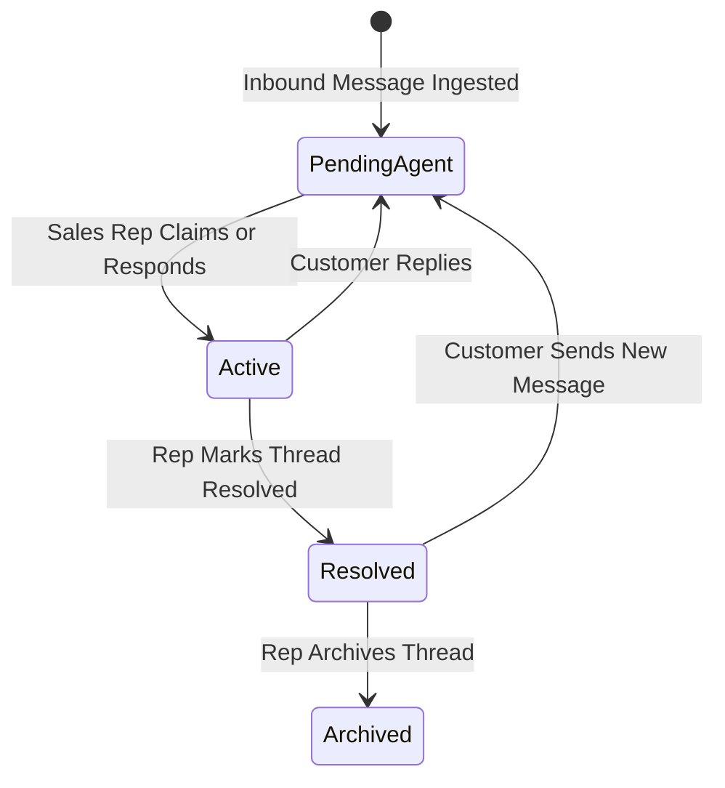
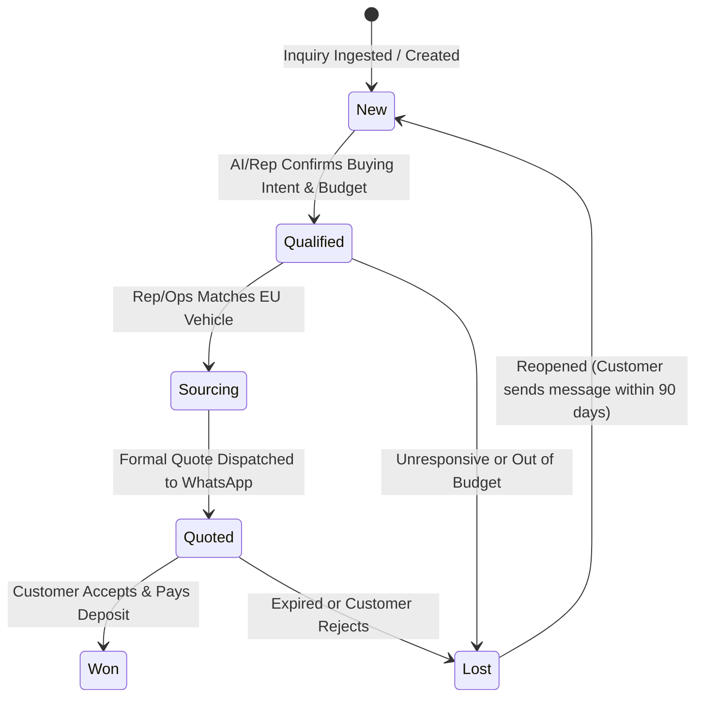
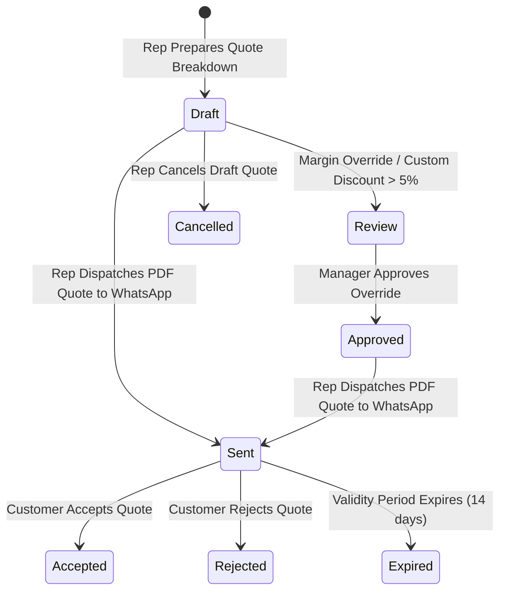
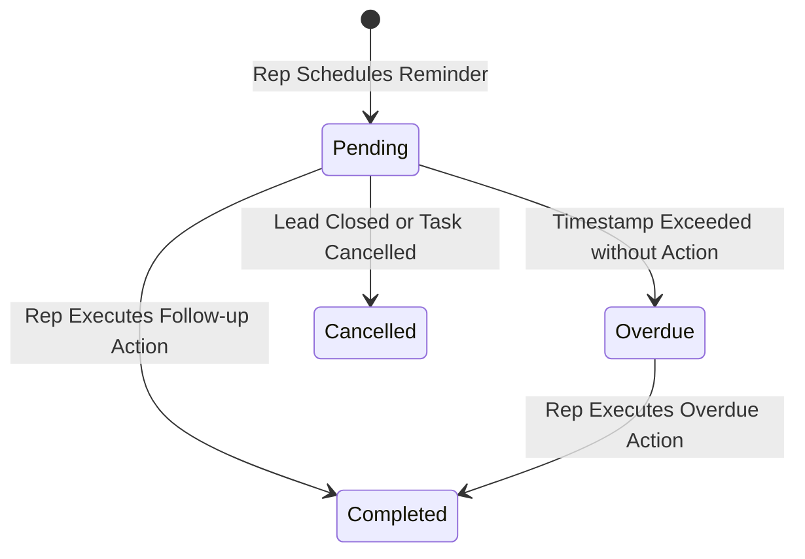

# Domain Model Specification

This document provides the refined, authoritative domain specification for **Car-Export-CRM**. It defines the business terminology, aggregates, entities, value objects, domain invariants, AI data provenance pipeline, state machines, and conceptual domain events.

---

## 1. Domain Terminology Glossary

| Canonical Term | Definition | Context / Synonyms |
| :--- | :--- | :--- |
| **`Tenant`** | The root organizational account representing a European car export business (e.g. "AutoExport Hamburg GmbH"). Owns all data. | Organization, Account Root |
| **`User`** | An employee belonging to a Tenant with assigned RBAC permissions (`SuperAdmin`, `TenantAdmin`, `SalesAgent`, `LogisticsAgent`). | Employee, Agent, Account |
| **`Customer`** | A buyer in Tunisia (individual returnee, broker, dealer) or European contact associated with export inquiries. | Client, Buyer, Contact |
| **`WhatsAppConversation`** | The messaging thread context tying together inbound and outbound messages between a Customer and Tenant sales reps. | Thread, Chat, Conversation |
| **`Message`** | An individual text, image, audio, or document payload sent or received over WhatsApp. | Chat Message, Payload |
| **`AIUnderstanding`** | System's AI-generated interpretation of customer intent, extracted vehicle parameters, and confidence scores. | AI Extraction, Summary |
| **`VehicleRequest`** | Structured sourcing criteria (Make, Model, Year, Fuel, Budget, FCR status) requested by a Customer. | Sourcing Request, Criteria |
| **`Lead`** | The primary sales opportunity aggregate tracking buyer qualification, sourcing progress, quotes, and closure. | Opportunity, Deal Card |
| **`Vehicle`** | A physical vehicle sourced in Europe available for sale or matched to a Vehicle Request. | Stock Item, Car Record |
| **`Quotation`** | A binding or formal export price breakdown PDF (vehicle price + EU VAT regime + shipping + customs estimate) sent to a Customer. | Export Quote, Offer PDF |
| **`FollowUp`** | A scheduled rep task/reminder to re-engage a Customer or check lead status. | Task, Reminder |
| **`Document`** | File metadata and reference for export documentation (*Carte Grise*, *FCR* certificate, Export Invoice, Quote PDF). | File Attachment, Export Doc |
| **`AuditEvent`** | An immutable record logging security events, role changes, data mutations, quote dispatches, or document views. | Audit Log, Security Trail |

---

## 2. AI Data Provenance Pipeline

To maintain strict non-authoritative AI boundaries, the domain model enforces an explicit 4-layer data provenance pipeline:

```text
Layer 1: Source Customer Message  ---> (Customer's raw WhatsApp text/media)
               │
               ▼
Layer 2: AI Interpretation        ---> (Provisional AIExtraction card with confidence score)
               │
               ▼
Layer 3: Human Correction         ---> (Sales Rep reviews, edits, and confirms parameters)
               │
               ▼
Layer 4: Authoritative Business Truth (Validated VehicleRequest & Lead state machine)
```

### Provenance Rules:
1. **No Direct Mutation**: Layer 2 (AI Interpretation) MUST NEVER directly mutate Layer 4 (Authoritative Business Truth) without passing through Layer 3 (Human Confirmation) for consequential business actions (Quotes, Prices, Availability).
2. **Immutable Audit History**: Layer 2 extractions and Layer 3 human corrections are preserved independently for quality and audit tracking.

---

## 3. Value Objects

Value objects represent descriptive domain concepts defined by their attributes rather than a persistent identity:

1. **`Money`**: Currency (`EUR`, `TND`) and Decimal amount. Encapsulates pricing formatting and calculations.
2. **`PhoneNumber`**: E.164 normalized phone string (e.g. `+21698123456`). Encapsulates country code parsing and validation.
3. **`VehicleSpecs`**: Make, Model, Min Year, Max Year, Fuel Type (`Diesel`, `Petrol`, `Hybrid`, `Electric`), Transmission (`Automatic`, `Manual`), Max Mileage.
4. **`QuotationValidity`**: Expiry Date (default 14 days) and Discount Threshold percentage.
5. **`AIConfidence`**: Intent Enum (`SourcingInquiry`, `PriceCheck`, `CustomsFCRInquiry`, `GeneralQuestion`) + Confidence Float (`0.0` to `1.0`).
6. **`Language`**: Language code enum (`fr`, `ar_tn`, `en`).

---

## 4. Aggregate Boundaries & Roots



### Aggregate Boundaries:
1. **`Tenant` Aggregate**: Root of organizational multi-tenancy. Owns all users.
2. **`Customer` Aggregate**: Root of customer master data. Independent of sales leads and chat threads.
3. **`WhatsAppConversation` Aggregate**: Root of chat communication. Owns child `Message` entities and `AIUnderstanding` values.
4. **`Lead` Aggregate**: Core sales aggregate. Owns the sales state machine, attached `VehicleRequest`, `FollowUp` tasks, and child `Quote` aggregates.
5. **`Vehicle` Aggregate**: Root of sourced inventory records.
6. **`Document` Aggregate**: Root of exported file metadata and secure access links.
7. **`AuditEvent` Aggregate**: Root of immutable system security logs.

---

## 5. Normalized Entity State Machines

### 5.1 `WhatsAppConversation` Thread State Machine


### 5.2 `Lead` Pipeline State Machine


### 5.3 `Quotation` Lifecycle State Machine


### 5.4 `FollowUp` Task State Machine


---

## 6. Domain Invariants Taxonomy (INV-*)

| Invariant ID | Domain Invariant Rule |
| :--- | :--- |
| **`INV-001`** | **Tenant Boundary Strictness**: Business entities owned by Tenant A MUST NEVER link to or reference business entities owned by Tenant B. Cross-tenant queries return `HTTP 404 Not Found`. |
| **`INV-002`** | **Authenticated Identity Context**: Tenant identity MUST originate strictly from authenticated user session tokens (JWT claims). Client payloads (URL, body, headers) are forbidden as tenant sources. |
| **`INV-003`** | **Human Authority on Quotation Dispatch**: AI engine MUST NOT independently approve, generate, or dispatch binding export quotes. Quotation dispatch requires explicit Human Rep action. |
| **`INV-004`** | **Tunisia FCR 5-Year Vehicle Age Rule**: Passenger vehicles imported under Tunisia FCR privileges MUST be 5 years old or less at registration. Vehicle requests > 5 years must be flagged. |
| **`INV-005`** | **Immutability of Dispatched Quotes & Messages**: Dispatched WhatsApp messages and issued PDF quotes are immutable business records. Updates require creating a new quote version. |
| **`INV-006`** | **AI Non-Authoritative Data Provenance**: AI extraction outputs remain provisional suggestions until validated or corrected by an authorized sales representative. |
| **`INV-007`** | **Customer Phone E.164 Uniqueness**: Within a single tenant context, customer phone numbers MUST be normalized to E.164 format and remain unique to prevent duplicate profile creation. |
| **`INV-008`** | **Pre-signed URL Access Control**: Export documents (*Carte Grise*, *FCR* certs, Invoices) MUST be served via private object storage links with short-lived pre-signed URLs (max 15-min expiry). |
| **`INV-009`** | **Immutable Security Audit Event Logging**: Security events, role modifications, data mutations, quote dispatches, and document views generate immutable `AuditEvent` records. |
| **`INV-010`** | **Manager Approval for Discount Overrides**: Quotations with custom discounts > 5% or custom margin overrides require explicit approval by a `TenantAdmin` prior to dispatch. |

---

## 7. Conceptual Domain Events

Domain events represent business occurrences without requiring an infrastructure event bus:

1. **`CustomerCreated`**: Triggered when a new customer profile is auto-ingested or manually created.
2. **`MessageReceived`**: Triggered when an inbound WhatsApp message is validated and attached to a thread.
3. **`ConversationAssigned`**: Triggered when a sales rep claims an unassigned chat thread.
4. **`AIUnderstandingExtracted`**: Triggered when background AI worker finishes extracting vehicle specs.
5. **`VehicleRequestConfirmed`**: Triggered when a sales rep validates or corrects AI extracted specs.
6. **`LeadCreated`**: Triggered when an inquiry advances to a qualified sales lead.
7. **`LeadStatusChanged`**: Triggered when a lead transitions pipeline states (`New` → `Qualified` → `Quoted`).
8. **`FollowUpScheduled`**: Triggered when a rep creates a reminder task for a lead.
9. **`QuotationSubmittedForReview`**: Triggered when a quote requires manager margin approval.
10. **`QuotationApproved`**: Triggered when a manager approves a quote override.
11. **`QuotationSent`**: Triggered when a PDF quote is dispatched to a customer WhatsApp thread.
12. **`QuotationAccepted`**: Triggered when a customer accepts an export quote.
13. **`QuotationRejected`**: Triggered when a customer declines a quote.
14. **`QuotationExpired`**: Triggered when a quote validity period (14 days) passes without response.

---

## 8. Requirements & Journey Traceability

### 8.1 Functional Requirements (`FR-*`) Traceability

| Requirement ID | Domain Aggregates & Entities | Enforced Invariants |
| :--- | :--- | :--- |
| `FR-AUTH-001`, `FR-AUTH-002` | `Tenant`, `User` | `INV-001`, `INV-002` |
| `FR-TENANT-001`, `FR-TENANT-002` | `Tenant`, `User`, All Aggregates | `INV-001`, `INV-002` |
| `FR-CUST-001`, `FR-CUST-002` | `Customer` | `INV-004`, `INV-007` |
| `FR-CONV-001`, `FR-CONV-002`, `FR-MSG-001` | `WhatsAppConversation`, `Message` | `INV-005`, `INV-009` |
| `FR-INBOX-001`, `FR-INBOX-002` | `WhatsAppConversation`, `Customer`, `Lead` | `INV-001` |
| `FR-AI-001`, `FR-AI-002` | `AIUnderstanding`, `VehicleRequest` | `INV-003`, `INV-006` |
| `FR-VREQ-001` | `VehicleRequest` | `INV-004` |
| `FR-LEAD-001`, `FR-LEAD-002` | `Lead` | `INV-001` |
| `FR-FOLLOWUP-001` | `FollowUp`, `Lead` | `INV-001` |
| `FR-QUOTE-001`, `FR-QUOTE-002` | `Quotation`, `Vehicle`, `Document` | `INV-003`, `INV-005`, `INV-010` |
| `FR-DOC-001` | `Document` | `INV-008` |
| `FR-AUDIT-001` | `AuditEvent` | `INV-009` |

### 8.2 User Journeys (`J1–J10`) Traceability

| User Journey | Primary Domain Aggregates Involved | Output Event |
| :--- | :--- | :--- |
| **J1 (Inbound Webhook Ingestion)** | `Tenant`, `Customer`, `WhatsAppConversation`, `Message` | `MessageReceived` |
| **J2 (Inbox Chat Management)** | `WhatsAppConversation`, `Message`, `User` | `ConversationAssigned` |
| **J3 (AI Spec Extraction)** | `Message`, `AIUnderstanding`, `VehicleRequest` | `AIUnderstandingExtracted` |
| **J4 (Rep Review of AI Extraction)** | `VehicleRequest`, `Lead`, `User` | `VehicleRequestConfirmed` |
| **J5 (Lead Pipeline Update)** | `Lead`, `Customer`, `User` | `LeadStatusChanged` |
| **J6 (Follow-up Scheduling)** | `FollowUp`, `Lead`, `User` | `FollowUpScheduled` |
| **J7 (Quotation Dispatch)** | `Quotation`, `Vehicle`, `Document`, `Message` | `QuotationSent` |
| **J8 (Manager Activity Review)** | `Tenant`, `WhatsAppConversation`, `Quotation`, `User` | `QuotationApproved` |
| **J9 (Admin User Provisioning)** | `Tenant`, `User` | `UserCreated` / `UserDeactivated` |
| **J10 (Secure Document Access)** | `Document`, `Customer`, `User` | `DocumentViewed` |

---

## 9. Domain Gap Analysis & Open Decisions

### Blocking Questions:
- **None**. All core domain concepts, aggregate boundaries, state machines, and invariants are complete and non-blocking.

### Non-Blocking Questions (Can Be Decided Later):
- Should quotation PDF files be versioned explicitly as `QT-2026-0042-V2` when pricing is updated after rejection? (Default: Create new quote record with incremented version number).
- Should lost leads automatically clear scheduled pending follow-up reminders? (Default: Automatically set pending follow-ups to `Cancelled` upon lead closure).
