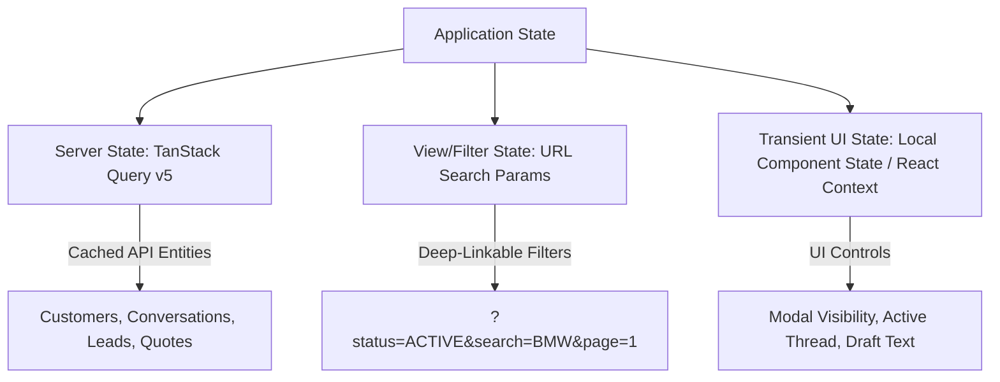
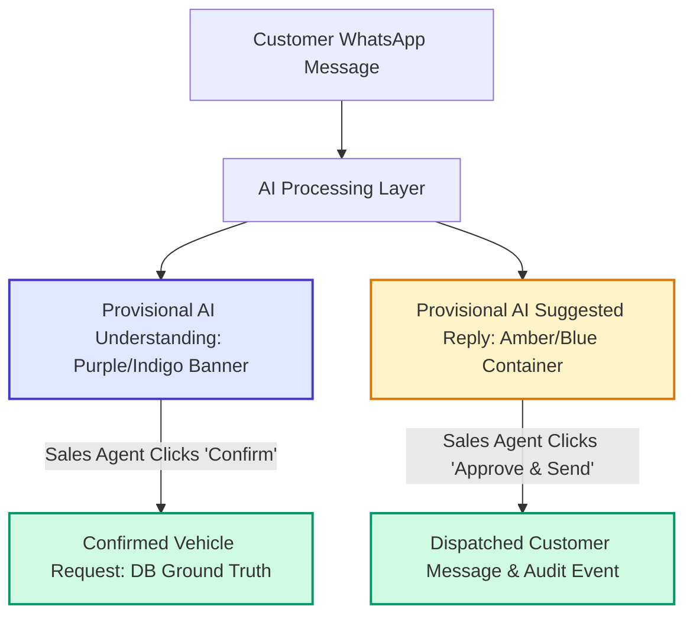

# Frontend Architecture & Design System Specification

This document defines the authoritative, production-grade frontend architecture, operational UX design system, component hierarchy, state management rules, API integration boundaries, accessibility controls, and security standards for **Car-Export-CRM**.

---

## 1. Frontend Objectives

Car-Export-CRM is a specialized B2B CRM designed for European car exporters handling high-volume WhatsApp sourcing requests from buyers in Tunisia. The frontend architecture is built around the following core operational objectives:

1. **Inbox-First Operational Primary Workspace**: The application centers on the 3-pane WhatsApp Inbox workspace (Conversation → Customer → Vehicle Request → Lead → Follow-up → Quote → Order). It is explicitly **not** a dashboard-first application.
2. **Zero AI-Slop Design Policy**: Rejects decorative background gradients, glowing AI borders, glassmorphism slop, oversized headings, and vanity charts. Prioritizes extreme information density, fast scanning, compact table structures, and restrained visual hierarchy.
3. **Keyboard-First & High Operational Efficiency**: Enables professional sales agents to process 50+ threads per day using keyboard navigation (`j`/`k` thread selection, `r` reply, `a` approve AI suggestion).
4. **Unambiguous AI Trust Boundaries**: Visually isolates provisional AI suggestions (`ai_understandings`, `ai_suggestions`) from confirmed database ground truth (`vehicle_requests`, `leads`, `quotations`) (`INV-003`, `INV-006`, `ADR 0012`, `ADR 0014`).
5. **100% Contract Compliance & Zero Client-Side Security Reliance**: Full alignment with backend FastAPI REST endpoints (`/api/v1`) and RFC 7807 problem details. Frontend permission checks exist strictly as UX controls; backend authorization remains 100% authoritative (`SEC-001`, `SEC-003`).

---

## 2. Technology Strategy

- **Core Framework**: React 18+ / 19 with TypeScript in strict mode (`"strict": true` in `tsconfig.json`, zero `any` types).
- **Build & Development Standard**: Vite build pipeline configured for ES2022 targets, fast module replacement (HMR), and code-splitting boundaries.
- **Server State & Caching**: TanStack Query (React Query) v5 for asynchronous data fetching, automatic caching, background refetching, and optimistic mutations (`ADR 0015`).
- **Routing**: React Router v6/7 with nested layout routes, loader-free declarative fetching via TanStack Query, and search-param-synced URL state.
- **Styling Architecture**: Vanilla CSS + Tailwind CSS utility framework enforcing a custom operational design system tokens configuration (no Tailwind gradients or glowing effects).
- **Form Architecture**: React Hook Form + Zod schema validation directly aligned with backend Pydantic request DTOs.
- **Iconography**: Lucide React for consistent, accessible 16px/20px monochrome linear icons.
- **Internationalization (i18n)**: i18next + react-i18next supporting French (`fr` - default), English (`en`), and Arabic (`ar`) with native RTL CSS logical properties.

---

## 3. Application Directory Structure

The project follows a modular, feature-first directory layout under `src/`:

```
src/
├── app/                        # App shell, root providers, router configuration
│   ├── providers/              # QueryClientProvider, AuthProvider, I18nProvider
│   ├── router/                 # React Router route definitions & guards
│   └── App.tsx                 # Root component
├── features/                   # Decoupled feature modules
│   ├── inbox/                  # 3-pane WhatsApp inbox workspace
│   │   ├── api/                # Feature TanStack Query hooks & API calls
│   │   ├── components/         # ThreadList, ChatHistory, CustomerSidebar, ReplyBox
│   │   ├── hooks/              # Feature-specific custom hooks
│   │   ├── types/              # Feature TypeScript interfaces
│   │   └── index.ts            # Public feature API export
│   ├── customers/              # Customer CRM directory & profile views
│   ├── leads/                  # Lead sourcing pipeline & stage management
│   ├── vehicles/               # Vehicle request catalog & specs lookup
│   ├── quotes/                 # FCR & Tax-regime quote builder & PDF dispatch
│   ├── orders/                 # Export order tracker & shipping milestones
│   ├── documents/              # Document uploader & pre-signed S3 viewer
│   ├── followups/              # Scheduled follow-up task manager
│   └── settings/               # Tenant profile & team RBAC settings
├── shared/                     # Shared cross-feature code
│   ├── api/                    # Axios API client instance, interceptors, RFC 7807 parser
│   ├── components/             # Reusable UI primitives & compound components
│   │   ├── ui/                 # Button, Input, Table, Badge, Modal, Tabs, Select
│   │   └── feedback/           # Toast, ErrorBoundary, SkeletonLoader, EmptyState
│   ├── hooks/                  # Generic custom hooks (useKeyboard, useDebounce, usePermission)
│   ├── i18n/                   # Translation files (fr.json, en.json, ar.json) & RTL utilities
│   ├── types/                  # Common API envelopes, pagination & user session types
│   └── utils/                  # Currency (EUR/TND), Date (Intl), & E.164 phone formatters
```

---

## 4. Routing Architecture

### Navigation Tree:
- `/login` — User authentication page (Public layout)
- `/inbox` — **Primary Operational Workspace** (Default landing route after login)
- `/customers` — Customer directory table view
- `/customers/:id` — Customer detail drawer / full page view
- `/leads` — Lead sourcing pipeline table & kanban view
- `/leads/:id` — Lead detailed overview & activity history
- `/vehicles` — Vehicle request & inventory catalog
- `/quotes` — Quotations list view
- `/quotes/new` — Quotation generator workspace
- `/quotes/:id` — Quotation preview & PDF dispatch status
- `/orders` — Export orders tracker
- `/documents` — Document repository & verification status
- `/followups` — Follow-up task list
- `/settings` — Tenant settings & user management

### Route Scope Matrix:

| Route Path | MVP Scope | Role Access | Layout Shell |
| :--- | :---: | :--- | :--- |
| `/login` | Yes | Public | Unauthenticated Layout |
| `/inbox` | **Yes (Primary)** | All Roles (`SuperAdmin`, `TenantAdmin`, `SalesAgent`, `LogisticsAgent`) | Main 3-Pane Operational Workspace |
| `/customers` | Yes | All Roles | Main Navigation Shell |
| `/leads` | Yes | All Roles | Main Navigation Shell |
| `/vehicles` | Yes | All Roles | Main Navigation Shell |
| `/quotes` | Yes | All Roles | Main Navigation Shell |
| `/orders` | Yes | All Roles | Main Navigation Shell |
| `/documents` | Yes | All Roles | Main Navigation Shell |
| `/followups` | Yes | All Roles | Main Navigation Shell |
| `/settings` | Yes | Admin Only (`SuperAdmin`, `TenantAdmin`) | Main Navigation Shell |

*Deferred Non-MVP Routes*: Bulk analytics export studio, automated workflow graph builder, custom template designer (deferred to post-MVP phase).

---

## 5. Component Architecture Hierarchy

Components follow a 4-layer strict design model:

```
[ Layer 4: Page Shells ] (InboxPage, CustomerDetailPage)
        ↓
[ Layer 3: Feature Components ] (ThreadList, ChatHistory, QuotationBuilder, AiSuggestionCard)
        ↓
[ Layer 2: Shared Compound Components ] (DataTable, FilterBar, DocumentUploader, StatusPill)
        ↓
[ Layer 1: Primitives ] (Button, Input, Badge, Modal, Table, Tabs, Select)
```

1. **Primitives**: Unstyled/lightly styled foundational components (`Button`, `Input`, `Badge`, `Modal`). Must receive typed props and emit standard events.
2. **Shared Compound Components**: Patterned assemblies combining primitives (`DataTable` with pagination controls, `FilterBar` with URL search-param sync).
3. **Feature Components**: Domain-aware components bound to feature API hooks (`ThreadList` fetching `/api/v1/conversations`, `AiSuggestionCard` with `[Approve & Send]` action).
4. **Page Shells**: Route containers managing layout arrangement, breadcrumbs, and top-level error boundaries.

---

## 6. Feature/Module Boundaries

- Feature modules in `src/features/*` are **strictly decoupled**.
- Feature A MUST NOT import internal components or hooks from Feature B directly.
- Cross-feature communication occurs exclusively through:
  1. Standardized URL search parameters (e.g. navigating from Inbox to Quote Builder via `/quotes/new?customer_id=123`).
  2. Public feature API exports exported strictly through `src/features/<feature_name>/index.ts`.
  3. Shared global Query Keys (`inboxKeys`, `customerKeys`).

---

## 7. State Management Architecture

State is split cleanly across 3 distinct tiers (`ADR 0015`):



- **No Global Client Redux Store**: Avoids redundant state synchronization code.
- **Server State**: Managed 100% by TanStack Query v5 with strict query key factories (`inboxKeys`, `customerKeys`, `leadKeys`, `quoteKeys`).
- **View/Filter State**: Synced to URL query parameters (`useSearchParams`), enabling native browser `Back`/`Forward` navigation and shareable URLs.
- **Transient UI State**: Isolated to React component local state (`useState`) or lightweight feature React Context (`InboxContext` for tracking active pane tab).

---

## 8. Server State vs Client State Categorization

| Data Concept | State Category | Storage Location | Invalidation Strategy |
| :--- | :--- | :--- | :--- |
| Customer List & Profiles | Server State | TanStack Query Cache (`customerKeys`) | Invalidated on Customer mutation or 60s stale time |
| Conversation Threads & Messages | Server State | TanStack Query Cache (`inboxKeys`) | Refetched on WebSocket message event / 5s stale time |
| AI Understandings & Suggestions | Server State | TanStack Query Cache (`inboxKeys`) | Refetched on AI processing complete webhook / manual refresh |
| Vehicle Requests & Specs | Server State | TanStack Query Cache (`vehicleKeys`) | 300s stale time |
| Quotation Records & PDFs | Server State | TanStack Query Cache (`quoteKeys`) | Invalidated on Quote creation / approval |
| Active Search Query & Filters | View State | URL Search Params (`?q=...`) | URL mutation |
| Active Thread Selection | Client UI State | Feature Context (`InboxContext`) | User click in Thread List |
| Reply Composer Draft Text | Client UI State | Component `useState` | Local keystroke |
| Modal / Drawer Open State | Client UI State | Component `useState` | User action trigger |

---

## 9. API Integration Architecture

- **API Base Route**: All API calls target `/api/v1` via a centralized Axios/Fetch API client (`src/shared/api/client.ts`).
- **Response Envelope Consumption**: Strictly parses backend REST envelopes:
  ```json
  {
    "success": true,
    "data": { ... },
    "meta": { "timestamp": "...", "correlation_id": "..." }
  }
  ```
- **Error Consumption (RFC 7807)**: API errors return RFC 7807 Problem Details and are converted into standardized UI notifications:
  ```json
  {
    "type": "https://api.carexport.com/errors/resource-not-found",
    "title": "Resource Not Found",
    "status": 404,
    "detail": "Customer entity not found or access unauthorized",
    "instance": "/api/v1/customers/018f... ",
    "correlation_id": "req_88f921a"
  }
  ```
- **Correlation Propagation**: Client injects or logs `X-Correlation-ID` header on every request for request tracing across client-server telemetry.
- **Optimistic Concurrency Control**: Mutation requests for entity updates include `If-Match: "etag_hash"` headers derived from server response headers (`ADR 0010`).
- **Retry Policy**: Automatic exponential backoff retry for network errors or HTTP 5xx responses (3 retries). Zero retries for HTTP 4xx client errors (`401`, `403`, `404`, `422`).

---

## 10. Authentication & Session Handling UX

- **Token Model**: Token-based authentication (`Authorization: Bearer <token>`). Tokens are maintained in secure in-memory storage (or via secure HttpOnly refresh token rotation).
- **Session Lifecycle Flow**:
  1. Login form POSTs credentials to `/api/v1/auth/login`.
  2. On success, user session context (User ID, Tenant ID, Role) is stored in `AuthContext`.
  3. API Client automatically attaches Bearer token header on all outgoing requests.
  4. On HTTP 401 response or user deactivation (`users.is_active == false`), `AuthContext` clears session data, cancels active queries, and redirects user to `/login?return_to=<current_path>`.
- **Session Expiration UX**: Non-intrusive warning modal appears 2 minutes prior to token expiry allowing a 1-click token renewal.

---

## 11. Authorization / UI Permission Handling

- **Persona Matrix Enforcement**:
  - `SuperAdmin` & `TenantAdmin`: Full access to all routes, tenant settings, quote approvals (>5% discount), and user management.
  - `SalesAgent`: Full access to Inbox, Customers, Leads, Vehicle Requests, and Quote creation. Read-only access to Logistics. Blocked from tenant settings and quote approvals > 5%.
  - `LogisticsAgent`: Full access to Vehicles, Documents, Orders. Read-only access to Conversations and Quotes.
- **Permission Check Component**: Reusable `<Can access="quotation:approve">` wrapper renders fallback or disabled state for unauthorized actions.
- **CRITICAL SECURITY INVARIANT**: Frontend permission checks exist strictly for **User Experience (UX)** clarity (preventing agents from attempting unauthorized actions). **The backend API remains 100% authoritative for authorization** (`SEC-001`, `SEC-003`). Frontend UI logic NEVER assumes authorization based on client-side state alone.

---

## 12. Error Handling Architecture

A 3-tier error handling architecture prevents application crashes:

```
[ Tier 1: Global React Error Boundary ] (Catches unhandled render crashes -> Fallback screen)
        ↓
[ Tier 2: Feature / Component Error Boundary ] (Isolates pane failures -> Replaces pane with Retry button)
        ↓
[ Tier 3: Field & Notification Errors ] (Inline form validation error messages + RFC 7807 toast alerts)
```

1. **Global Error Boundary**: Wraps root app shell; catches unexpected JS runtime errors, displaying an operational recovery page with a "Reload Workspace" button.
2. **Feature Error Boundaries**: Wraps major feature panels (e.g. Chat History pane, Customer Sidebar). If Chat History crashes, only the center pane shows an error state, keeping Thread List and Customer Sidebar fully operational.
3. **Field & Notification Errors**: Inline form validation errors under inputs + toast notification popups for API errors showing backend `detail` and `correlation_id`.

---

## 13. Loading States Strategy

- **Skeleton Loaders**: Custom skeleton components matching the exact layout and height of target components (`ThreadListSkeleton`, `ChatHistorySkeleton`, `CustomerSidebarSkeleton`). Eliminates Cumulative Layout Shift (CLS = 0).
- **Inline Button Spinners**: Submit buttons show an integrated 14px monochrome spinner and disabled state during pending API mutations.
- **Background Refetch Indicators**: Subtle 2px progress bar at the top of active data tables indicating non-blocking background refetching in progress.

---

## 14. Empty States Strategy

All empty states provide operational context and actionable next steps:

- **Inbox Empty State**: *"No unread conversations in this view. All customer inquiries are up to date."* + `[Clear Filters]` button.
- **Customer Directory Empty State**: *"No customer records match your filter criteria."* + `[Create New Customer]` button.
- **Vehicle Requests Empty State**: *"No active vehicle sourcing requests for this customer."* + `[Add Sourcing Request]` button.
- **Documents Empty State**: *"No export documentation uploaded yet (*Carte Grise*, *FCR*)."* + `[Upload Document]` dropzone button.

---

## 15. Optimistic Updates Strategy

Optimistic UI updates are applied to high-frequency sales workflows (`ADR 0015`):

1. **Thread Assignment**: Clicking "Assign to Me" immediately updates thread assignee avatar in UI before server ACK.
2. **Message Dispatch**: Sent WhatsApp reply immediately renders in Chat History with a light grey pending icon (`Sending...`). Upon server ACK, status updates to single tick (`Sent`).
3. **Lead Stage Move**: Dragging/selecting lead stage immediately updates status badge.
4. **Rollback Safety**: On API error, TanStack Query automatically restores cache to pre-mutation snapshot, fires an RFC 7807 error toast, and highlights the failed element.

---

## 16. Real-Time Update Strategy

The MVP uses a hybrid Polling + WebSocket update strategy:

- **WebSocket Primary Connection**: Established to `/api/v1/ws/inbox` upon user login. Listens for events:
  - `INBOX_MESSAGE_RECEIVED`: Automatically prepends new message to Chat History and updates Thread List item.
  - `AI_UNDERSTANDING_READY`: Triggers animation-free render of provisional AI Understanding banner.
  - `LEAD_STAGE_UPDATED`: Refreshes lead status pill.
- **Fallback Polling**: If WebSocket connection drops, TanStack Query seamlessly falls back to 5-second interval polling for the active thread and thread list.
- **Automatic Reconnection**: Exponential backoff reconnects WebSocket background connection silently.

---

## 17. Forms & Validation Architecture

- **Library**: React Hook Form for un-controlled high-performance form state + Zod for schema validation.
- **Contract Alignment**: Zod schemas in `src/features/<feature>/types/schema.ts` mirror backend Pydantic request models field-for-field.
- **Monetary & Financial Inputs**: Money fields (prices, margins, transport fees) MUST NEVER use floating-point calculations in JavaScript. Financial inputs handle amounts as integer cents or exact decimal strings. Currency codes (`EUR`, `TND`) are explicitly rendered alongside input boxes.
- **Real-Time Validation**: Field validation executes `onBlur`, with submission validation executing `onSubmit`.

---

## 18. Accessibility (WCAG 2.2 AA Compliance)

- **Keyboard Navigation**: 100% of interactive elements accessible via `Tab` and keyboard shortcuts:
  - `j` / `k`: Select next / previous conversation thread in Inbox.
  - `r`: Focus reply composer textarea.
  - `a`: Open AI suggestion confirmation popover.
  - `c`: Focus Customer Details sidebar.
  - `Escape`: Close active modal or drawer.
- **Focus Management**: Visible focus rings (`focus-visible:ring-2 focus-visible:ring-slate-900 dark:focus-visible:ring-slate-100`). Modals automatically trap focus and restore focus to trigger element on close.
- **Screen Readers**: Semantic HTML5 tags (`<main>`, `<nav>`, `<aside>`, `<section>`, `<table>`), explicit `aria-label` attributes on icon-only buttons, and `aria-live="polite"` regions for incoming message notifications.
- **Color Contrast**: Text-to-background contrast ratio strictly exceeds 4.5:1 for normal text and 3:0 for large text across both light and dark modes.

---

## 19. Responsive Behavior Architecture

Designed for professional desktop B2B workstations with responsive adaptations:

- **Desktop (1440px+ - Primary Target)**: Full 3-pane operational layout: Thread List (320px) | Chat History (flex 1) | Customer Sidebar (380px).
- **Laptop (1024px - 1439px)**: 2-pane layout (Thread List | Chat History), with Customer Sidebar converting to an overlay drawer toggled via top bar icon.
- **Tablet / Mobile (768px - 1023px)**: Single-pane view with smooth view-switching tabs (`[Threads]`, `[Chat]`, `[Customer Details]`).
- **Composer Stability**: Chat composer fixed at bottom of screen with sticky positioning; soft keyboard on mobile does not push chat controls off-screen.

---

## 20. Internationalization (i18n)

- **Engine**: i18next + react-i18next.
- **Supported Languages**: French (`fr` - primary default for European/Tunisian export market), English (`en`), Arabic (`ar`).
- **Decoupled Customer Message vs UI Language**: A French sales agent can operate the CRM with UI controls in French while viewing customer WhatsApp messages written in Romanized Tunisian Arabic (Derja) or standard Arabic.
- **Translation Resource Structure**: Translation strings structured by module (`common.json`, `inbox.json`, `customer.json`, `quote.json`, `errors.json`). Zero hardcoded text strings in UI components.

---

## 21. RTL (Right-to-Left) Considerations

- **CSS Logical Properties**: Layout styles use CSS logical properties (`margin-inline-start`, `padding-block-end`, `inset-inline-0`, `text-align: start`) instead of directional properties (`margin-left`, `right`).
- **RTL Direction Switch**: Setting language to Arabic (`ar`) dynamically updates root HTML attributes (`<html dir="rtl" lang="ar">`).
- **Bi-Directional Text Rendering**: Customer chat bubbles use `dir="auto"` to properly format mixed-language messages (e.g. French car names like *"Golf 8 GTI"* embedded within Arabic or Derja text).

---

## 22. Date, Time & Currency Formatting

- **Currency Formatting**: Locale-aware formatting using `Intl.NumberFormat`:
  - Euros: `€35,000.00` (EN) / `35 000,00 €` (FR).
  - Tunisian Dinars: `35 000.000 DT`.
  - Currency code is ALWAYS displayed alongside amounts.
- **Date & Time Formatting**: Formatted using `Intl.DateTimeFormat`:
  - Relative Timestamps for Inbox: `Just now`, `5m ago`, `2h ago`, `Yesterday`.
  - Hover Tooltip: Full UTC timestamp (`2026-09-11 15:30:00 UTC`).
  - Document Dates: ISO 8601 formatting (`YYYY-MM-DD`).

---

## 23. File & Document UX Architecture

- **Upload Dropzone**: Supports drag-and-drop file upload for export documents (*Carte Grise*, *FCR* certificates, Passport copies, Invoices) (`BR-013`).
- **Validation**: Strict client-side file type check (`.pdf`, `.png`, `.jpeg`) and file size limit check (Max 10MB).
- **Upload Progress & Malware Scanning Status**:
  - Displays progress bar (0-100%).
  - Shows scan status badge: `Scanning...` (Pending), `Verified Clean` (Green), or `Infection Blocked` (Red).
- **Pre-signed URL Access**: Document preview links fetch short-lived S3 pre-signed URLs (15-min expiry) (`INV-008`). Pre-signed URLs are automatically refreshed on expiry.

---

## 24. Conversation / Inbox UX Architecture

The **Inbox Workspace** is the core operational screen (`ADR 0016`):

```
+---------------------------------------------------------------------------------------------------+
| GLOBAL NAVBAR: Logo | Search (Ctrl+K) | Tenant Selector | Notifications | User Profile             |
+------------------------------+------------------------------------+-------------------------------+
| THREAD LIST (320px)          | CHAT HISTORY (Flex 1)              | CUSTOMER SIDEBAR (380px)      |
| [Search threads...]          | [Customer Header & Status Pill]    | [Customer Profile Card]       |
| Tabs: All|Unread|NeedsAction | ---------------------------------- | - Name: Anis Rahmouni         |
|                              | Customer Message (Left Bubble)     | - Phone: +216 98 123 456      |
| Thread 1: Anis R. (2m ago)   | <untrusted_user_message>           | ------------------------------- |
| "Golf 8 GTI 2022 FCR..."     |                                    | [Vehicle Sourcing Request]    |
| [Status: New] [Badge: AI]    | AI Understanding Banner (Indigo)   | - VW Golf 8 GTI (2022+)       |
|                              | [AI Detected: Golf 8 GTI]          | - Budget: €32,000             |
| Thread 2: Mohamed K. (15m)   | [Edit] [Confirm Request]           | ------------------------------- |
| "Bonjour, dispo Passat?"     |                                    | [Quick Quote Generator]       |
|                              | AI Suggested Reply (Amber/Blue)    | [Generate FCR Quote PDF]      |
|                              | "Bonjour Anis, nous avons..."      | ------------------------------- |
|                              | [Edit Prompt] [Approve & Send]     | [Activity History Timeline]   |
|                              | ---------------------------------- |                               |
|                              | Reply Box [ Textarea... ] [Send]   |                               |
+------------------------------+------------------------------------+-------------------------------+
```

---

## 25. AI UX & Human Confirmation (HITL Boundary)

AI UX strictly implements the Human-in-the-Loop boundary (`INV-003`, `INV-006`, `ADR 0012`, `ADR 0014`):



### Visual Hierarchy Rules:
1. **CUSTOMER MESSAGE**: Light Grey bubble, left-aligned, tagged `<untrusted_user_message>`.
2. **AI UNDERSTANDING**: Indigo container with badge *"AI Detected — Provisional"* + explicit `[Edit]` and `[Confirm Request]` buttons.
3. **AI SUGGESTED REPLY**: Amber/Blue container with badge *"Suggested Reply — Not Sent"* + explicit `[Edit Prompt]` and `[Approve & Send]` buttons.
4. **HUMAN RESPONSE**: Green/Blue right-aligned bubble representing confirmed agent dispatch.
5. **AUTHORITATIVE BUSINESS DATA**: Dark table card with badge *"Confirmed Ground Truth"*.

*Forbidden AI UX Tells*: AI automatically updating lead status without rep click, AI sending message without rep approval, glowing AI particles, decorative AI sparkles.

---

## 26. Notifications Architecture

- **Toast Notifications**: Non-blocking top-right toast alerts for background events (e.g. *"New message from Anis Rahmouni"*, *"Quotation PDF generated successfully"*).
- **Unread Counters**: Real-time badge counters on Navigation bar icons (`Inbox [3]`, `Follow-ups [2]`).
- **Sound Telemetry**: Optional subtle audio chime for incoming messages (user-configurable in Settings).

---

## 27. Search & Filtering Architecture

- **Global Search (`Ctrl+K` / `Cmd+K`)**: Keyboard-driven modal querying across Customers, Leads, Vehicle Requests, and Quotes.
- **Table Filters**: Column header filters (Status, Date Range, Assignee, Tax Regime) with instant URL query parameter sync.
- **Filter Whitelist**: Client search filters strictly enforce whitelist validation matching backend repository filters (`ADR 0009`).

---

## 28. Performance Architecture

- **Target Budgets**:
  - Initial Bundle Size: < 250KB gzipped.
  - Initial Page Load (FCP): < 1.2s on 4G network connection.
  - Time to Interactive (TTI): < 1.5s.
- **List Virtualization**: Inbox Thread List and Chat History use `@tanstack/react-virtual` for smooth 60fps rendering of lists containing 1,000+ items.
- **Code Splitting**: Route-based dynamic imports (`React.lazy`) for secondary screens (`/quotes`, `/documents`, `/settings`).

---

## 29. Frontend Security Architecture

- **XSS Prevention**: 100% of customer text and LLM outputs are rendered using React DOM automatic escaping. Plaintext customer messages NEVER use `dangerouslySetInnerHTML`.
- **Content Security Policy (CSP)**: Compatible with strict CSP headers (`default-src 'self'`). Zero inline script execution.
- **Zero Exposed Secrets**: Backend API keys, WhatsApp secrets, and database credentials are NEVER exposed to or stored in frontend code.
- **Storage Constraints**: Sensitive tokens are kept in-memory or HttpOnly cookies. `localStorage` is used strictly for non-sensitive UI preferences (dark mode toggle, sidebar collapsed state).

---

## 30. Observability & Telemetry Architecture

- **Correlation Tracking**: Client captures `X-Correlation-ID` from response headers and attaches it to telemetry reports.
- **Client Error Logging**: Uncaught React errors or failed API requests report structured telemetry to `/api/v1/telemetry/errors`:
  ```json
  {
    "correlation_id": "req_88f921a",
    "route": "/inbox",
    "error_name": "ApiError",
    "status_code": 404,
    "message": "Customer entity not found",
    "user_agent": "Mozilla/5.0..."
  }
  ```
- **Privacy Scrubbing**: Client telemetry logger scrubs passwords, tokens, API keys, and private customer message bodies before sending logs.

---

## 31. Testing Strategy

```
              /  E2E Tests (Playwright)  \           <- 8 Core Journeys (J1 - J8)
             / Integration Tests (RTL)    \          <- Forms, AI Confirmation, State Hooks
            / Unit Tests (Vitest)          \         <- Components, Formatters, Schemas
```

- **Unit Tests (Vitest)**: Tests utility functions (currency/date formatters, phone validators) and primitive UI components.
- **Integration Tests (React Testing Library)**: Tests complex feature workflows (React Hook Form + Zod validation, TanStack Query optimistic update hooks, AI suggestion confirmation interaction).
- **E2E Integration Tests (Playwright)**: Verifies 8 core user journeys:
  - `J1`: WhatsApp message ingestion → Customer record creation.
  - `J2`: AI understanding → Human confirmation → Vehicle request created.
  - `J3`: Customer → Lead pipeline advancement.
  - `J4`: Lead → Follow-up task creation & completion.
  - `J5`: Lead → Quotation PDF generation & send.
  - `J6`: Document upload → S3 pre-signed preview.
  - `J7`: Tenant isolation (User A cannot see Tenant B data in UI).
  - `J8`: Role-based UI behavior (Sales Agent vs Logistics Agent restricted views).

---

## 32. Design System Baseline & Visual Tokens

- **Design Philosophy**: High-density operational B2B workspace. Zero AI-slop.
- **Color Tokens**:
  - `bg-primary`: Slate 900 (`#0f172a` dark) / Slate 50 (`#f8fafc` light).
  - `surface`: Slate 800 (`#1e293b` dark) / White (`#ffffff` light).
  - `border`: Slate 700 (`#334155` dark) / Slate 200 (`#e2e8f0` light).
  - `text-main`: Slate 100 (`#f1f5f9` dark) / Slate 900 (`#0f172a` light).
  - `text-muted`: Slate 400 (`#94a3b8` dark) / Slate 500 (`#64748b` light).
  - `status-confirmed`: Emerald 600 (`#059669`).
  - `status-provisional-ai`: Indigo 600 (`#4f46e5`).
  - `status-pending`: Amber 600 (`#d97706`).
  - `status-error`: Rose 600 (`#e11d48`).
- **Typography Tokens**:
  - Main Font: `Inter`, `-apple-system`, `BlinkMacSystemFont`, `sans-serif`.
  - Monospace / Tabular Font: `JetBrains Mono`, `ui-monospace`, `monospace` (used for Prices, Currency, VINs, Correlation IDs).
- **Spacing**: Base 4px scale (`p-1`=4px, `p-2`=8px, `p-3`=12px, `p-4`=16px). Compact table row height (`36px`).

---

## 33. UX Consistency Rules

1. **Button Variants**: `Primary` (Solid dark/emerald), `Secondary` (Slate outline), `Destructive` (Rose solid), `Ghost` (Icon hover only).
2. **Status Badges**: All statuses use solid pills with 11px uppercase bold text.
3. **Modal Dialogs**: Header title left-aligned, close `X` top-right, action buttons right-aligned in footer (`[Cancel]` `[Confirm]`).
4. **Toast Positioning**: Top-right corner, 4-second auto-dismiss.

---

## 34. Frontend/Backend Contract Alignment

- **Strict Type Alignment**: Frontend TypeScript interfaces in `src/shared/types/api.ts` are generated from or matched 1:1 against backend FastAPI Pydantic schemas.
- **API Endpoints Alignment**:
  - Auth: `POST /api/v1/auth/login`
  - Conversations: `GET /api/v1/conversations`, `GET /api/v1/conversations/{id}/messages`, `POST /api/v1/conversations/{id}/messages`
  - Customers: `GET /api/v1/customers`, `POST /api/v1/customers`, `GET /api/v1/customers/{id}`
  - Leads: `GET /api/v1/leads`, `PATCH /api/v1/leads/{id}/stage`
  - Vehicles: `GET /api/v1/vehicle-requests`, `POST /api/v1/vehicle-requests`
  - Quotes: `GET /api/v1/quotations`, `POST /api/v1/quotations`, `POST /api/v1/quotations/{id}/approve`
  - Documents: `POST /api/v1/documents/upload-url`, `GET /api/v1/documents/{id}/download-url`

---

## 35. Requirement & Domain Traceability Matrix

| Requirement / Invariant ID | Description | Frontend Architecture Implementation | Test Coverage |
| :--- | :--- | :--- | :--- |
| `FR-AUTH-001` / `SEC-001` | Server-Side Identity Context | Token attached via API client interceptor (`AuthContext`) | Integration / E2E J7 |
| `FR-TENANT-001` / `SEC-002` | Client Non-Trust | Client never passes `tenant_id` in forms; server context authoritative | E2E J7 |
| `FR-CONV-001` / `BR-007` | WhatsApp Webhook Ingestion | Inbox Workspace center pane real-time WebSocket update | E2E J1 |
| `FR-AI-001` / `BR-009` | Prompt Injection / Tagging | `<untrusted_user_message>` rendered escaped in Light Grey bubble | Integration / E2E J2 |
| `FR-AI-002` / `INV-003` | Non-Authoritative AI HITL | Provisional AI Indigo banner + `[Confirm]` button requirement | Integration / E2E J2 |
| `FR-DOC-001` / `BR-013` | Private Document Storage | S3 Dropzone + Pre-signed 15-min URL viewer | E2E J6 |
| `FR-AUDIT-001` / `INV-009` | Audit Logging Attribution | User actions trigger API calls recorded to backend `audit_events` | E2E J5 |
| Journey `J1` - `J8` | Core User Journeys | Inbox-first 3-pane operational layout & router paths | E2E J1 - J8 |

---

## 36. Open Frontend Architectural Decisions

- **Status**: **ALL CORE FRONTEND ARCHITECTURAL DECISIONS RESOLVED & LOCKED**.
- **Resolved Key Decisions**:
  - Primary Workspace: 3-Pane Inbox Workspace (`ADR 0016`).
  - State Management: TanStack Query v5 + URL Params + Local State (`ADR 0015`).
  - Styling & Design System: Vanilla CSS + Tailwind CSS operational density tokens (`ADR 0016`).
  - Real-time Strategy: Hybrid Polling + WebSocket (`Section 16`).
  - AI Safety UI: Explicit 5-tier visual hierarchy (`Section 25`).
