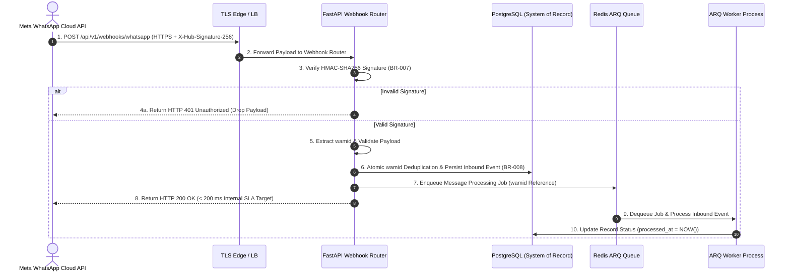
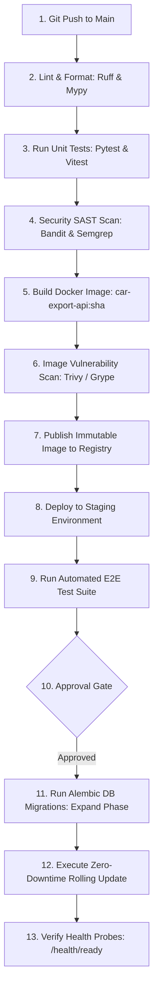

# Infrastructure Architecture & Production Deployment Specification

This document defines the authoritative, production-grade infrastructure architecture, deployment topology, environment isolation controls, CI/CD pipeline, backup/recovery strategy, and observability baseline for **Car-Export-CRM**.

---

## 1. Infrastructure Objectives

Car-Export-CRM manages sensitive multi-tenant B2B car export operations across Europe and Tunisia. The infrastructure architecture is designed around six primary objectives:

1. **Operational Simplicity**: Avoid premature enterprise complexity. Prefer managed cloud services + stateless application compute + asynchronous workers over self-managed distributed infrastructure (`ADR 0001`, `ADR 0017`).
2. **Anti-Premature-Kubernetes Invariant**: Kubernetes MUST NOT be the MVP default. Managed container compute nodes and managed storage resources provide the initial production foundation (`ADR 0004`, `ADR 0017`).
3. **Durable Inbound Webhook Processing**: PostgreSQL is the ONLY authoritative system of record for inbound WhatsApp messages and business ground truth. Redis serves strictly as a task queue and ephemeral cache.
4. **High Availability & Low Ingestion Latency**: Guarantee high availability across independent failure domains and fast (<200ms target) WhatsApp webhook ingestion/acknowledgement without blocking on external AI providers.
5. **Strict Data Isolation & Security**: Enforce private subnet isolation for database and Redis stores, TLS 1.3 preferred (TLS 1.2 permitted where required for compatibility), AES-256 at rest, zero hardcoded secrets, and tenant-isolated queues/caches (`SEC-001` through `SEC-011`).
6. **Evolutionary Infrastructure Scaling**: Support linear infrastructure growth across 3 explicit phases (MVP → Growth → Enterprise) backed by measurable metrics (`ADR 0004`).

---

## 2. Infrastructure Principles

1. **Managed Services + Stateless Compute > Self-Managed Distributed Systems**: Offload infrastructure management (PostgreSQL, Redis, S3, Load Balancing) to proven cloud providers.
2. **PostgreSQL-First Durability Invariant**: Inbound WhatsApp events are persisted to PostgreSQL BEFORE webhook HTTP 200 acknowledgement. Message loss is prevented even if Redis worker queues temporarily crash or drop jobs.
3. **Private-by-Default & Outbound Egress Guard**: Database and Redis instances reside inside isolated Private Subnets with ZERO Internet exposure. App nodes restrict outbound network calls strictly to approved endpoints (WhatsApp API, LLM API, S3 VPC endpoint).
4. **Zero Secrets in Source or Frontend**: Plaintext credentials, tokens, and API keys MUST NEVER exist in source code, git commits, Dockerfiles, or client-side JavaScript bundles.
5. **Immutable Infrastructure & Artifacts**: Application compute nodes run immutable Docker container images tagged with exact Git commit SHA hashes (`car-export-api:<sha>`).
6. **Graceful Degradation & Failure Isolation**: External AI provider failure or WhatsApp API hiccups MUST NEVER crash or block core CRM operations (customer access, conversation history, manual message replies) (`INV-003`).

---

## 3. MVP Production Topology

```text
                         Internet / WhatsApp Meta API
                                      │
                                      ▼
                              ┌───────────────┐
                              │ DNS / TLS Edge│
                              │ Load Balancer │
                              └───────┬───────┘
                                      │
                 ┌────────────────────┴────────────────────┐
                 │                                         │
          ┌──────▼──────┐                           ┌──────▼──────┐
          │ FastAPI App │                           │ FastAPI App │
          │ Instance 1  │                           │ Instance 2  │
          │ (Zone A)    │                           │ (Zone B)    │
          └──────┬──────┘                           └──────┬──────┘
                 │                                         │
                 └────────────────────┬────────────────────┘
                                      │
                             ┌────────▼────────┐
                             │ Durable Queue / │
                             │ Redis (SEC-005) │
                             └────────┬────────┘
                                      │
                 ┌────────────────────┴────────────────────┐
                 │                                         │
          ┌──────▼──────┐                           ┌──────▼──────┐
          │ ARQ Worker  │                           │ ARQ Worker  │
          │ Instance 1  │                           │ Instance 2  │
          │ (Zone A)    │                           │ (Zone B)    │
          └──────┬──────┘                           └──────┬──────┘
                 │                                         │
                 └────────────────────┬────────────────────┘
                                      │
          ┌───────────────────────────┼───────────────────────────┐
          │                           │                           │
   ┌──────▼──────┐             ┌──────▼──────┐             ┌─────▼─────┐
   │ PostgreSQL  │             │    Redis    │             │ S3 Object │
   │ + pgvector  │             │ Cache/Queue │             │  Storage  │
   │ (Private DB)│             │ (Private)   │             │ (Private) │
   └─────────────┘             └─────────────┘             └───────────┘

External Provider Integrations (Outbound Egress Guard):
WhatsApp Cloud API ───────────► Webhook API (/api/v1/webhooks/whatsapp)
LLM Provider API   ◄──────────► AI Provider Adapter Port (Server-side)
```

---

## 4. Application Compute Architecture & Failure Domains

- **Stateless Application Model**: FastAPI application instances are completely stateless. Session state, tokens, and cached queries reside in Redis or database stores.
- **Independent Failure Domain Distribution**: Multiple FastAPI app instances and ARQ workers MUST be deployed across **independent failure domains / availability zones** (e.g., Availability Zone A and Availability Zone B). Equating "2x containers on 1 host" to High Availability is explicitly forbidden.
- **Health Probe Endpoints**:
  - `/health/live` (**Liveness Probe**): Checks if the FastAPI process is alive. Returns `HTTP 200 {"status": "alive"}`.
  - `/health/ready` (**Readiness Probe**): Verifies whether the instance can safely process incoming traffic. Checks database and Redis connectivity. Returns `HTTP 200 {"status": "ready"}` or `HTTP 503`. **Critical Invariant**: Readiness probe DOES NOT depend on external LLM/WhatsApp API connectivity, preventing cascading API outages during third-party provider hiccups.
- **Graceful Shutdown**: On `SIGTERM`, FastAPI stops accepting new HTTP connections, waits up to 15 seconds for active requests to finish, closes database connection pools cleanly, and exits.
- **Connection Management & Timeouts**: Database connections managed via `asyncpg` connection pool (Min: 5, Max: 20 per app instance). HTTP request timeout capped at 30 seconds.
- **Resource Sizing Expectations**: Baseline per app container: 1 vCPU, 2GB RAM. Max request payload size capped at 10MB (file uploads handled via S3 pre-signed URLs).

---

## 5. Background Worker Architecture

- **ARQ Worker Model**: Asynchronous background jobs run as isolated Python process replicas (`car-export-worker`) consuming jobs from Redis queues.
- **Queue Types**:
  - `high_priority`: WhatsApp webhook message ingestion, fast AI parsing.
  - `default`: Document OCR, quote PDF generation, customer notification emails.
  - `dead_letter`: Failed/poison jobs routed for security & debugging inspection.
- **Job Lifecycle & Deduplication**: Incoming WhatsApp webhooks persist the message in PostgreSQL and enqueue a job using Meta `provider_message_id` (`wamid`) as the idempotency key. Duplicate `wamid` jobs are dropped before execution (`BR-008`).
- **Retry Behavior & Backoff**: Failed jobs retry up to 3 times with exponential backoff (10s, 30s, 90s). On 4th failure, job is routed to `dead_letter` queue triggering an alert.
- **Authenticated Job Context (`SEC-011`)**: Every background job payload MUST carry validated tenant ID, user ID (if applicable), and transaction references derived from a trusted application transaction. Workers MUST NOT derive authorization solely from user-controlled payload data.
- **Payload PII Scrubbing**: Queue payloads MUST NOT contain raw passwords, access tokens, API keys, or complete private chat transcripts. Jobs pass database entity UUID references instead.
- **Graceful Shutdown**: On `SIGTERM`, ARQ worker finishes currently executing job (up to 30s timeout) before terminating.

---

## 6. PostgreSQL Architecture

- **Primary System of Record**: PostgreSQL 16 serves as the authoritative database for all multi-tenant entity storage (`users`, `tenants`, `customers`, `conversations`, `messages`, `vehicle_requests`, `leads`, `quotations`, `documents`, `audit_events`) (`ADR 0005`).
- **pgvector for MVP RAG**: Vector embeddings for tenant Knowledge Base retrieval stored in PostgreSQL using `pgvector` extension (`ADR 0011`). No separate vector database is introduced for MVP.
- **Private Subnet Isolation**: PostgreSQL operates within an isolated Private Subnet with ZERO public Internet exposure.
- **Encryption at Rest & Transit**: AES-256 disk volume encryption; TLS 1.3 / 1.2 enforced for all database connections.
- **Tenant Isolation (`SEC-003`, `SEC-007`)**: All queries MUST enforce `.where(Model.tenant_id == current_tenant_id)`. Vector searches enforce `WHERE tenant_id = :current_tenant_id`.
- **Database User Roles**:
  - `car_export_app`: Application runtime user. Granted `SELECT`, `INSERT`, `UPDATE` on business tables; `INSERT` ONLY on `audit_events` (`INV-009`). Cannot execute DDL commands.
  - `car_export_migrator`: Dedicated migration runner user. Granted schema migration DDL rights used exclusively during deployment pipeline execution.

---

## 7. Redis Architecture & Durability Semantics

- **Explicit Responsibilities**:
  - **PostgreSQL**: Authoritative business ground truth & durable inbound message record store.
  - **Redis**: Asynchronous task queue (ARQ), ephemeral API query cache, and rate-limiting sliding window counters.
- **NOT Authoritative DB**: Redis is strictly an ephemeral broker and task queue. Redis MUST NOT be used as the authoritative business database.
- **Reconciliation & Failure Semantics**:
  - *Normal Flow*: Webhook persists message in PostgreSQL (`inbound_messages`) → Enqueues job in Redis → ARQ worker processes job → Updates `processed_at` timestamp and status in PostgreSQL.
  - *Redis Outage / Data Loss Recovery*: If Redis crashes or loses volatile queue data, an automated background reconciliation query executed against PostgreSQL identifies un-processed records (`processed_at IS NULL AND created_at < NOW() - 5m`) and re-enqueues them safely once Redis restores connectivity. Zero message loss occurs and no complex Kafka infrastructure is required.
- **Tenant-Aware Keyspace (`SEC-005`)**: Cache keys MUST include tenant namespace prefixes (`cache:<tenant_id>:<resource>:<id>`).
- **Persistence & Eviction**: Configured with Append-Only File (AOF) persistence (`appendonly yes`). Memory limit set to 2GB with `volatile-lru` eviction policy (evicts cached query keys under pressure; task queue keys preserved).

---

## 8. Object-Storage Architecture

- **Private Storage**: Export documents (*Carte Grise*, *FCR* certificates, quote PDFs) stored in private AWS S3 (or S3-compatible) buckets with `block-public-access = true` (`BR-013`).
- **Tenant-Aware Object Paths**: Objects structured as `tenants/<tenant_id>/documents/<document_id>/<filename>`.
- **Pre-signed URL Access (`INV-008`)**: All document downloads and previews execute via short-lived pre-signed URLs with a **15-minute maximum expiration window**. Public bucket URLs are strictly prohibited.
- **File Upload & Malware Scanning Flow**:
  1. Client requests pre-signed upload URL from API (`POST /api/v1/documents/upload-url`).
  2. API validates file type (`.pdf`, `.png`, `.jpeg`), size limit (Max 10MB), and records file SHA-256 checksum and scan status (`Pending`).
  3. Client uploads file directly to S3.
  4. Async worker scans file integrity. Clean files update status to `Clean`; infected files trigger immediate deletion and security alert.

---

## 9. AI / LLM External Connectivity Architecture

- **Server-Side Trust Boundary**: External LLM providers (OpenAI / Anthropic / Local models) are external APIs accessed exclusively by backend server infrastructure via generic provider ports (`LLMProvider`, `ADR 0002`).
- **Zero Client Credential Exposure**: Provider API keys are stored in cloud secret managers and injected into backend app/worker environments. API keys MUST NEVER reach browser clients, WhatsApp users, or worker queue payloads.
- **Egress Guard & Network Controls**: Outbound HTTPS requests to provider API endpoints (`https://api.openai.com`) enforce:
  - 30-second strict request timeout.
  - Automatic 3x retry with exponential backoff on HTTP 5xx / 429 rate limit responses.
  - Circuit breaker pattern degrading to manual sales inbox fallback on total provider outage.
- **PII Minimization & Zero Data Retention**: Customer PII (names, phone numbers, passport details) is scrubbed from LLM prompts where irrelevant to vehicle parameter extraction. Production LLM provider configurations mandate **Zero Data Retention** (no training on tenant data).

---

## 10. Network Architecture & Egress Segmentation

```mermaid
flowchart TD
    subgraph Public Network Boundary
        Internet[Public Internet / Meta WhatsApp API]
    end

    subgraph Perimeter Ingress Security Zone (DMZ)
        EdgeLB[TLS Edge Load Balancer / Nginx\nPublic IP: Ports 80, 443\nTLS 1.3 Preferred / 1.2 Fallback]
    end

    subgraph Private Compute Boundary (App Subnet)
        FastAPI[FastAPI App Containers\nZone A & B - Private IP: Port 8000]
        ARQWorkers[ARQ Worker Containers\nZone A & B - Private IP]
    end

    subgraph Private Storage Boundary (Data Subnet - Zero Internet Ingress/Egress)
        PostgreSQL[(PostgreSQL 16 + pgvector\nPrivate IP: Port 5432)]
        Redis[(Redis Queue & Cache\nPrivate IP: Port 6379)]
    end

    subgraph Approved Outbound Egress Destinations Only
        MetaCloud[Meta WhatsApp Cloud API]
        LLMProvider[External LLM Provider APIs]
        S3Endpoint[AWS S3 Private VPC Endpoint]
    end

    Internet -->|HTTPS / Port 443| EdgeLB
    EdgeLB -->|HTTP / Port 8000| FastAPI
    FastAPI -->|Port 5432| PostgreSQL
    FastAPI -->|Port 6379| Redis
    ARQWorkers -->|Port 5432| PostgreSQL
    ARQWorkers -->|Port 6379| Redis
    FastAPI -->|VPC Endpoint| S3Endpoint
    ARQWorkers -->|Approved Egress 443| MetaCloud
    ARQWorkers -->|Approved Egress 443| LLMProvider
```

- **Strict Security Group Rules**:
  - `Edge LB`: Ingress allowed on 80/443 from Public Internet. Egress allowed ONLY to App Subnet on Port 8000.
  - `App Subnet`: Ingress allowed ONLY from Edge LB IP on Port 8000. Outbound Egress restricted ONLY to approved external destinations (Meta WhatsApp API, LLM API, S3 VPC Endpoint).
  - `Data Subnet`: Ingress allowed ONLY from App Subnet IPs on Ports 5432 (DB) and 6379 (Redis). **ZERO public Internet ingress or egress.**

---

## 11. Environment Separation Strategy

Independent isolation across 3 environments:

| Feature / Control | Local Development (`local`) | Staging Environment (`staging`) | Production Environment (`production`) |
| :--- | :--- | :--- | :--- |
| **Compute Engine** | Docker Compose | Managed Container Instance | Multi-Zone Container Cluster |
| **Database** | Containerized PostgreSQL 16 + pgvector | Managed PostgreSQL (Staging Instance) | Managed PostgreSQL 16 (Prod Instance + PITR) |
| **Redis** | Containerized Redis (Port 6379) | Managed Redis (Staging Instance) | Managed Redis (Prod Instance) |
| **Object Storage** | LocalStack / MinIO | S3 Staging Bucket (`staging-docs`) | S3 Production Bucket (`prod-docs`) |
| **WhatsApp Integration**| Mock Webhook Generator | Meta Sandbox Number | Live Verified Meta Business Number |
| **LLM Configuration** | Mock Provider / OpenAI Sandbox | OpenAI Staging API Key | OpenAI Production Key (Zero Retention) |
| **Secrets Source** | `.env.local` file | AWS Secrets Manager (Staging) | AWS Secrets Manager (Production) |

*Production Data Privacy Guard*: Production customer data MUST NEVER be copied to local development or staging environments. Staging tests use synthetic data generators.

---

## 12. Secrets Management Architecture

- **Zero Hardcoded Secrets**: DB passwords, JWT secret keys, Meta App Secrets, S3 access credentials, and LLM API keys MUST be loaded from runtime environment variables.
- **Cloud Secret Injection**: Secrets stored in cloud secret managers (AWS Secrets Manager / GCP Secret Manager / Infisical) and injected into container environments at launch.
- **Rotation Policy**: Database credentials and JWT signing keys support scheduled rotation without downtime.
- **Least Privilege**: Application runtime containers receive read-only secret access restricted to their active environment scope.

---

## 13. Authentication & Identity Infrastructure

- **Server-Side Token Authentication**: Authentication establishes trusted user and tenant identity (`Authorization: Bearer <token>`). Token claims (`sub`, `tenant_id`, `role`, `exp`) are validated in server-side FastAPI authentication middleware (`SEC-001`).
- **Client Non-Trust Invariant**: Client-supplied `tenant_id` parameters in URL paths or request bodies are strictly ignored (`SEC-002`). Tenant context is established server-side.
- **Credential Storage**: Passwords hashed using Argon2id or bcrypt (work factor 12). Plaintext passwords are NEVER stored or logged.
- **Deactivation Enforcement**: API middleware checks `users.is_active == true` on every request (`FR-AUTH-002`). Deactivated user tokens are rejected immediately.

---

## 14. WhatsApp Webhook Ingress & Persistence Sequence



### Ingress SLA Target & Non-Blocking AI Principles:
- **PostgreSQL Persistence Invariant**: Inbound WhatsApp messages are persisted to PostgreSQL *before* webhook HTTP 200 OK acknowledgement.
- **Internal SLA Target**: Webhook endpoint targets completing **Verify HMAC → Validate Schema → Persist in DB → Enqueue in Redis → Return HTTP 200 OK** in **< 200 ms** under normal operating conditions.
- **Non-Blocking AI Boundary**: Expensive AI processing runs asynchronously in background workers and NEVER blocks the webhook ACK path.

---

## 15. DNS, TLS & Edge Architecture

- **HTTPS Everywhere**: TLS 1.3 preferred/required where supported, with TLS 1.2 permitted only where required for provider/client compatibility and explicitly documented. HTTP calls automatically issue `301 Permanent Redirect` to HTTPS.
- **Certificate Management**: Automated SSL/TLS certificate issuance and renewal via Let's Encrypt ACME or AWS Certificate Manager (ACM).
- **Request Size & Timeout Limits**: Maximum request body size capped at 10MB. HTTP request timeout capped at 30 seconds.
- **Edge Rate Limiting & Abuse Defense**: Edge Load Balancer rate limits login endpoints (5 req/min per IP) and webhook endpoints (100 req/sec per phone ID).

---

## 16. Deployment & CI/CD Architecture



---

## 17. CI/CD Pipeline Standards

- **Immutable Image Tags**: Images tagged with exact Git commit SHA (`ghcr.io/org/car-export-api:c8f921a`). `latest` tags are prohibited in production.
- **Artifact Provenance & Vulnerability Scanning**: Container images scanned for Critical/High CVEs prior to registry publish.
- **Automated Rollback**: If `/health/ready` probe fails post-deployment, the load balancer automatically rolls back traffic to the previous healthy container release tag.

---

## 18. Database Migration Architecture (Expand → Migrate → Contract)

- **Expand → Migrate → Contract Schema Evolution**: All database migrations follow a 5-phase zero-downtime strategy:
  1. *Expand*: Apply backward-compatible schema additions (new nullable columns, new tables).
  2. *Deploy*: Deploy new application release compatible with both old and new schema.
  3. *Migrate*: Execute asynchronous data backfill / transformation scripts.
  4. *Switch*: Switch application logic to read/write new schema elements.
  5. *Contract*: Remove obsolete DB columns/tables in a subsequent scheduled release.
- **Rolling Compatibility Invariant**: The database schema MUST remain compatible with both the currently deployed application and the newly deployed application version during rolling deployments.
- **Controlled Migration Ownership**: Schema migrations executed exclusively via Alembic under the dedicated `car_export_migrator` user role during CI/CD pipeline Step 11. Application runtime containers (`car_export_app`) cannot execute DDL.

---

## 19. Backup & Recovery Architecture

- **Automated PostgreSQL Snapshots**: Daily full storage snapshots taken at 02:00 UTC with a 30-day retention schedule.
- **Point-in-Time Recovery (PITR)**: Write-Ahead Logs (WAL) continuously streamed to geo-redundant S3 backup storage every 5 minutes.
- **Target vs. Guarantee Metrics**:
  - **Recovery Point Objective (RPO) Operational Target**: < 5 minutes (subject to provider WAL streaming validation).
  - **Recovery Time Objective (RTO) Operational Target**: < 1 hour (subject to provider restoration drill validation).
- **Object Storage Protection**: S3 Versioning enabled with cross-region replication for 5-year commercial export document retention (`BR-016`).

---

## 20. Disaster Recovery & Failure Scenarios

| Failure Scenario | Detection Mechanism | Automated Containment & Recovery | Expected Data Loss | Customer Impact |
| :--- | :--- | :--- | :--- | :--- |
| **FastAPI Instance Crash** | Liveness probe fails (`/health/live`) | Container manager restarts instance; Load Balancer routes to replica | Zero | Zero impact (Traffic served by replica 2) |
| **ARQ Worker Failure** | Worker heartbeat missed | Worker container restarts; Redis queue retains un-acknowledged job | Zero (Queue durability) | Transient delay in AI parsing (< 1 min) |
| **Redis Store Crash** | Readiness probe fails (`/health/ready`) | Managed Redis failover; DB reconciliation job re-enqueues un-processed messages | Zero (PostgreSQL persisted) | Transient delay in background processing |
| **PostgreSQL Primary Crash**| DB connection pool error | Managed DB failover to standby replica (< 60s) | Zero (Synchronous replication) | Brief 30s API request retry window |
| **External LLM Outage** | 3x LLM provider timeouts | Circuit breaker trips; UI degrades to manual inbox sales fallback | Zero | AI suggestions paused; Manual CRM 100% functional |
| **Failed App Deployment** | Post-deploy readiness probe fails | Automated deployment rollback to previous image tag | Zero | Zero impact |

---

## 21. Observability, Telemetry & Alerting Architecture

- **Structured JSON Logging**: Standardized log format emitted to stdout/stderr:
  ```json
  {
    "timestamp": "2026-09-11T15:44:00Z",
    "level": "INFO",
    "correlation_id": "req_88f921a",
    "tenant_id": "018f7d9a-...",
    "user_id": "018f7d9b-...",
    "module": "inbox",
    "action": "webhook_message_ingested",
    "latency_ms": 42
  }
  ```
- **Strict Data & PII Scrubbing Invariant**: Logs and metrics MUST NEVER leak plaintext passwords, access tokens, API keys, raw sensitive headers (`Authorization`, `Cookie`), unredacted PII, or complete LLM prompts/responses.
- **Prometheus Metrics**: Exposes HTTP request latency, error rates, ARQ queue depth, worker job failure rates, DB connection pool utilization, and LLM token usage.
- **Actionable Alerts Index**:
  1. `Webhook HMAC Signature Failures` > 5 in 1 minute → Security Alert.
  2. `Webhook Ingestion Latency` > 1,000 ms → Performance Alert.
  3. `ARQ Queue Depth` > 1,000 pending items → Queue Backlog Alert.
  4. `Dead-Letter Queue (DLQ) Job` enqueued → Worker Poison Job Alert.
  5. `DB Connection Saturation` > 85% → Infrastructure Warning Alert.
  6. `Redis Connection Loss` → Critical Component Alert.
  7. `AI Provider Outage / 5xx` > 10% → Provider Circuit Breaker Alert.
  8. `Backup Pipeline Failure` → High Priority DR Alert.
  9. `SSL/TLS Certificate Expiry` < 14 days → Maintenance Alert.
  10. `Unusual HTTP 5xx Rate` > 2% over 5 minutes → High Severity Alert.

---

## 22. Technical Data Retention Architecture

- **Commercial Export Retention**: Quotations, invoices, and customer transaction records retained for 5 years per European commercial export laws (`BR-016`).
- **GDPR Erasure**: Customer right-to-erasure executed by scrubbing PII fields (name, phone, address, passport copies) while preserving anonymized export quote accounting records (`anonymized_customer_<uuid>`).
- **Audit Record Retention**: Immutable `audit_events` logs preserved in append-only storage (`INV-009`).
- **S3 Storage Lifecycle**: Automated S3 lifecycle rules transition older documents to Glacier storage after 1 year and enforce 5-year retention deletion policies.

---

## 23. Security Boundaries & Invariants Index

| Invariant ID | Security / Infrastructure Boundary | Enforcing Mechanism |
| :--- | :--- | :--- |
| **`SEC-001`** | Server-Side Identity Context | Token validation middleware in FastAPI (`BR-001`) |
| **`SEC-002`** | Client Non-Trust | Client-supplied `tenant_id` ignored; server context authoritative |
| **`SEC-003`** | Database Private Subnet & Isolation | DB in Private Subnet; mandatory `.where(Model.tenant_id)` query boundary |
| **`SEC-004` / `SEC-011`**| Authenticated Worker Job Context | Validated tenant and transaction context passed in Redis job payloads |
| **`SEC-005`** | Redis Cache Tenant Keyspace | `cache:<tenant_id>:<key>` keyspace isolation |
| **`SEC-006` / `INV-008`**| Private S3 Object Bucket | Private bucket + 15-minute pre-signed URL expiration (`BR-013`) |
| **`SEC-007`** | Vector RAG Isolation | `WHERE tenant_id = :current_tenant_id` SQL filter on `pgvector` (`ADR 0011`) |
| **`SEC-008`** | AI Prompt Context Isolation | Cross-tenant data excluded from LLM prompts |
| **`SEC-009` / `INV-009`**| Append-Only Audit Logging | DB role permissions restrict `UPDATE` and `DELETE` on `audit_events` |
| **`SEC-010` / `AC-01`**| Disclosure Prevention | Unauthorized queries return `HTTP 404 Not Found` masking existence |

---

## 24. Container & Infrastructure Security Baseline

- **Non-Root Execution**: Container images run as unprivileged non-root user (`UID 10001`).
- **Minimal Base Images**: Built on minimal distroless or Alpine Linux base images to minimize CVE attack surface.
- **ReadOnly Root Filesystem**: Container root filesystem mounted read-only; ephemeral writes restricted to `/tmp`.
- **Dropped Capabilities**: All unnecessary Linux kernel capabilities dropped (`--cap-drop=ALL`).
- **Zero Embedded Secrets**: Secrets injected strictly via runtime environment variables.

---

## 25. Supply-Chain Security Baseline

- **Dependency Pinning**: All Python (`pyproject.toml`) and Node.js (`package.json`) dependencies explicitly pinned.
- **Automated SAST & Dependency Scanning**: `pip-audit`, `npm audit`, Dependabot, and `bandit` scan repositories on every push.
- **Trusted Base Images**: Dockerfiles inherit strictly from official, verified parent images.

---

## 26. Availability Strategy & Graceful Degradation

- **MVP Target Availability**: Designed for 99.5% uptime target across API and webhook processing components.
- **Graceful AI Degradation Invariant**:
  ```
  LLM Provider Outage / Timeout
          ↓
  AI Orchestrator Circuit Breaker Trips
          ↓
  FastAPI API & Webhook Ingestion Remain 100% Operational
          ↓
  Sales Reps View WhatsApp Messages & Submit Quotes Manually
  ```
  **Under NO circumstances does an LLM provider outage cause a general CRM outage.**

---

## 27. Cost Architecture & Control Principles

- **Preliminary Base Infrastructure Estimate**: Initial compute spend estimated at **~$120.00 / month** (2x App VMs, 2x Worker VMs, Managed PostgreSQL 16, Managed Redis, S3 Storage, Load Balancer).
- **Explicit Cost Qualification**: *This is a preliminary planning estimate for base compute infrastructure ONLY. It explicitly excludes variable operational costs: Meta WhatsApp per-message fees, LLM token volume, embedding API calls, network egress, storage growth, backup retention, and monitoring telemetry. Variable AI/WhatsApp workload costs may exceed base compute spend.*
- **Cost Controls**: Cloud billing alerts set at $150/mo threshold; S3 lifecycle rules automatically transition old files to Glacier; LLM token usage monitored per tenant.

---

## 28. Infrastructure Testing Architecture

- **Health Probe Verification**: Automated CI tests verifying `/health/live` and `/health/ready` probe responses.
- **Deployment Smoke Tests**: Automated HTTP status checks post-deployment before traffic shift.
- **Backup Restoration Drills**: Quarterly automated restore of PostgreSQL WAL PITR backups to staging environment.
- **Tenant Isolation Probes (`AC-01`)**: Integration tests executing cross-tenant queries asserting `HTTP 404 Not Found`.

---

## 29. Operational Runbooks Index

The engineering team maintains 12 operational runbooks:
1. `RB-001`: Application Deployment & Zero-Downtime Release
2. `RB-002`: Deployment Rollback Procedure
3. `RB-003`: Expand-Migrate-Contract DB Schema Evolution & Recovery
4. `RB-004`: PostgreSQL Backup Restoration (PITR Drill)
5. `RB-005`: Background Worker Queue Recovery & DB Reconciliation
6. `RB-006`: Redis Store Failover & Reconciliation Re-enqueue
7. `RB-007`: PostgreSQL Failover & Connection Pool Reset
8. `RB-008`: Meta WhatsApp Webhook Ingestion Outage Recovery
9. `RB-009`: LLM Provider Outage & Circuit Breaker Reset
10. `RB-010`: Security Credential & API Key Rotation
11. `RB-011`: Security Incident & Account Suspension Isolation
12. `RB-012`: Document Malware Quarantine & Scan Error Resolution

---

## 30. Explicit Failure Boundaries

1. **AI Failure**: Does NOT block CRM login, customer view, chat history, or manual reply dispatch.
2. **Redis Failure**: Does NOT corrupt or mutate authoritative PostgreSQL database state or lose inbound messages (persisted to PostgreSQL first).
3. **Worker Failure**: Does NOT lose durable background jobs queued in Redis or persisted in PostgreSQL.
4. **S3 Failure**: Does NOT corrupt database metadata or expose private document objects.
5. **App Container Failure**: Does NOT take down the API if at least one replica remains healthy in an independent availability zone.

---

## 31. Infrastructure Security Principles Checklist

- [x] **Least Privilege**: Application runtime role (`car_export_app`) restricted from executing DDL or dropping tables.
- [x] **Defense in Depth**: WAF → TLS Edge → Private App Subnet → Private Data Subnet → Parameterized Queries.
- [x] **Private-by-Default**: DB, Redis, and S3 are strictly private with zero public IP exposure.
- [x] **Encrypted Everywhere**: TLS 1.3 / 1.2 in transit; AES-256 at rest.
- [x] **Immutable Artifacts**: Containers tagged with Git commit SHAs.
- [x] **Zero Hardcoded Secrets**: Secrets loaded strictly via environment/secret manager injection.

---

## 32. Infrastructure Traceability Matrix

| Requirement / Invariant ID | Infrastructure Component | Enforcement Mechanism |
| :--- | :--- | :--- |
| `FR-CONV-001` / `BR-007` | TLS Edge & Webhook Router | HMAC-SHA256 verification + <200ms queue dispatch |
| `FR-TENANT-001` / `SEC-001` | FastAPI Compute Nodes | Server-side token context extraction in App Middleware |
| `SEC-003` | Private DB Subnet | Security Groups restrict DB access to App compute nodes only |
| `SEC-004` / `SEC-011` | ARQ Worker Containers | Validated tenant context passed in Redis job payloads |
| `SEC-005` | Redis Cache Store | Tenant keyspace prefixes (`cache:<tenant_id>:<key>`) |
| `SEC-006` / `INV-008` | Private S3 Object Bucket | Private bucket + 15-min pre-signed download URLs (`BR-013`) |
| `SEC-007` | PostgreSQL pgvector | `WHERE tenant_id = :current_tenant_id` SQL filter (`ADR 0011`) |
| `SEC-010` / `AC-01` | FastAPI Repository Layer | 404 response masking on unauthorized queries |
| `FR-AUDIT-001` / `INV-009` | PostgreSQL Audit Table | Database role restrictions preventing UPDATE/DELETE |

---

## 33. Open Infrastructure Decisions

- **Status**: **ALL CORE INFRASTRUCTURE DECISIONS RESOLVED & LOCKED**.
- **Resolved Key Decisions**:
  - MVP Production Topology: Stateless FastAPI + ARQ Workers + Managed DB/Redis/S3 (`ADR 0017`).
  - Anti-Premature Kubernetes Rule: Kubernetes is an evolutionary option, NOT the MVP default (`ADR 0004`, `ADR 0017`).
  - Webhook Inbound Durability: PostgreSQL persistence before HTTP 200 ACK; Redis is queue, not system of record.
  - Schema Evolution: Expand → Migrate → Contract zero-downtime strategy.
  - Multi-Instance Availability: Distributed across independent availability zones (Zone A, Zone B).
  - Backup Strategy: Automated daily snapshots + continuous WAL PITR (RPO < 5 min target, RTO < 1 hour target).
  - Cost Planning Estimate: ~$120.00 / month base compute estimate (qualified to exclude variable LLM/WhatsApp usage).
