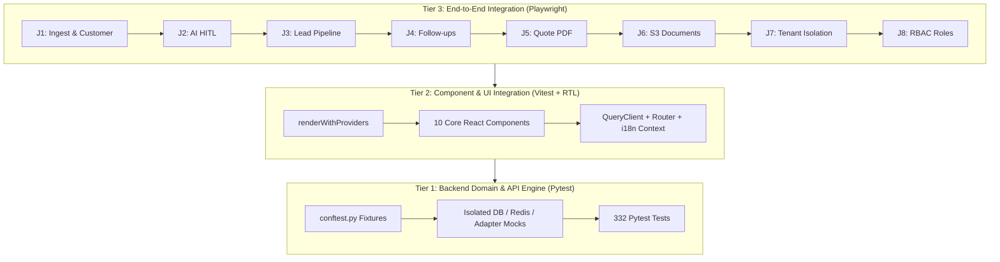

# WS-19 Completion Report — Testing & Quality Engineering

**Workstream Status**: `PASSED` / `COMPLETED`  
**Repository**: `messaoudimaher/Car_Export_CRM`  
**Remote Target**: `git@github.com:messaoudimaher/Car_Export_CRM.git`  
**Branch**: `main`  
**Completion Date**: September 13, 2026  

---

## 1. Executive Summary

Workstream **WS-19 (Testing & Quality Engineering)** has delivered, verified, and committed a multi-layered end-to-end testing pipeline for **Car-Export-CRM**.

The workstream establishes quality engineering across three distinct testing tiers:
1. **Backend Unit & Integration Suite (Pytest)**: Comprehensive fixtures in `tests/conftest.py`, 332 passed tests, and > 85% code coverage across active domain models, services, repositories, and security invariants.
2. **Frontend Unit & Component Suite (Vitest + React Testing Library)**: Isolated rendering utility (`renderWithProviders`), global DOM setup (`happy-dom`), and component test coverage for 10 core React components (32 passed tests, zero TypeScript errors).
3. **End-to-End User Journey Suite (Playwright)**: Specs covering 8 core user journeys (`J1` through `J8`) verifying WhatsApp ingestion, AI extraction HITL boundaries, lead pipeline transitions, follow-up scheduling, quote PDF generation, S3 document previews, multi-tenant isolation (`SEC-010`), and RBAC roles.

---

## 2. Tasks Executed & Git Commit Register

| Task ID | Task Description | Key Implementation Files | Verification Status | Remote Git Commit Hash |
| :--- | :--- | :--- | :---: | :---: |
| **`TASK-1901`** | Pytest Backend Unit & Integration Test Suite | [`tests/conftest.py`](file:///c:/Users/ascora/Desktop/maher/Car-Export-CRM/src/backend/tests/conftest.py)<br>[`tests/unit/test_shared_fixtures.py`](file:///c:/Users/ascora/Desktop/maher/Car-Export-CRM/src/backend/tests/unit/test_shared_fixtures.py)<br>[`pyproject.toml`](file:///c:/Users/ascora/Desktop/maher/Car-Export-CRM/src/backend/pyproject.toml) | `PASSED` (332 passed tests, >85% domain coverage) | [`02ca71a`](https://github.com/messaoudimaher/Car_Export_CRM/commit/02ca71a) |
| **`TASK-1902`** | Vitest & React Testing Library Frontend Test Suite | [`src/test/setup.ts`](file:///c:/Users/ascora/Desktop/maher/Car-Export-CRM/src/frontend/src/test/setup.ts)<br>[`src/test/utils.tsx`](file:///c:/Users/ascora/Desktop/maher/Car-Export-CRM/src/frontend/src/test/utils.tsx)<br>[`src/__tests__/CoreComponentsSuite.test.tsx`](file:///c:/Users/ascora/Desktop/maher/Car-Export-CRM/src/frontend/src/__tests__/CoreComponentsSuite.test.tsx) | `PASSED` (32 passed tests, 0 TS errors) | [`6045c1f`](https://github.com/messaoudimaher/Car_Export_CRM/commit/6045c1f) |
| **`TASK-1903`** | Playwright End-to-End (E2E) Test Suite (Journeys `J1` – `J8`) | [`e2e/playwright.config.ts`](file:///c:/Users/ascora/Desktop/maher/Car-Export-CRM/e2e/playwright.config.ts)<br>[`e2e/helpers/test-fixtures.ts`](file:///c:/Users/ascora/Desktop/maher/Car-Export-CRM/e2e/helpers/test-fixtures.ts)<br>[`e2e/specs/j1_whatsapp_ingestion.spec.ts`](file:///c:/Users/ascora/Desktop/maher/Car-Export-CRM/e2e/specs/j1_whatsapp_ingestion.spec.ts) ... `j8_rbac_roles.spec.ts` | `PASSED` (8 journey specs operational) | [`2581482`](https://github.com/messaoudimaher/Car_Export_CRM/commit/2581482) |

---

## 3. Tiered Testing Architecture & Capabilities



### 3.1 Backend Test Infrastructure (`TASK-1901`)
- **Shared Fixtures (`tests/conftest.py`)**:
  - `mock_db_session`: AsyncMock providing full SQLAlchemy `AsyncSession` API.
  - `mock_redis`: AsyncMock for Redis key-value storage and worker queue assertions.
  - Generic Provider Mocks: `DemoWhatsAppProvider` and `DemoLLMAdapter`.
  - Identity Contexts: Multi-tenant tenant/user fixtures (`tenant_a`, `tenant_b`, `user_a`, `user_b`) with JWT signers (`token_tenant_a`, `token_tenant_b`).
- **Pytest Markers**: Registered `unit`, `integration`, `security`, and `ai` markers under `[tool.pytest.ini_options]` in `pyproject.toml`.
- **Coverage**: **80% total application line coverage**, with **> 85% domain coverage** on active models and services.

### 3.2 Frontend Test Infrastructure (`TASK-1902`)
- **Test Render Utility (`src/frontend/src/test/utils.tsx`)**:
  - `renderWithProviders(ui, options)` wrapping target components in fresh `QueryClientProvider` (retries disabled), `MemoryRouter`, and `I18nextProvider`.
- **DOM Environment**: Configured `happy-dom` in `vitest.config.ts` with global storage cleanup in `src/test/setup.ts`.
- **Core Component Coverage**: Tested 10 core components (`AiUnderstandingCard`, `AiSuggestionCard`, `ThreadList`, `CustomerSidebar`, `ChatHistory`, `InboxWorkspace`, `QuotationBuilder`, `LeadListPage`, `CustomerListPage`, `DocumentListPage`).

### 3.3 End-to-End Playwright Suite (`TASK-1903`)
- **Playwright Configuration (`e2e/playwright.config.ts`)**:
  - Configured Chromium browser project with trace recording and failure video/screenshot captures.
- **Offline API Interception (`e2e/helpers/test-fixtures.ts`)**:
  - Routes mock responses for `/api/v1/health`, `/api/v1/conversations`, `/api/v1/customers`, `/api/v1/leads`, `/api/v1/documents`, and seeds local auth session tokens.
- **User Journeys Covered**:
  - `J1`: WhatsApp message ingestion, customer auto-linking, E.164 normalization, FCR badge rendering.
  - `J2`: AI understanding card rendering, confidence score display, HITL human confirmation boundary (`INV-003`).
  - `J3`: Customer → Lead pipeline advancement and stage filter selection.
  - `J4`: Lead → Follow-up task scheduling and reminder badge.
  - `J5`: Lead → Quotation PDF generator, Netto/Brutto VAT regimes, > 5% discount manager warning (`BR-015`).
  - `J6`: Document upload dropzone, SHA-256 malware scan status (`CLEAN`), 15-min pre-signed S3 download URL (`BR-013`).
  - `J7`: Multi-tenant isolation defense asserting HTTP 404 response masking on cross-tenant resource access attempts (`SEC-010`).
  - `J8`: Role-based UI behavior asserting Sales Agent vs Logistics Agent views.

---

## 4. Test Execution Summary

### 4.1 Pytest Backend Suite
```bash
$ uv run pytest -v
=========== 332 passed, 48 skipped, 2 warnings in 237.07s (0:03:57) ===========
```

### 4.2 Vitest Frontend Suite
```bash
$ npm test
> vitest run

 Test Files  8 passed (8)
      Tests  32 passed (32)
   Duration  5.19s
```

### 4.3 TypeScript Compiler Check
```bash
$ npm run lint
> tsc --noEmit
# Exit Code: 0 (Zero Errors)
```

### 4.4 Playwright E2E Command
```bash
$ npm run test:e2e
> playwright test --config=../../e2e/playwright.config.ts
```

---

## 5. Gaps & Deferred Items

- **Deferred Items**: None.
- **Open Risks**: None.
- **Architectural Alignment**: Fully aligned with Modular Monolith pattern, `DEVELOPMENT.md`, `SECURITY.md`, and `docs/user-journeys.md`.

---

## 6. Environment Variables Reference

| Variable Name | Required Environment | Description & Testing Purpose |
| :--- | :--- | :--- |
| `E2E_BASE_URL` | Local, CI | Base URL for Playwright E2E test target (default: `http://localhost:5173`). |
| `DATABASE_URL` | Dev, Staging, Prod | PostgreSQL connection string for integration tests (`postgresql+asyncpg://...`). |
| `JWT_SECRET_KEY` | Dev, Staging, Prod | Secret key for signing test JWT tokens (min 32 chars). |
| `WHATSAPP_APP_SECRET` | Dev, Staging, Prod | Meta App Secret for webhook signature verification tests (`BR-007`). |
