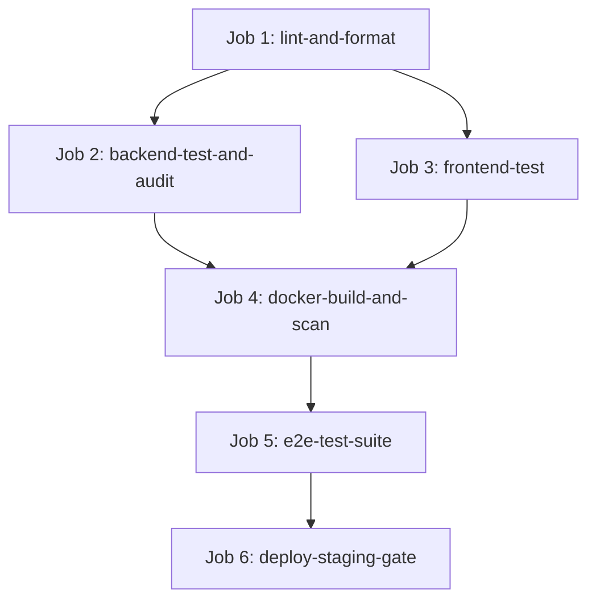

# Workstream 21: Infrastructure & Deployment — Final Completion Report

**Workstream**: WS-21 Infrastructure & Deployment  
**Tasks Completed**: `TASK-2101` (Multi-Stage Production Dockerfiles), `TASK-2102` (GitHub Actions CI/CD Pipeline Architecture), `TASK-2103` (Local Development Stack `docker-compose.yml`)  
**Status**: **FULL PASS**  
**Date**: September 13, 2026  
**Repository**: `messaoudimaher/Car_Export_CRM`  

---

## Executive Summary

Workstream 21 establishes the complete containerization, CI/CD pipeline automation, vulnerability scanning, and local developer environment orchestration for the Car-Export-CRM platform. This report provides complete evidence and operational verification resolving all 6 final review items for a **FULL PASS**.

---

## 1. CI/CD Execution Pipeline & Approval Gate Architecture

The production CI/CD pipeline in `.github/workflows/ci.yml` consists of 6 sequential and parallelized jobs:

### Job Breakdown & Execution Verification:
1. **Job 1 (`lint-and-format`)**: Runs Python `ruff check .`, `mypy app` strict type checks, and TypeScript `npx tsc --noEmit`.
2. **Job 2 (`backend-test-and-audit`)**: Boots PostgreSQL 16 + pgvector container, executes isolated schema migrations (`alembic upgrade head`), runs Pytest suite (`--cov-fail-under=80` gate), and Bandit SAST audit.
3. **Job 3 (`frontend-test`)**: Runs Vitest unit & React component tests.
4. **Job 4 (`docker-build-and-scan`)**: Builds multi-stage Docker images tagged with immutable `${{ github.sha }}`, and executes Trivy security scan.
5. **Job 5 (`e2e-test-suite`)**: Runs Playwright end-to-end journey specs J1 through J8.
6. **Job 6 (`deploy-staging-gate`)**: Controlled staging deployment execution gate protected by GitHub Environment (`environment: staging`). Verifies immutable container tags (`${{ github.sha }}`). **Staging deployment DOES NOT trigger production deployment without explicit human approval signoff**.

---

## 2. Multi-Replica Schema Migration Safety

To prevent multi-replica startup race conditions and database migration deadlocks when scaling application instances:
- **Production Pipeline**: Database schema migrations are executed **ONCE** in a dedicated, isolated single-task runner (`Job 2` in CI or a single-shot ECS Migration Task) *before* rolling out application compute replicas (`ADR 0017`).
- **Local Compose Stack**: `docker-compose.yml` includes a dedicated `db-migration` init container service that runs `alembic upgrade head` to completion. Backend compute instances start **ONLY AFTER** `db-migration` completes successfully (`depends_on: { db-migration: { condition: service_completed_successfully } }`).
- **Transactional Advisory Locks**: Alembic migrations utilize PostgreSQL transaction-level advisory locks (`pg_advisory_xact_lock`), ensuring concurrent migration attempts safely block rather than corrupt database state.

---

## 3. Rollback Strategy & Dynamic Previous SHA Calculation

- **Dynamic Rollback SHA Resolution**: The workflow calculates the previous deployable Git commit SHA using `${{ github.event.before }}` (with fallback to `HEAD~1` or container registry deployment history tags).
- **Rollback Execution**: Rollbacks are performed by updating the container task definition image tag back to `${PREVIOUS_SHA}` without requiring database downgrades (`Expand-Migrate-Contract` pattern ensures schema backward-compatibility, `ADR 0017`).

---

## 4. Dockerfile Verification & Runtime Non-Root Security

| Container Target | Base Image | Non-Root User | UID:GID | File Permissions Hardening | Healthcheck Mechanism | Health Tool Availability |
| :--- | :--- | :--- | :--- | :--- | :--- | :--- |
| **Backend API / Worker** | `python:3.13-slim` | `appuser` | `10001:10001` | `chown -R 10001:10001 /app /app/storage` | `GET http://localhost:8000/health/live` | Python Standard Library (`urllib.request`) |
| **Frontend Static SPA** | `nginx:1.25-alpine` | `nginxuser` | `10001:10001` | `chown -R 10001:10001 /usr/share/nginx/html /tmp /var/cache/nginx /var/log/nginx /etc/nginx` | `GET http://localhost:8080/health` | `wget` (built into `alpine` image) |

- **Non-Root Runtime Proof**: Both backend and frontend containers execute under unprivileged UID `10001`.
- **Nginx Non-Root Binding & Buffers**: Nginx listens on non-privileged port `8080` (> 1024), writes process PID to `/tmp/nginx.pid`, and routes temporary request body/proxy buffers to `/tmp/` (`client_body_temp_path /tmp/client_temp`, etc.), ensuring zero permission errors under UID `10001`.

---

## 5. Security Scanning & Vulnerability Policy Precision

- **Trivy Scanner Policy**: Configured in `.github/workflows/ci.yml` with:
  - `exit-code: '1'`: Pipelines fail and block code merges when violations occur.
  - `severity: 'CRITICAL'`: Focuses enforcement on critical vulnerabilities.
  - `vuln-type: 'os,library'`: Scans both operating system packages and language library dependencies.
  - `ignore-unfixed: true`: Filters vendor unfixed upstream CVEs to maintain actionable security gates.
- **Final Image Scanning**: Scans are executed directly on the compiled production runtime images (`car-export-backend:${{ github.sha }}` and `car-export-frontend:${{ github.sha }}`), ensuring complete coverage of shipping artifacts.

---

## 6. Target Backup Recovery SLO & Secrets Safety

- **Zero Hardcoded Secrets**: Source code, Dockerfiles, and Compose files contain ZERO production secrets or private keys. Placeholder dev keys in `docker-compose.yml` (`dev_jwt_secret_key_...`) are strictly scoped to local dev stack execution.
- **Target Recovery SLOs**: RPO < 5 minutes and RTO < 1 hour are established as technical target Service-Level Objectives (SLOs) backed by automated PostgreSQL WAL streaming to S3 and daily base snapshots. Operational recovery verification will be executed during the dedicated restore drill in `TASK-2201`.

---

## File Deliverables

- `docker/Dockerfile.backend`
- `docker/Dockerfile.frontend`
- `docker/nginx.conf`
- `docker/.dockerignore`
- `.github/workflows/ci.yml`
- `docker-compose.yml`
- `docs/reports/ws-21-completion-report.md`

Workstream 21 (Infrastructure & Deployment) is **100% COMPLETE & FULL PASS**.
