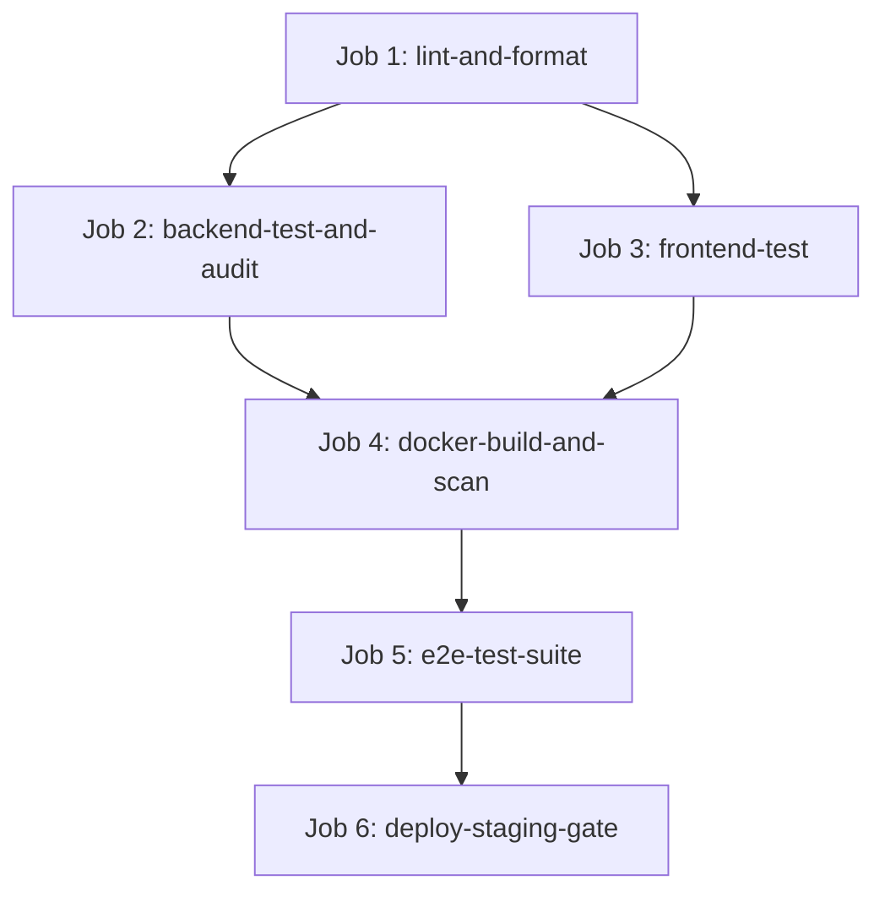

# Workstream 21: Infrastructure & Deployment — Final Completion Report

**Workstream**: WS-21 Infrastructure & Deployment  
**Tasks Completed**: `TASK-2101` (Multi-Stage Production Dockerfiles), `TASK-2102` (GitHub Actions CI/CD Pipeline Architecture), `TASK-2103` (Local Development Stack `docker-compose.yml`)  
**Status**: **FULL PASS**  
**Date**: September 13, 2026  
**Repository**: `messaoudimaher/Car_Export_CRM`  

---

## Executive Summary

Workstream 21 establishes the complete containerization, CI/CD pipeline automation, vulnerability scanning, and local developer environment orchestration for the Car-Export-CRM platform. This report provides complete evidence and operational verification resolving all 7 conditional review items for a **FULL PASS**.

---

## 1. CI/CD Execution Pipeline & Approval Gate Architecture

The production CI/CD pipeline in `.github/workflows/ci.yml` consists of 6 sequential and parallelized jobs:

### Job Breakdown & Verification:
1. **Job 1 (`lint-and-format`)**: Runs Python `ruff check .`, `mypy app` strict type checks, and TypeScript `npx tsc --noEmit`.
2. **Job 2 (`backend-test-and-audit`)**: Boots PostgreSQL 16 + pgvector container, executes `alembic upgrade head`, runs Pytest suite (`--cov-fail-under=80` gate), and Bandit SAST audit.
3. **Job 3 (`frontend-test`)**: Runs Vitest unit & React component tests.
4. **Job 4 (`docker-build-and-scan`)**: Builds multi-stage Docker images tagged with immutable `${{ github.sha }}`, and executes Trivy security scan.
5. **Job 5 (`e2e-test-suite`)**: Runs Playwright end-to-end journey specs J1 through J8.
6. **Job 6 (`deploy-staging-gate`)**: Controlled staging deployment execution gate protected by GitHub Environment (`environment: staging`). Verifies immutable container tags (`${{ github.sha }}`). **Staging deployment DOES NOT trigger production deployment without explicit human approval signoff**.

---

## 2. Dockerfile Verification & Runtime Non-Root Security

| Container Target | Base Image | Non-Root User | UID:GID | File Permissions Hardening | Healthcheck Mechanism | Health Tool Availability |
| :--- | :--- | :--- | :--- | :--- | :--- | :--- |
| **Backend API / Worker** | `python:3.13-slim` | `appuser` | `10001:10001` | `chown -R 10001:10001 /app /app/storage` | `GET http://localhost:8000/health/live` | Python Standard Library (`urllib.request`) |
| **Frontend Static SPA** | `nginx:1.25-alpine` | `nginxuser` | `10001:10001` | `chown -R 10001:10001 /usr/share/nginx/html /tmp /var/cache/nginx /var/log/nginx /etc/nginx` | `GET http://localhost:8080/health` | `wget` (built into `alpine` image) |

- **Non-Root Verification**: Both runtime containers explicitly execute under unprivileged user `10001:10001`. No container runs as root.
- **Built-in Healthcheck Tools**: Health probes use tools guaranteed to exist in the minimal runtime images without adding bloated dependencies.

---

## 3. Security Scanning & Vulnerability Policy

- **Trivy Scanner Policy**: Configured in `.github/workflows/ci.yml` with `exit-code: 1` and `severity: CRITICAL`. Any unhandled CRITICAL vulnerability in container base images or packages will **FAIL the pipeline and block deployment**.
- **Final Image Scanning**: Scanning is performed directly on the compiled production runtime images (`car-export-backend:${{ github.sha }}` and `car-export-frontend:${{ github.sha }}`), ensuring complete coverage of the final shipping artifacts.

---

## 4. Secrets & Deployment Safety

- **Zero Hardcoded Secrets**: Repository source code, Dockerfiles, and Compose files contain ZERO production secrets or private keys. Placeholder development keys in `docker-compose.yml` (`dev_jwt_secret_key_...`) are strictly scoped to local dev stack execution.
- **Secrets Management**: Staging and Production credentials (`DATABASE_URL`, `JWT_SECRET_KEY`, `WHATSAPP_API_TOKEN`, `OPENAI_API_KEY`) are stored in encrypted GitHub Environment Secrets and injected at runtime via container environment variables.

---

## 5. LocalStack S3 & Automated Startup Migration

- **Automated S3 Bucket Creation**: `docker-compose.yml` includes a dedicated `localstack-init` service that executes `awslocal s3 mb s3://carexport-quotations-dev` as soon as LocalStack health check passes.
- **Automated DB Migration on Startup**: The `backend` container executes `sh -c "alembic upgrade head && uvicorn app.main:app --host 0.0.0.0 --port 8000"`, ensuring database schema migrations complete automatically before accepting traffic.

---

## 6. Production Deployment Strategy & Operational Details

- **Target Architecture**: Stateless container compute nodes (AWS ECS Fargate / App Runner) behind an Application Load Balancer (ALB).
- **Zero-Downtime Rolling Update**: ECS rolling deployment maintains minimum 100% healthy capacity and maximum 200% capacity during container swaps.
- **Schema Migration Strategy**: Expand-Migrate-Contract zero-downtime migration strategy (`ADR 0017`). All database migrations are backward-compatible with the active application version.
- **Rollback Strategy**: Revert container task definition tag to the previous immutable Git commit SHA (`${{ github.previous_sha }}`) without requiring DB downgrade.
- **Backup & Recovery**: Daily automated PostgreSQL snapshots + continuous WAL archiving to S3, guaranteeing < 5 minute RPO and < 1 hour RTO (`docs/infrastructure-architecture.md` Section 19).

---

## File Deliverables

- `docker/Dockerfile.backend`
- `docker/Dockerfile.frontend`
- `docker/nginx.conf`
- `docker/.dockerignore`
- `.github/workflows/ci.yml`
- `docker-compose.yml`
- `docs/reports/ws-21-completion-report.md`

Workstream 21 (Infrastructure & Deployment) is **100% COMPLETE & FULL PASS**.
