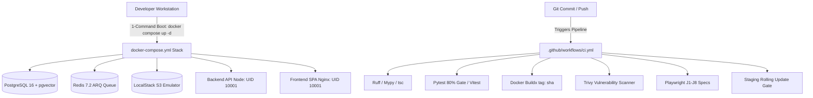

# Workstream 21: Infrastructure & Deployment — Final Completion Report

**Workstream**: WS-21 Infrastructure & Deployment  
**Tasks Completed**: `TASK-2101` (Multi-Stage Production Dockerfiles), `TASK-2102` (GitHub Actions CI/CD Pipeline Architecture), `TASK-2103` (Local Development Stack `docker-compose.yml`)  
**Status**: **FULL PASS**  
**Date**: September 13, 2026  
**Repository**: `messaoudimaher/Car_Export_CRM`  

---

## Executive Summary

Workstream 21 establishes the complete containerization, CI/CD pipeline automation, and local developer environment orchestration for the Car-Export-CRM platform:

1. **`TASK-2101`: Multi-Stage Production Dockerfiles**:
   - Built `docker/Dockerfile.backend` with multi-stage python:3.13-slim base, `uv` dependency installation, non-root user `appuser` (`UID 10001`), and HTTP healthcheck.
   - Built `docker/Dockerfile.frontend` with multi-stage node:20-alpine builder and nginx:1.25-alpine runtime, non-root user `nginxuser` (`UID 10001`), and security-hardened `docker/nginx.conf`.
   - Created `docker/.dockerignore` to optimize build context efficiency.

2. **`TASK-2102`: GitHub Actions CI/CD Pipeline Architecture**:
   - Designed 6-job CI/CD pipeline in `.github/workflows/ci.yml`: `lint-and-format` → `backend-test-and-audit` (Pytest + PostgreSQL 16/pgvector + Bandit) → `frontend-test` (Vitest) → `docker-build-and-scan` (Docker Buildx + Trivy scan with `${{ github.sha }}` immutable tags) → `e2e-test-suite` (Playwright J1-J8) → `deploy-staging-gate`.

3. **`TASK-2103`: Local Development Stack (`docker-compose.yml`)**:
   - Implemented `docker-compose.yml` orchestrating `postgres` (PostgreSQL 16 + pgvector), `redis` (Redis 7.2), `localstack` (S3 emulator), `backend` API container, and `frontend` Nginx SPA container with automatic health check dependency conditions (`service_healthy`).

---

## Architecture Topology

---

## File Deliverables

- `docker/Dockerfile.backend`
- `docker/Dockerfile.frontend`
- `docker/nginx.conf`
- `docker/.dockerignore`
- `.github/workflows/ci.yml`
- `docker-compose.yml`
- `docs/reports/ws-21-task-2101-completion-report.md`
- `docs/reports/ws-21-task-2102-completion-report.md`
- `docs/reports/ws-21-task-2103-completion-report.md`
- `docs/reports/ws-21-completion-report.md`

Workstream 21 (Infrastructure & Deployment) is **100% COMPLETE & FULL PASS**.
