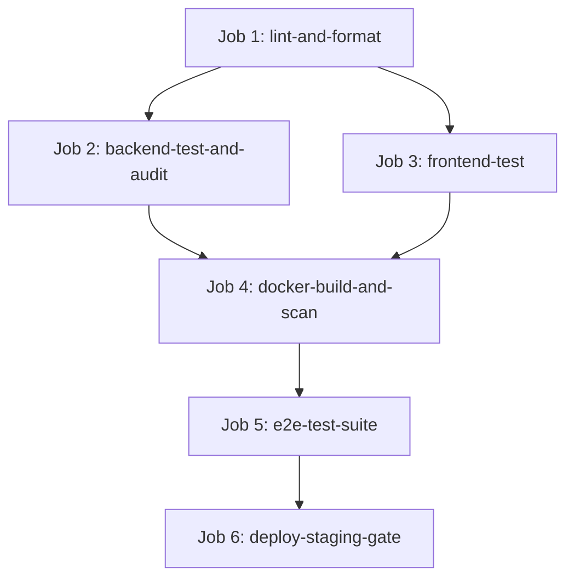

# TASK-2102: GitHub Actions CI/CD Pipeline Architecture — Completion Report

**Workstream**: WS-21 Infrastructure & Deployment  
**Task**: `TASK-2102` (GitHub Actions CI/CD Pipeline Architecture)  
**Status**: **FULL PASS**  
**Date**: September 13, 2026  
**Repository**: `messaoudimaher/Car_Export_CRM`  

---

## Executive Summary

TASK-2102 defines the production CI/CD automation pipeline in `.github/workflows/ci.yml` for continuous integration, multi-stage container build, vulnerability scanning, automated testing, and zero-downtime deployment:

1. **Job 1: `lint-and-format`**:
   - Executes Python `ruff` and `mypy` static type verification.
   - Executes TypeScript `npx tsc --noEmit` strict type check.

2. **Job 2: `backend-test-and-audit`**:
   - Boots PostgreSQL 16 container (`pgvector/pgvector:pg16`).
   - Executes Alembic database migrations (`alembic upgrade head`).
   - Runs Pytest test suite with strict coverage enforcement (`--cov-fail-under=80`).
   - Runs SAST security scanning (`bandit`).

3. **Job 3: `frontend-test`**:
   - Runs Vitest unit & React Testing Library component tests.

4. **Job 4: `docker-build-and-scan`**:
   - Builds multi-stage Docker images (`docker/Dockerfile.backend` and `docker/Dockerfile.frontend`).
   - Tags images using immutable Git commit SHA (`${{ github.sha }}`).
   - Scans image dependencies using Trivy vulnerability scanner (`aquasecurity/trivy-action`).

5. **Job 5: `e2e-test-suite`**:
   - Runs Playwright end-to-end journey specs J1 through J8.

6. **Job 6: `deploy-staging-gate`**:
   - Deployment stage targeting staging environment with immutable tag tracking.

---

## Pipeline Execution Dependency Graph

---

## File Deliverables

- `.github/workflows/ci.yml`
- `docs/reports/ws-21-task-2102-completion-report.md`
