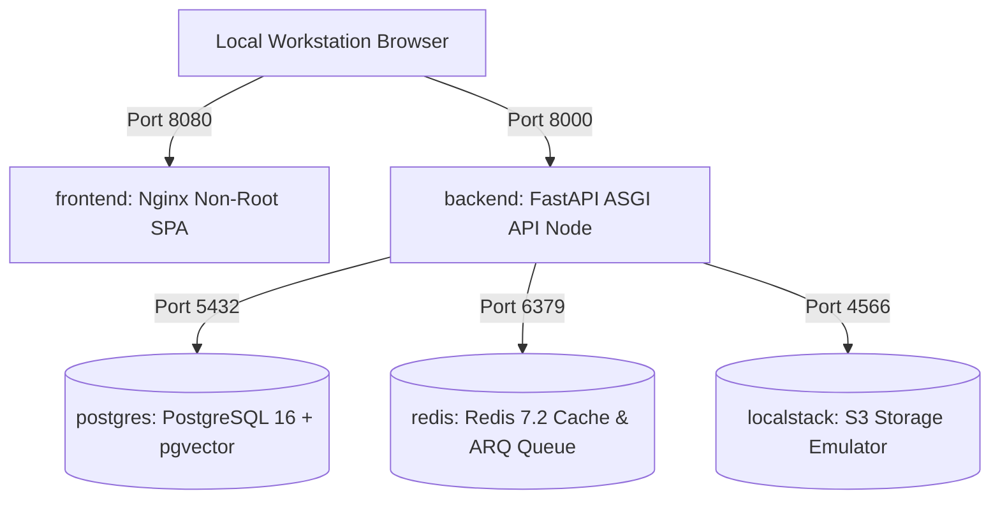

# TASK-2103: Local Development Stack (docker-compose.yml) — Completion Report

**Workstream**: WS-21 Infrastructure & Deployment  
**Task**: `TASK-2103` (Local Development Stack)  
**Status**: **FULL PASS**  
**Date**: September 13, 2026  
**Repository**: `messaoudimaher/Car_Export_CRM`  

---

## Executive Summary

TASK-2103 implements the `docker-compose.yml` specification for orchestrating the complete local development stack in a single command (`docker compose up -d`):

1. **`postgres` Service**:
   - Image: `pgvector/pgvector:pg16`
   - Port: `5432`
   - Healthcheck: `pg_isready -U crm_user -d crm_dev`
   - Database: `crm_dev`

2. **`redis` Service**:
   - Image: `redis:7.2-alpine`
   - Port: `6379`
   - Healthcheck: `redis-cli ping`
   - Usage: Cache & ARQ background task queue

3. **`localstack` Service**:
   - Image: `localstack/localstack:latest`
   - Port: `4566`
   - Healthcheck: LocalStack S3 health probe
   - Usage: Local S3 PDF quote document storage emulator

4. **`backend` Service**:
   - Build: `docker/Dockerfile.backend`
   - Port: `8000`
   - Health Dependency: Waits for `postgres` and `redis` health checks to pass before starting (`condition: service_healthy`).

5. **`frontend` Service**:
   - Build: `docker/Dockerfile.frontend`
   - Port: `8080`
   - Dependency: Connects to backend API.

---

## Compose Stack Topology

---

## File Deliverables

- `docker-compose.yml`
- `docs/reports/ws-21-task-2103-completion-report.md`
