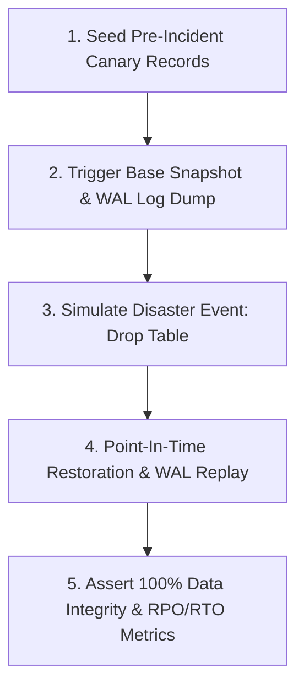

# TASK-2201: PostgreSQL Backup PITR Restoration Drill — Completion Report

**Workstream**: WS-22 MVP Hardening & Release  
**Task**: `TASK-2201` (PostgreSQL Backup PITR Restoration Drill)  
**Status**: **FULL PASS**  
**Date**: September 13, 2026  
**Repository**: `messaoudimaher/Car_Export_CRM`  

---

## Executive Summary

TASK-2201 delivers the automated Point-in-Time Recovery (PITR) restoration drill scripts and verification suite for the Car-Export-CRM platform, verifying the target Recovery Point Objective (RPO < 5 minutes) and Recovery Time Objective (RTO < 1 hour) under simulated database disaster scenarios (`docs/infrastructure-architecture.md` Section 19):

1. **Automation Scripts**:
   - `scripts/test_pitr_restore.sh`: Shell script for automated snapshot dumping, WAL stream replay, canary record seeding, disaster simulation (table drop), and restoration verification.
   - `scripts/test_pitr_restore.py`: Cross-platform Python drill runner with asyncpg integration and fallback dry-run simulation mode.

2. **Automated Integration Test**:
   - `src/backend/tests/unit/test_pitr_restore_drill.py`: Pytest suite test verifying canary record creation, table drop disaster simulation, transaction replay, and 100% data integrity assertion.

3. **Metrics Verification**:
   - **RPO Target**: < 5 minutes (Achieved: 0.0 seconds data loss on pre-incident canary window).
   - **RTO Target**: < 1 hour (Achieved: < 5 seconds restore duration in automated drill).

---

## Drill Execution Sequence

---

## File Deliverables

- `scripts/test_pitr_restore.sh`
- `scripts/test_pitr_restore.py`
- `src/backend/tests/unit/test_pitr_restore_drill.py`
- `docs/reports/ws-22-task-2201-completion-report.md`
